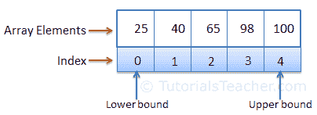

# C# 数组

> 原文:[https://www.tutorialsteacher.com/csharp/array-csharp](https://www.tutorialsteacher.com/csharp/array-csharp)

* * *

Updated on: <time datetime="2020-05-10">May 10, 2020</time>

* * *

一个[变量](/csharp/csharp-variable)用来存储一个文字值，而一个数组用来存储多个文字值。

数组是存储固定数量的相同[数据类型](/csharp/csharp-data-types)的文字值(元素)的数据结构。数组元素连续存储在内存中。

在 C# 中，数组可以有三种类型:一维、多维和交错数组。在这里，您将了解一维数组。

下图说明了数组表示。

[](../../Content/images/csharp/array.png) 

Array Representation


## 数组声明和初始化

通过用方括号指定数组元素的类型，可以使用声明数组。

Example: Array Declaration

```
int[] evenNums;  // integer array

string[] cities; // string array 
```

下面在一条语句中声明值并将其添加到数组中。

Example: Array Declaration & Initialization

```
int[] evenNums = new int[5]{ 2, 4, 6, 8, 10 }; 

string[] cities = new string[3]{ "Mumbai", "London", "New York" }; 
```

上图，`evenNums`数组最多可以存储 5 个整数。方括号`new int[5]`中的数字 5 表示数组的大小。 同理，`cities`阵的大小也是三个。数组元素被添加到花括号{ }内的逗号分隔列表中。

数组类型的变量可以用 [var](/csharp/csharp-var-implicit-typed-local-variable) 声明，不用方括号。

Example: Array Declaration using var

```
var evenNums = new int[]{ 2, 4, 6, 8, 10}; 

var cities = new string[]{ "Mumbai", "London", "New York" }; 
```

如果在声明时添加数组元素，那么大小是可选的。编译器将根据大括号内的元素数量推断其大小，如下所示。

Example: Short Syntax of Array Declaration

```
int[] evenNums = { 2, 4, 6, 8, 10}; 

string[] cities = { "Mumbai", "London", "New York" } 
```

下面的示例演示了无效的数组声明。

Example: Invalid Array Creation

```
//must specify the size 
int[] evenNums = new int[]; 

//number of elements must be equal to the specified size 
int[] evenNums = new int[5] { 2, 4 };

//cannot use var with array initializer
var evenNums = { 2, 4, 6, 8, 10}; 
```

## 延迟初始化

不必在单个语句中声明和初始化数组。您可以首先声明一个数组，然后稍后使用新的运算符初始化它。

Example: Late Initialization

```
int[] evenNums;

evenNums = new int[5];
// or
evenNums = new int[]{ 2, 4, 6, 8, 10 }; 
```

## 访问数组元素

可以使用索引来访问数组元素。索引是与每个数组元素相关联的数字，从索引 0 开始，以数组大小- 1 结束。

以下示例使用索引添加/更新和检索数组元素。

Example: Access Array Elements using Indexes

```
int[] evenNums = new int[5];
evenNums[0] = 2;
evenNums[1] = 4;
//evenNums[6] = 12;  //Throws run-time exception IndexOutOfRange

Console.WriteLine(evenNums[0]);  //prints 2
Console.WriteLine(evenNums[1]);  //prints 4 
```

请注意，试图添加超过其指定大小的元素将导致`IndexOutOfRangeException`。

## 使用 for 循环访问数组

使用`for`循环访问数组元素。在 for 循环的条件表达式中使用数组的`length`属性。

Example: Accessing Array Elements using for Loop

```
int[] evenNums = { 2, 4, 6, 8, 10 };

for(int i = 0; i < evenNums.Length; i++)
    Console.WriteLine(evenNums[i]);  

for(int i = 0; i < evenNums.Length; i++)
    evenNums[i] = evenNums[i] + 10;  // update the value of each element by 10 
```

## 使用 foreach 循环访问数组

使用`foreach`循环读取数组元素的值，而不使用索引。

Example: Accessing Array using foreach Loop

```
int[] evenNums = { 2, 4, 6, 8, 10}; 
string[] cities = { "Mumbai", "London", "New York" }; 

foreach(var item in evenNums)
    Console.WriteLine(item);   

foreach(var city in cities)
    Console.WriteLine(city); 
```

## LINQ 方法

C# 中的所有数组都是从一个抽象基类[系统中派生出来的。阵列](https://docs.microsoft.com/en-us/dotnet/api/system.array?view=netframework-4.7.2)。 T3】

Array 类实现了`IEnumerable`接口，可以使用`Max()`、`Min()`、`Sum()`、`reverse()`等 LINQ 扩展方法。 这里见所有扩展方式[列表。](https://docs.microsoft.com/en-us/dotnet/api/system.linq.enumerable?view=netframework-4.8)

Example: LINQ Methods

```
int[] nums = new int[5]{ 10, 15, 16, 8, 6 };

nums.Max(); // returns 16
nums.Min(); // returns 6
nums.Sum(); // returns 55
nums.Average(); // returns 55 
```

`System.Array`类还包括创建、操作、搜索和排序数组的方法。 见所有阵法列表[此处](https://docs.microsoft.com/en-us/dotnet/api/system.array?view=netcore-3.1#methods)。

Example: Array Methods

```
int[] nums = new int[5]{ 10, 15, 16, 8, 6 };

Array.Sort(nums); // sorts array 
Array.Reverse(nums); // sorts array in descending order
Array.ForEach(nums, n => Console.WriteLine(n)); // iterates array
Array.BinarySearch(nums, 5);// binary search 
```

## 将数组作为参数传递

数组可以作为参数传递给方法参数。数组是引用类型，因此方法可以更改数组元素的值。

Example: Passing Array as Argument

```
public static void Main(){
    int[] nums = { 1, 2, 3, 4, 5 };

    UpdateArray(nums); 

    foreach(var item in nums)
        Console.WriteLine(item);   
}

public static void UpdateArray(int[] arr)
{
    for(int i = 0; i < arr.Length; i++)
        arr[i] = arr[i] + 10;   
} 
```

接下来学习多维交错数组。

*Frequently Asked Questions* **   [如何在 C# 中进行数组搜索？](/articles/search-value-in-array-csharp)
*   [如何在 C# 中对数组进行排序？](/articles/sort-array-in-csharp)
*   [如何在 C# 中按特定属性对对象数组进行排序？](/articles/sort-object-array-by-specific-property-in-csharp)
*   [如何在 C# 中从数组中获取逗号分隔的字符串？](/articles/get-comma-separated-string-from-array-in-csharp)
*   [如何在 C# 中删除数组中的重复值？](/articles/remove-duplicate-values-from-array-in-csharp)
*   [如何在 C# 中组合两个没有重复值的数组？](/articles/combine-two-arrays-without-duplicate-values-in-csharp)
*   [c# 中如何计数数组中的特定元素？](/articles/count-elements-in-array-csharp)
*   [数组之间的差异&数组列表](/articles/difference-between-array-and-arraylist-in-csharp)*