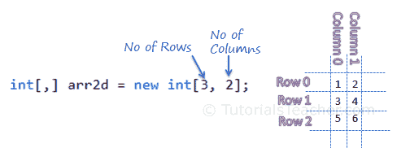

# C# 多维数组

> 原文：<https://www.tutorialsteacher.com/csharp/csharp-multi-dimensional-array>

C# 支持多达 32 维的多维数组。多维数组可以通过在方括号中添加逗号来声明。例如，[，]声明二维数组，[，，]声明三维数组，[，，，]声明四维数组，等等。因此，在多维数组中，逗号数=维数- 1。

下面声明多维数组。

Example: Multidimensional Arrays

```cs
int[,] arr2d; // two-dimensional array
int[, ,] arr3d; // three-dimensional array
int[, , ,] arr4d ; // four-dimensional array
int[, , , ,] arr5d; // five-dimensional array 
```

让我们理解二维数组。下面初始化二维数组。

Example: two-dimensional Array

```cs
int[,] arr2d = new int[3,2]{ 
                                {1, 2}, 
                                {3, 4}, 
                                {5, 6} 
                            };

// or 
int[,] arr2d = { 
                    {1, 2}, 
                    {3, 4}, 
                    {5, 6} 
                }; 
```

在上面的二维数组示例中，`[3, 2]`定义了行数和列数。第一级表示行数，第二级定义列数。下图说明了分成行和列的二维数组。

 

Two-dimensional Array


以下是二维数组的访问值。

Example: Access two-dimensional Array

```cs
int[,] arr2d = new int[3,2]{ 
                                {1, 2}, 
                                {3, 4}, 
                                {5, 6} 
                            };

arr2d[0, 0]; //returns 1
arr2d[0, 1]; //returns 2
arr2d[1, 0]; //returns 3
arr2d[1, 1]; //returns 4
arr2d[2, 0]; //returns 5
arr2d[2, 1]; //returns 6
//arr2d[3, 0]; //throws run-time error as there is no 4th row 
```

在上例中，二维数组的值可以通过行和列的索引号作为[行索引，列索引]来访问。所以，`[0, 0]`返回第一行第一列的值，`[1, 1]`返回第二行第二列的值。

现在，让我们来了解一下三维数组。下面声明并初始化三维数组。

Example: Three-dimensional Array

```cs
int[, ,] arr3d1 = new int[1, 2, 2]{
                { { 1, 2}, { 3, 4} }
            };

int[, ,] arr3d2 = new int[2, 2, 2]{
                { {1, 2}, {3, 4} },
                { {5, 6}, {7, 8} }
            };

int[, ,] arr3d3 = new int[2, 2, 3]{
                { { 1, 2, 3}, {4, 5, 6} },
                { { 7, 8, 9}, {10, 11, 12} }
            };

arr3d2[0, 0, 0]; // returns 1 
arr3d2[0, 0, 1]; // returns 2 
arr3d2[0, 1, 0]; // returns 3 
arr3d2[0, 1, 1]; // returns 4 
arr3d2[1, 0, 0]; // returns 5 
arr3d2[1, 0, 1]; // returns 6 
arr3d2[1, 1, 0]; // returns 7 
arr3d2[1, 1, 1]; // returns 8 
```

如上例所示，`arr3d1`的[1，2，2]指定它将包含一行二维数组[2，2]。 `arr3d2`指定维度【2，2，2】，表示它包含两行二维数组【2，2】。因此，第一等级指示内部二维数组的行数。

现在，考虑下面的四维数组。

Example: Four-dimensional Array

```cs
int[,,,] arr4d1 = new int[1, 1, 2, 2]{
                { 
                    { { 1, 2}, { 3, 4} }     
                }
            };

arr4d1[0, 0, 0, 0]; // returns 1
arr4d1[0, 0, 0, 1]; // returns 2
arr4d1[0, 0, 1, 0]; // returns 3
arr4d1[0, 0, 1, 1]; // returns 4

int[,,,] arr4d2 = new int[1, 2, 2, 2]{
		{
			{ {1, 2}, {3, 4} },
			{ {5, 6}, {7, 8} }
		}
	};

arr4d2[0, 0, 0, 0]; // returns 1
arr4d2[0, 0, 0, 1]; // returns 2
arr4d2[0, 0, 1, 0]; // returns 3
arr4d2[0, 0, 1, 1]; // returns 4
arr4d2[0, 1, 0, 0]; // returns 5
arr4d2[0, 1, 0, 1]; // returns 6
arr4d2[0, 1, 1, 0]; // returns 7
arr4d2[0, 1, 1, 1]; // returns 8 
```

在上面的例子中，四维数组`arr4d1`指定了【1，1，2，2】，这表示它包括三维数组的一行。

同样，您可以在 C# 中声明和初始化五维、六维数组以及最多 32 维数组。