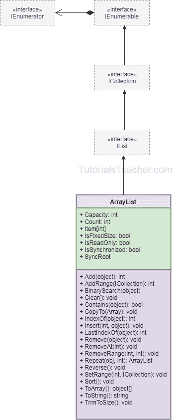

# C# 阵列列表

> 原文：<https://www.tutorialsteacher.com/csharp/csharp-arraylist>

在 C# 中，`ArrayList`是一个非泛型的对象集合，其大小动态增加。 与[阵](/csharp/array-csharp)相同，只是大小动态增加。

在不知道数据类型和大小的情况下，可以使用`ArrayList`添加未知数据。

## 创建数组列表

包含在`System.Collections`命名空间中的`ArrayList`类。 使用`new`关键字创建`ArrayList`的对象。

Example: Create an ArrayList

```
using System.Collections;

ArrayList arlist = new ArrayList(); 
// or 
var arlist = new ArrayList(); // recommended 
```

## 在数组列表中添加元素

使用`Add()`方法或[对象初始值设定项语法](/csharp/csharp-object-initializer)在`ArrayList`中添加元素。

一个`ArrayList`可以包含多个`null`和重复值。

Example: Adding Elements in ArrayList

```
// adding elements using ArrayList.Add() method
var arlist1 = new ArrayList();
arlist1.Add(1);
arlist1.Add("Bill");
arlist1.Add(" ");
arlist1.Add(true);
arlist1.Add(4.5);
arlist1.Add(null);

// adding elements using object initializer syntax
var arlist2 = new ArrayList()
                {
                    2, "Steve", " ", true, 4.5, null
                }; 
```

使用`AddRange(ICollection c)`方法在`ArrayList`中添加整个[数组](/csharp/array-csharp)、[哈希表](/csharp/csharp-hashtable)、[排序列表](/csharp/csharp-sortedlist)、`ArrayList`、`BitArray`、[队列](/csharp/csharp-queue)、[堆栈](/csharp/csharp-stack)。

Example: Adding Entire Array/ArrayList into ArrayList

```
var arlist1 = new ArrayList();

var arlist2 = new ArrayList()
                    {
                        1, "Bill", " ", true, 4.5, null
                    };

int[] arr = { 100, 200, 300, 400 };

Queue myQ = new Queue();
myQ.Enqueue("Hello");
myQ.Enqueue("World!");

arlist1.AddRange(arlist2); //adding arraylist in arraylist 
arlist1.AddRange(arr); //adding array in arraylist 
arlist1.AddRange(myQ); //adding Queue in arraylist 
```

## 访问数组列表

`ArrayList`类实现了`IList`接口。因此，可以使用索引器访问元素，就像访问数组一样。 指数从零开始，随后每个元素增加一。

需要显式转换为适当的类型，或者使用 [var](/csharp/csharp-var-implicit-typed-local-variable) 变量。

Example: Accessing Elements of ArrayList

```
var arlist = new ArrayList()
                {
                    1,
                    "Bill",
                    300,
                    4.5f
                };

//Access individual item using indexer
int firstElement = (int) arlist[0]; //returns 1
string secondElement = (string) arlist[1]; //returns "Bill"
//int secondElement = (int) arlist[1]; //Error: cannot cover string to int

//using var keyword without explicit casting
var firstElement = arlist[0]; //returns 1
var secondElement = arlist[1]; //returns "Bill"
//var fifthElement = arlist[5]; //Error: Index out of range

//update elements
arlist[0] = "Steve"; 
arlist[1] = 100;
//arlist[5] = 500; //Error: Index out of range 
```

## 迭代数组列表

`ArrayList`实现支持集合类型迭代的 [ICollection](https://docs.microsoft.com/en-us/dotnet/api/system.collections.icollection?view=netframework-4.8) 接口。 所以，使用`foreach`和`for`循环迭代一个`ArrayList`。 一个`ArrayList`的`Count`属性返回一个`ArrayList`中的元素总数。

Example: Iterate ArrayList

```
ArrayList arlist = new ArrayList()
                        {
                            1,
                            "Bill",
                            300,
                            4.5F
                        };

foreach (var item in arlist)
    Console.Write(item + ", "); //output: 1, Bill, 300, 4.5, 

for(int i = 0 ; i < arlist.Count; i++)
    Console.Write(arlist[i] + ", "); //output: 1, Bill, 300, 4.5, 
```

## 在数组列表中插入元素

使用`Insert()`方法将指定索引处的元素插入`ArrayList`中。

签字:`*void Insert(int index, Object value)*`

Example: Insert Element in ArrayList

```
ArrayList arlist = new ArrayList()
                {
                    1,
                    "Bill",
                    300,
                    4.5f
                };

arlist.Insert(1, "Second Item");

foreach (var val in arlist)
    Console.WriteLine(val); 
```

使用`InsertRange()`方法在指定索引处的`ArrayList`中插入集合。

签字:`*Void InsertRange(int index, ICollection c)*`

Example: Insert Collection in ArrayList

```
ArrayList arlist1 = new ArrayList()
                {
                    100, 200, 600
                };

ArrayList arlist2 = new ArrayList()
                {
                    300, 400, 500
                };
arlist1.InsertRange(2, arlist2);

foreach(var item in arlist1)
    Console.Write(item + ", "); //output: 100, 200, 300, 400, 500, 600, 
```

## 从数组列表中删除元素

使用`Remove()`、`RemoveAt()`或`RemoveRange`方法从`ArrayList`中移除元素。

Example: Remove Elements from ArrayList

```
ArrayList arList = new ArrayList()
                {
                    1,
                    null,
                    "Bill",
                    300,
                    " ",
                    4.5f,
                    300,
                };

arList.Remove(null); //Removes first occurance of null
arList.RemoveAt(4); //Removes element at index 4
arList.RemoveRange(0, 2);//Removes two elements starting from 1st item (0 index) 
```

## 检查数组列表中的元素

使用`Contains()`方法确定指定元素是否存在于`ArrayList`中。如果存在则返回真，否则返回假。

Example: Check for Elements

```
ArrayList arList = new ArrayList()
                {
                    1,
                    "Bill",
                    300,
                    4.5f,
                    300
                };

Console.WriteLine(arList.Contains(300)); // true
Console.WriteLine(arList.Contains("Bill")); // true
Console.WriteLine(arList.Contains(10)); // false
Console.WriteLine(arList.Contains("Steve")); // false 
```

*Note:**It is not recommended to use the `ArrayList` class due to performance issue. Instead, use `List<object>` to store heterogeneous objects. To store data of same data type, use [Generic List<T>](/csharp/csharp-list).* *## 数组列表类

下图说明了`ArrayList`类。

[](../../Content/images/csharp/arraylist.png)

C# ArrayList


## 数组列表属性

| 性能 | 描述 |
| --- | --- |
| 容量 | 获取或设置数组列表可以包含的元素数量。 |
| 数数 | 获取数组列表中实际包含的元素数量。 |
| 固定大小 | 获取一个值，该值指示数组列表是否具有固定大小。 |
| IsReadOnly | 获取一个值，该值指示数组列表是否为只读。 |
| 项目 | 获取或设置指定索引处的元素。 |

## 数组列表方法

| 方法 | 描述 |
| --- | --- |
| [Add()/AddRange()](#add-elements) | Add()方法在数组列表的末尾添加单个元素。
AddRange()方法将指定集合中的所有元素添加到 ArrayList 中。 |
| [Insert()/InsertRange()](#insert-elements) | Insert()方法在数组列表中的指定索引处插入单个元素。
InsertRange()方法从 ArrayList 中的指定索引开始插入指定集合的所有元素。 |
| 移除()/移除范围() | Remove()方法从数组列表中移除指定的元素。
RemoveRange()方法从数组列表中移除一系列元素。 |
| [RemoveAt()](#remove-elements) | 从数组列表中移除指定索引处的元素。 |
| 排序() | 对数组列表的所有元素进行排序。 |
| 反向() | 颠倒整个数组列表中元素的顺序。 |
| [包含](#contains)T2】 | 检查数组列表中是否存在指定的元素。如果存在则返回真，否则返回假。 |
| 清楚的 | 移除数组列表中的所有元素。 |
| 复制到 | 将所有元素或元素范围复制到可编译数组。 |
| GetRange | 从数组列表的指定索引中返回指定数量的元素。 |
| 索引 | 搜索指定的元素，如果找到，则返回从零开始的索引。如果找不到元素，则返回-1。 |
| toaarray(阵列) | 从数组列表中返回可编译数组。 |

*Further Reading* **   [数组之间的差异&数组列表](/articles/difference-between-array-and-arraylist-in-csharp)
*   [数组列表的方法&属性](https://docs.microsoft.com/en-us/dotnet/api/system.collections.arraylist?view=netframework-4.8)**