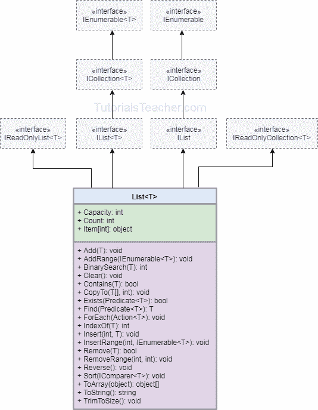

# C# -列表

> 原文:[https://www.tutorialsteacher.com/csharp/csharp-list](https://www.tutorialsteacher.com/csharp/csharp-list)

`List<T>`是强类型对象的集合，可以通过索引访问，并且具有排序、搜索和修改列表的方法。 它是属于`System.Collection.Generic`命名空间的[数组列表](/csharp/csharp-arraylist)的[通用](/csharp/csharp-generics)版本。

## 列出<t>特征</t>

*   `List<T>`相当于[数组列表](/csharp/csharp-arraylist)，实现[IList<T>T4。](https://docs.microsoft.com/en-us/dotnet/api/system.collections.generic.ilist-1?view=netframework-4.8)
*   它属于`System.Collections.Generic`命名空间。
*   `List<T>`可以包含指定类型的元素。它提供编译时类型检查，并且不执行装箱拆箱，因为它是泛型的。
*   可以使用`Add()`、``AddRange()`、`方法或集合初始值设定项语法来添加元素。
*   可以通过传递一个索引来访问元素，例如`myList[0]`。索引从零开始。
*   `List<T>`比`ArrayList`执行得更快，更不容易出错。

## 创建列表

`List<T>`是一个泛型集合，因此您需要为它可以存储的数据类型指定一个类型参数。 下面的例子展示了如何创建列表和添加元素。

Example: Adding elements in List

```
List<int> primeNumbers = new List<int>();
primeNumbers.Add(1); // adding elements using add() method
primeNumbers.Add(3);
primeNumbers.Add(5);
primeNumbers.Add(7);

var cities = new List<string>();
cities.Add("New York");
cities.Add("London");
cities.Add("Mumbai");
cities.Add("Chicago");
cities.Add(null);// nulls are allowed for reference type list

//adding elements using collection-initializer syntax
var bigCities = new List<string>()
                    {
                        "New York",
                        "London",
                        "Mumbai",
                        "Chicago"                    
                    }; 
```

在上面的例子中，`List<int> primeNumbers = new List<int>();`创建了一个 int 类型的列表。 同理，`cities` 和`bigCities`都是串型列表。 然后，您可以使用`Add()`方法或集合初始值设定项语法在列表中添加元素。

您还可以使用集合初始值设定项语法添加自定义类的元素。下面在`List<Student>`中添加`Student`类的对象。

Example: Add Custom Class Objects in List

```
var students = new List<Student>() { 
                new Student(){ Id = 1, Name="Bill"},
                new Student(){ Id = 2, Name="Steve"},
                new Student(){ Id = 3, Name="Ram"},
                new Student(){ Id = 4, Name="Abdul"}
            }; 
```

## 在列表中添加数组

使用`AddRange()`方法将一个数组或另一个集合中的所有元素添加到列表中。

AddRange()签名:

Example: Add Arrays in List

```
string[] cities = new string[3]{ "Mumbai", "London", "New York" };

var popularCities = new List<string>();

// adding an array in a List
popularCities.AddRange(cities);

var favouriteCities = new List<string>();

// adding a List 
favouriteCities.AddRange(popularCities); 
```

## 访问列表

可以通过索引、for/foreach 循环和使用 LINQ 查询来访问列表。列表的索引从零开始。传递方括号中的索引以访问单个列表项，与数组相同。使用`foreach`或`for`循环迭代一个`List<T>`集合。

Example: Accessing List

```
List<int> numbers = new List<int>() { 1, 2, 5, 7, 8, 10 };
Console.WriteLine(numbers[0]); // prints 1
Console.WriteLine(numbers[1]); // prints 2
Console.WriteLine(numbers[2]); // prints 5
Console.WriteLine(numbers[3]); // prints 7

// using foreach LINQ method
numbers.ForEach(num => Console.WriteLine(num + ", "));//prints 1, 2, 5, 7, 8, 10,

// using for loop
for(int i = 0; i < numbers.Count; i++)
    Console.WriteLine(numbers[i]); 
```

## 使用 LINQ 访问列表

`List<T>`实现`IEnumerable`界面。因此，我们可以使用 LINQ 查询语法或方法语法来查询列表，如下所示。

Example: LINQ Query on List

```
var students = new List<Student>() { 
                new Student(){ Id = 1, Name="Bill"},
                new Student(){ Id = 2, Name="Steve"},
                new Student(){ Id = 3, Name="Ram"},
                new Student(){ Id = 4, Name="Abdul"}
            };

//get all students whose name is Bill
var result = from s in students
	     where s.Name == "Bill"
	     select s;

foreach(var student in result)
    Console.WriteLine(student.Id + ", " + student.Name); 
```

## 在列表中插入元素

使用`Insert()`方法将元素插入到指定索引处的`List<T>`集合中。

插入()签名:`void Insert(int index, T item);`

Example: Insert elements into List

```
var numbers = new List<int>(){ 10, 20, 30, 40 };

numbers.Insert(1, 11);// inserts 11 at 1st index: after 10.

foreach (var num in numbers)
    Console.Write(num); 
```

## 从列表中删除元素

使用`Remove()`方法删除`List<T>`集合中指定元素的第一次出现。 使用`RemoveAt()`方法从指定的索引中移除元素。如果指定索引处没有元素，则抛出`ArgumentOutOfRangeException`。

移除()签名: `bool Remove(T item)`

RemoveAt()签名:

Example: Remove elements from List

```
var numbers = new List<int>(){ 10, 20, 30, 40, 10 };

numbers.Remove(10); // removes the first 10 from a list

numbers.RemoveAt(2); //removes the 3rd element (index starts from 0)

//numbers.RemoveAt(10); //throws ArgumentOutOfRangeException

foreach (var el in intList)
    Console.Write(el); //prints 20 30 
```

## 检查列表中的元素

使用`Contains()`方法确定元素是否在`List<T>`中。

Example: Contains()

```
var numbers = new List<int>(){ 10, 20, 30, 40 };
numbers.Contains(10); // returns true
numbers.Contains(11); // returns false
numbers.Contains(20); // returns true 
```

## 列表<t>类层次</t>

下图说明了`List<T>`层次结构。

<figure>[](../../Content/images/csharp/list.png)</figure>

## 列出<t>类属性和方法</t>

下表列出了`List<T>`类的重要属性和方法:

| 财产 | 使用 |
| --- | --- |
| 项目 | 获取或设置指定索引处的元素 |
| 数数 | 返回列表中存在的元素总数 |

| 方法 | 使用 |
| --- | --- |
| 增加 | 在列表的末尾添加一个元素<t>。</t> |
| 添加范围 | 在列表的末尾添加指定集合的元素<t>。</t> |
| 二分查找 | 搜索元素并返回元素的索引。 |
| 清楚的 | 从列表中移除所有元素<t>。</t> |
| 包含 | 检查列表<t>中是否存在指定的元素。</t> |
| 发现 | 根据指定的谓词函数查找第一个元素。 |
| 为每一个 | 遍历列表<t>。</t> |
| 插入 | 在列表中的指定索引处插入一个元素<t>。</t> |
| 插入范围 | 在指定的索引处插入另一个集合的元素。 |
| 移动 | 移除指定元素的第一个匹配项。 |
| 删除在 | 移除指定索引处的元素。 |
| RemoveRange | 移除与提供的谓词函数匹配的所有元素。 |
| 分类 | 对所有元素进行排序。 |
| 修剪多余部分 | 将容量设置为元素的实际数量。 |
| 对所有人都是如此 | 确定列表<t>中的每个元素是否符合指定谓词定义的条件。</t> |