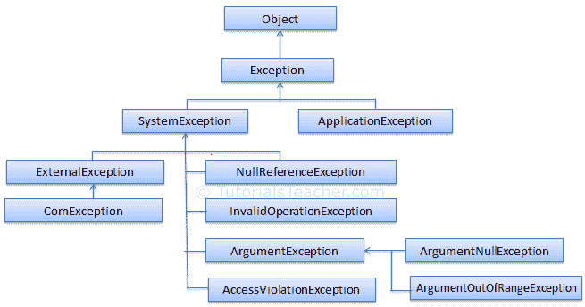
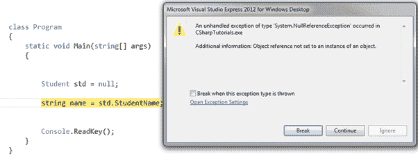

# C# 中内置的异常类

> 原文：<https://www.tutorialsteacher.com/csharp/csharp-exception>

在这里，您将了解 C# 中内置的异常类。

C# .NET 包含针对每个可能错误的内置异常类。[异常](https://docs.microsoft.com/en-us/dotnet/api/system.exception?view=netframework-4.8)类是所有异常类的基类。 T3】

下面是中异常类的层次结构 .NET:

Exception Classes in .NET

在上图中，`Exception`类是`SystemException`和`ApplicationException`类的基类。`SystemException`类是中所有内置异常类的基类 .NET 框架。

建议将`ApplicationException`作为所有自定义异常类的基类(如果可以使用非系统异常类，并且您需要新的异常类来处理业务规则违规或其他应用相关错误，则应创建自定义异常类)。它旨在区分应用定义的异常和系统定义的异常。 然而，微软现在建议从`Exception`类而不是`ApplicationException`类中派生自定义异常类。

下图显示了当您在运行时访问空对象属性时，在 Visual Studio 调试模式下如何抛出`NullReferenceException`。

NullReferenceException

## 内置异常类

下表列出了. NET 中重要的内置异常类

| 异常类 | 描述 |
| --- | --- |
| 推理异常 | 当传递给方法的非 null 参数无效时引发。 |
| [参数 NullException](https://docs.microsoft.com/en-us/dotnet/api/system.argumentnullexception?view=netframework-4.8) | 将 null 参数传递给方法时引发。 |
| [argumenterofrange exception](https://docs.microsoft.com/en-us/dotnet/api/system.argumentoutofrangeexception?view=netframework-4.8) | 当参数值超出有效值范围时引发。 |
| [DivideByZeroException](https://docs.microsoft.com/en-us/dotnet/api/system.dividebyzeroexception?view=netframework-4.8) | 当整数值被零除时引发。 |
| filenotfounindexception | 当指定位置不存在物理文件时引发。 |
| [格式异常](https://docs.microsoft.com/en-us/dotnet/api/system.formatexception?view=netframework-4.8) | 当值的格式不适合通过转换方法(如解析)从字符串转换时引发。 |
| [IndexOutOfRangeException](https://docs.microsoft.com/en-us/dotnet/api/system.indexoutofrangeexception?view=netframework-4.8) | 当数组索引超出数组或集合的下限或上限时引发。 |
| 无效操作抑制 | 当方法调用在对象的当前状态下无效时引发。 |
| [keynotfounindexception](https://docs.microsoft.com/en-us/dotnet/api/system.collections.generic.keynotfoundexception?view=netframework-4.8) | 当用于访问集合中成员的指定键不存在时引发。 |
| 紧急支援例外 | 当不支持方法或操作时引发。 |
| 零参考例外 | 当程序访问 null 对象的成员时引发。 |
| 超流异常 | 当算术、转换或转换操作导致溢出时引发。 |
| [outofmemoreryexception](https://docs.microsoft.com/en-us/dotnet/api/system.outofmemoryexception?view=netframework-4.8) | 当程序没有足够的内存来执行代码时引发。 |
| [StackOverflowException](https://docs.microsoft.com/en-us/dotnet/api/system.stackoverflowexception?view=netframework-4.8) | 当内存中的`Stack`溢出时引发。 |
| 时间异常 | 分配给操作的时间间隔已过期。 |

发生错误时，应用代码或默认处理程序会处理异常。在下一节学习如何处理练习。