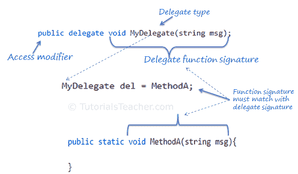

# C# 委托

> 原文：<https://www.tutorialsteacher.com/csharp/csharp-delegates>

如果我们想传递一个函数作为参数呢？C# 如何处理回调函数或事件处理程序？答案是——委托。

委托是引用类型数据类型<u>定义方法签名</u>。 您可以定义委托的变量，就像其他数据类型一样，它可以引用与委托具有相同签名的任何方法。

与委托合作涉及三个步骤:

1.  声明委托人
2.  设定目标方法
3.  调用委托

可以使用`delegate` [关键字](/csharp/csharp-keywords)后跟函数签名来声明委托，如下所示。

Delegate Syntax

```cs
[access modifier] delegate [return type] [delegate name]([parameters])

```

下面声明一个名为`MyDelegate`的委托。

Example: Declare a Delegate

```cs
public delegate void MyDelegate(string msg); 
```

上面，我们已经用一个 <vode>void</vode> 返回类型和一个字符串参数声明了一个委托`MyDelegate`。委托可以在类外部或类内部声明。实际上，应该在课堂之外宣布。

声明委托后，我们需要设置目标方法或一个[Lambda 表达式](/linq/linq-lambda-expression)。我们可以通过使用 new 关键字创建委托的对象，并传递一个签名与委托签名匹配的方法来实现。

Example: Set Delegate Target

```cs
public delegate void MyDelegate(string msg); // declare a delegate

// set target method
MyDelegate del = new MyDelegate(MethodA);
// or 
MyDelegate del = MethodA; 
// or set lambda expression 
MyDelegate del = (string msg) =>  Console.WriteLine(msg);

// target method
static void MethodA(string message)
{
    Console.WriteLine(message);
} 
```

您可以通过直接分配方法来设置目标方法，而无需创建委托对象，例如`MyDelegate del = MethodA`。

设置目标方法后，可以使用`Invoke()`方法或使用`()`运算符调用委托。

Example: Invoke a Delegate

```cs
del.Invoke("Hello World!");
// or 
del("Hello World!"); 
```

下面是委托的完整示例。

Example: Delegate

```cs
public delegate void MyDelegate(string msg); //declaring a delegate

class Program
{
    static void Main(string[] args)
    {
        MyDelegate del = ClassA.MethodA;
        del("Hello World");

        del = ClassB.MethodB;
        del("Hello World");

        del = (string msg) => Console.WriteLine("Called lambda expression: " + msg);
        del("Hello World");
    }
}

class ClassA
{
    static void MethodA(string message)
    {
        Console.WriteLine("Called ClassA.MethodA() with parameter: " + message);
    }
}

class ClassB
{
    static void MethodB(string message)
    {
        Console.WriteLine("Called ClassB.MethodB() with parameter: " + message);
    }
} 
```

下图说明了委托。



C# Delegate


## 将委托作为参数传递

方法可以有委托类型的参数，如下所示。

Example: Delegate

```cs
public delegate void MyDelegate(string msg); //declaring a delegate

class Program
{
    static void Main(string[] args)
    {
        MyDelegate del = ClassA.MethodA;
        InvokeDelegate(del);

        del = ClassB.MethodB;
        InvokeDelegate(del);

        del = (string msg) => Console.WriteLine("Called lambda expression: " + msg);
        InvokeDelegate(del);
    }

    static void InvokeDelegate(MyDelegate del) // MyDelegate type parameter
    {
        del("Hello World");
    }
}

class ClassA
{
    static void MethodA(string message)
    {
        Console.WriteLine("Called ClassA.MethodA() with parameter: " + message);
    }
}

class ClassB
{
    static void MethodB(string message)
    {
        Console.WriteLine("Called ClassB.MethodB() with parameter: " + message);
    }
} 
```

*Note:**In .NET, [Func](/csharp/csharp-func-delegate) and [Action](/csharp/csharp-action-delegate) types are built-in generic delegates that should be used for most common delegates instead of creating new custom delegates.* *## 多播代理

委托可以指向多个方法。指向多个方法的委托称为多播委托。“+”或“+=”运算符将函数添加到调用列表中，而“-”和“-=”运算符将其移除。

Example: Multicast Delegate

```cs
public delegate void MyDelegate(string msg); //declaring a delegate

class Program
{
    static void Main(string[] args)
    {
        MyDelegate del1 = ClassA.MethodA;
        MyDelegate del2 = ClassB.MethodB;

        MyDelegate del = del1 + del2; // combines del1 + del2
        del("Hello World");

        MyDelegate del3 = (string msg) => Console.WriteLine("Called lambda expression: " + msg);
        del += del3; // combines del1 + del2 + del3
        del("Hello World");

        del = del - del2; // removes del2
        del("Hello World");

        del -= del1 // removes del1
        del("Hello World");
    }
}

class ClassA
{
    static void MethodA(string message)
    {
        Console.WriteLine("Called ClassA.MethodA() with parameter: " + message);
    }
}

class ClassB
{
    static void MethodB(string message)
    {
        Console.WriteLine("Called ClassB.MethodB() with parameter: " + message);
    }
} 
```

加法和减法运算符始终作为赋值的一部分工作:`del1 += del2;`完全等同于`del1 = del1+del2;`，减法也是如此。

如果委托返回值，则调用多播委托时，将返回最后分配的目标方法的值。

Example: Multicast Delegate Returning a Value

```cs
public delegate int MyDelegate(); //declaring a delegate

class Program
{
    static void Main(string[] args)
    {
        MyDelegate del1 = ClassA.MethodA;
        MyDelegate del2 = ClassB.MethodB;

        MyDelegate del = del1 + del2; 
        Console.WriteLine(del());// returns 200
    }
}

class ClassA
{
    static int MethodA()
    {
        return 100;
    }
}

class ClassB
{
    static int MethodB()
    {
        return 200;
    }
} 
```

## 通用委托

泛型委托的定义方式与委托相同，但使用泛型类型参数或返回类型。设置目标方法时，必须指定泛型类型。

例如，考虑以下用于 int 和 string 参数的泛型委托。

Example: Generic Delegate

```cs
public delegate T add<T>(T param1, T param2); // generic delegate

class Program
{
    static void Main(string[] args)
    {
        add<int> sum = Sum;
        Console.WriteLine(sum(10, 20));

        add<string> con = Concat;
        Console.WriteLine(conct("Hello ","World!!"));
    }

    public static int Sum(int val1, int val2)
    {
        return val1 + val2;
    }

    public static string Concat(string str1, string str2)
    {
        return str1 + str2;
    }
} 
```

委托也用于声明[事件](/csharp/csharp-event)和[匿名方法](/csharp/csharp-anonymous-method)。

点击了解更多关于委托[的信息。](https://docs.microsoft.com/en-us/dotnet/api/system.delegate?view=netframework-4.8)

  Points to Remember :

1.  委托是定义签名的引用类型数据类型。
2.  委托类型变量可以引用与委托具有相同签名的任何方法。
3.  语法:*【访问修饰符】委托【返回类型】【委托名称】(【参数】)*
4.  目标方法的签名必须与委托签名匹配。
5.  委托可以像普通函数或 invoke()方法一样被调用。
6.  可以使用“+”或“+=”运算符将多个方法分配给委托，并使用“-”或“-=”运算符将其移除。它被称为多播委托。
7.  如果多播委托返回一个值，那么它将返回最后一个分配的目标方法的值。
8.  委托用于在 C# 中声明事件和匿名方法。*