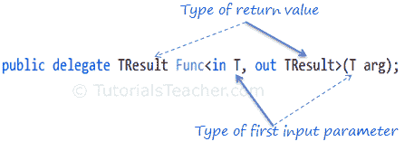

# C# `Func`委托

> 原文：<https://www.tutorialsteacher.com/csharp/csharp-func-delegate>

C# 包括内置的泛型委托类型`Func`和`Action`，因此在大多数情况下不需要手动定义自定义委托。

`Func`是包含在`System`命名空间中的通用委托。它有零个或多个*输入*参数和一个*输出*参数。最后一个参数被视为输出参数。

获取一个输入参数和一个输出参数的`Func`委托在`System`命名空间中定义，如下所示:

Signature: Func

```
namespace System
{    
    public delegate TResult Func<in T, out TResult>(T arg);
} 
```

尖括号`<>`中的最后一个参数被认为是返回类型，其余参数被认为是输入参数类型，如下图所示。

[](../../Content/images/csharp/func-delegate.png)

Func delegate


具有两个输入参数和一个输出参数的 Func 委托将表示如下。

[](../../Content/images/csharp/func-delegate2.png)

Func delegate


下面的`Func`委托接受两个 int 类型的输入参数，并返回一个 int 类型的值:

```
Func<int, int, int> sum; 
```

您可以将任何方法分配给上述函数委托，该委托接受两个 *int* 参数并返回一个 *int* 值。

Example: Func

```
class Program
{
    static int Sum(int x, int y)
    {
        return x + y;
    }

    static void Main(string[] args)
    {
        Func<int,int, int> add = Sum;

        int result = add(10, 10);

        Console.WriteLine(result); 
    }
} 
```

输出：

```
20
```

Func 委托类型可以包含 0 到 16 个不同类型的输入参数。但是，它必须为结果包含一个 out 参数。例如，下面的 Func 委托没有任何输入参数，它只包含一个 out 参数。

Example: Func with Zero Input Parameter

```
Func<int> getRandomNumber; 
```
# 
## 带有匿名方法的 C#函数

您可以使用 delegate 关键字将匿名方法分配给 Func 委托。

Example: Func with Anonymous Method

```
Func<int> getRandomNumber = delegate()
                            {
                                Random rnd = new Random();
                                return rnd.Next(1, 100);
                            }; 
```

## 带有 Lambda 表达式的函数

Func 委托也可以与 lambda 表达式一起使用，如下所示:

Example: Func with lambda expression

```
Func<int> getRandomNumber = () => new Random().Next(1, 100);

//Or 

Func<int, int, int>  Sum  = (x, y) => x + y; 
```

  Points to Remember :

1.  Func 是内置委托类型。
2.  Func 委托类型必须返回值。
3.  Func 委托类型可以有 0 到 16 个输入参数。
4.  Func 委托不允许 ref 和 out 参数。
5.  Func 委托类型可以与[匿名方法](/csharp/csharp-anonymous-method)或[Lambda 表达式](/linq/linq-lambda-expression)一起使用。