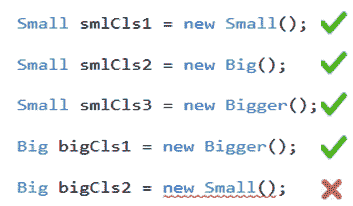

# C# 中的协方差和逆方差

> 原文：<https://www.tutorialsteacher.com/csharp/csharp-covariance-and-contravariance>

协方差和逆方差允许我们在处理类层次时灵活。

在我们学习协方差和逆变之前，请考虑以下类层次结构:

Example: Class Hierarchy

```
public class Small
{ 

}
public class Big: Small
{

}
public class Bigger : Big
{ 

} 
```

根据上面的示例类，小是大的基类，大是大的基类。这里要记住的一点是，派生类总是会有比基类更多的东西，所以基类相对比派生类小。

现在，考虑以下初始化:

[](../../Content/images/csharp/class-initialization.png)

Class initialization


如上所述，基类可以容纳派生类，但是派生类不能容纳基类。换句话说，一个实例即使要求小也能接受大，但如果要求大就不能接受小。

现在，让我们学习协方差和逆变。

## C# 中的协方差

协方差使您能够在需要基类型的地方传递派生类型。共同方差就像同类方差。基类和其他派生类被认为是向基类型添加额外功能的同一类。因此，协方差允许您在需要基类的地方使用派生类(规则:如果需要小的，可以接受大的)。

协方差可以应用于委托、泛型、数组、接口等。

## 与委托的协方差

委托中的协方差允许委托方法的返回类型具有灵活性。

Example: Covariance with Delegate

```
public delegate Small covarDel(Big mc);

public class Program
{
    public static Big Method1(Big bg)
    {
        Console.WriteLine("Method1");

        return new Big();
    }
    public static Small Method2(Big bg)
    {
        Console.WriteLine("Method2");

        return new Small();
    }

    public static void Main(string[] args)
    {
        covarDel del = Method1;

        Small sm1 = del(new Big());

        del= Method2;
        Small sm2 = del(new Big());
    }
} 
```

Output:<samp>Method1
Method2</samp>

正如你在上面的例子中看到的，委托期望一个小的返回类型(基类)，但是我们仍然可以分配返回大的方法 1(派生类)和与委托期望的具有相同签名的方法 2。

因此，协方差允许您将方法分配给派生较少的返回类型的委托。

## C# 逆变

对比变量应用于**参数**。Cotravariance 允许将带有基类参数的方法分配给需要派生类参数的委托。

继续上面的示例，添加与委托具有不同参数类型的方法 3:

Example: Contravariance with Delegte

```
delegate Small covarDel(Big mc);

class Program
{
    static Big Method1(Big bg)
    {
        Console.WriteLine("Method1");
        return new Big();
    }
    static Small Method2(Big bg)
    {
        Console.WriteLine("Method2");
        return new Small();
    }

    static Small Method3(Small sml)
    {
        Console.WriteLine("Method3");

        return new Small();
    }
    static void Main(string[] args)
    {
        covarDel del = Method1;
        del += Method2;
        del += Method3;

        Small sm = del(new Big());
} 
```

Output:<samp>Method1
Method2
Method3</samp>

如您所见，方法 3 有一个小类的参数，而委托需要一个大类的参数。不过，您可以将方法 3 用于委托。

您也可以用如下所示的相同方法使用协方差和逆变。

Example: Covariance and Contravariance

```
delegate Small covarDel(Big mc);

class Program
{

    static Big Method4(Small sml)
    {
        Console.WriteLine("Method3");

        return new Big();
    }

    static void Main(string[] args)
    {
        covarDel del = Method4;

        Small sm = del(new Big());
    }
} 
```

Output:<samp>Method4</samp>