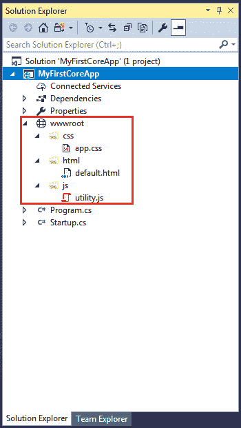

# ASP.NET Core- wwwroot 文件夹

> 原文：<https://www.tutorialsteacher.com/core/aspnet-core-wwwroot>

默认情况下，ASP.NET Core 项目中的 **wwwroot** 文件夹被视为 web 根文件夹。静态文件可以存储在 web 根目录下的任何文件夹中，并且可以使用该根目录的相对路径进行访问。

在标准的 ASP.NET 应用程序中，静态文件可以从应用程序的根文件夹或其下的任何其他文件夹中提供。这在 ASP.NET Core 区已经改变了。现在，只有那些在 web root - wwwroot 文件夹中的文件可以通过 http 请求提供服务。所有其他文件都被阻止，默认情况下无法提供服务。

一般来说，对于不同类型的静态文件，如 JavaScript、CSS、Images、库脚本等，应该有单独的文件夹。如下所示。

[](../../Content/images/core/wwwroot.png)

wwwroot


您可以使用基本网址和文件名访问静态文件。例如，我们可以通过`http://localhost:<port>/css/app.css`访问 css 文件夹中的以上`app.css`文件。

记住，在 Startup.cs 的 Configure 方法中需要包含一个服务静态文件的中间件，在[服务静态文件](/core/aspnet-core-static-file "Serve static files in ASP.NET Core")部分了解更多。

## 重命名 wwwroot 文件夹

您可以根据自己的选择将 wwwroot 文件夹重命名为任何其他名称，并在程序中准备宿主环境时将其设置为 web 根目录。

例如，让我们将 wwwroot 文件夹重命名为 Content 文件夹。现在，调用 UseWebRoot()方法，在 Program 类的 Main()方法中将 Content 文件夹配置为 web 根文件夹，如下所示。

```
public class Program
{
    public static void Main(string[] args)
    {
        var host = new WebHostBuilder()
            .UseKestrel()
            .UseContentRoot(Directory.GetCurrentDirectory())
            .UseWebRoot("Content")
            .UseIISIntegration()
            .UseStartup<MyStartup>()
            .Build();

        host.Run();
    }
} 
```

因此，您可以根据自己的选择重命名默认的 web 根文件夹 wwwroot。