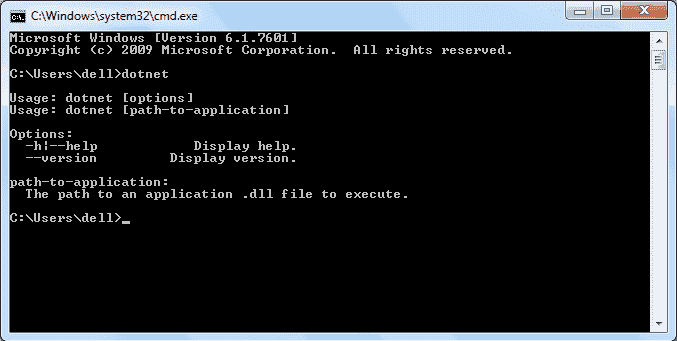
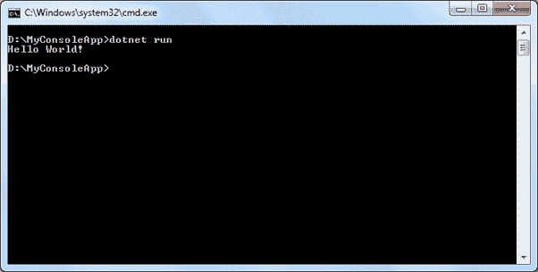
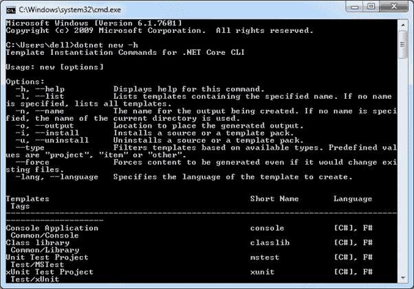

# 。NET 核心命令行界面

> 原文:[https://www . tutorial stearn . com/core/net-core-命令行-界面](https://www.tutorialsteacher.com/core/net-core-command-line-interface)

那个。NET Core 命令行界面是一种新的跨平台工具，用于创建、恢复包、构建、运行和发布。NET 应用程序。

在前一章中，我们使用 Visual Studio 创建了我们的第一个 ASP.NET 核心应用程序。Visual Studio 在内部使用该命令行界面来恢复、生成和发布应用程序。其他更高级别的 ide、编辑器和工具都可以使用 CLI 来支持。NET 核心应用程序。

那个。NET Core 命令行界面与一起安装。NET 核心软件开发工具包。所以我们不需要在开发机上单独安装。我们可以通过在 Windows 中打开命令提示符并编写 dotnet 并按 Enter 键来验证 CLI 是否安装正确。如果它显示如下所示的用法和帮助，则表示它安装正确。

<figure>

<figcaption>.NET Core Command-line Interface</figcaption>

</figure>

## 指令结构

以下是命令结构。

`dotnet <command> <argument> <option>`

所有命令都以名为 dotnet 的驱动程序开始。驱动程序开始执行指定的命令。在 dotnet 之后，我们可以提供命令(也称为动词)来执行特定的动作。每个命令后面都可以有参数和选项。以下是。NET Core 2.x 命令行界面命令。

| 基本命令 | 描述 |
| --- | --- |
| [新](https://docs.microsoft.com/en-us/dotnet/core/tools/dotnet-new)T2】 | 基于指定的模板创建新的项目、配置文件或解决方案。 |
| [恢复](https://docs.microsoft.com/en-us/dotnet/core/tools/dotnet-restore)T2】 | 恢复项目的依赖项和工具。 |
| [建造](https://docs.microsoft.com/en-us/dotnet/core/tools/dotnet-build)T2】 | 构建项目及其所有依赖项。 |
| [跑](https://docs.microsoft.com/en-us/dotnet/core/tools/dotnet-run)T2】 | 在没有任何显式编译或启动命令的情况下运行源代码。 |
| [发布](https://docs.microsoft.com/en-us/dotnet/core/tools/dotnet-publish)T2】 | 将应用程序及其依赖项打包到一个文件夹中，以便部署到托管系统。 |
| [测试](https://docs.microsoft.com/en-us/dotnet/core/tools/dotnet-test)T2】 | 执行单元测试。 |
| [vtest](https://docs.microsoft.com/en-us/dotnet/core/tools/dotnet-vstest) | 从指定的文件运行测试。 |
| 包 T2】 | 将代码打包到 NuGet 包中。 |
| [清洁](https://docs.microsoft.com/en-us/dotnet/core/tools/dotnet-clean)T2】 | 清理项目的输出。 |
| [SLN](https://docs.microsoft.com/en-us/dotnet/core/tools/dotnet-sln)T2] | 修改. NET Core 解决方案文件。 |
| [帮助](https://docs.microsoft.com/en-us/dotnet/core/tools/dotnet-help)T2】 | 显示指定命令的帮助 |
| [门店](https://docs.microsoft.com/en-us/dotnet/core/tools/dotnet-store)T2】 | 将指定的程序集存储在运行时包存储中。 |

| 项目修改命令 | 描述 |
| --- | --- |
| [加包](https://docs.microsoft.com/en-us/dotnet/core/tools/dotnet-add-package)T2】 | 向项目添加包引用。 |
| [添加参考](https://docs.microsoft.com/en-us/dotnet/core/tools/dotnet-add-reference) | 添加项目到项目(P2P)引用。 |
| [取出包裹](https://docs.microsoft.com/en-us/dotnet/core/tools/dotnet-remove-package) | 从项目中移除包引用。 |
| [移除引用](https://docs.microsoft.com/en-us/dotnet/core/tools/dotnet-remove-reference) | 删除项目引用 |
| [列表参考](https://docs.microsoft.com/en-us/dotnet/core/tools/dotnet-list-reference) | 列出所有项目到项目的引用 |

| 高级命令 | 描述 |
| --- | --- |
| [取消删除](https://docs.microsoft.com/en-us/dotnet/core/tools/dotnet-nuget-delete)T2】 | 从服务器中删除或取消列出包。 |
| [努 get 本地人](https://docs.microsoft.com/en-us/dotnet/core/tools/dotnet-nuget-locals) | 清除或列出本地 NuGet 资源。 |
| [纽吉特推](https://docs.microsoft.com/en-us/dotnet/core/tools/dotnet-nuget-push) | 将包推送到服务器并发布它。 |
| [msbuild](https://docs.microsoft.com/en-us/dotnet/core/tools/dotnet-msbuild)T2】 | 构建项目及其所有依赖项。 |
| [dotnet 安装脚本](https://docs.microsoft.com/en-us/dotnet/core/tools/dotnet-install-script) | 用于安装的脚本。核心命令行界面工具和共享运行时。 |

让我们创建、恢复、构建和运行。NET Core 控制台应用程序使用命令行界面，而不使用 Visual Studio。

## 创建新项目

创建一个新的。NET Core 项目，我们必须使用新命令后跟模板名参数。我们可以创建控制台、类库、web、mvc、webapi、razor、angular、react 等。使用命令行界面的项目。使用控制台模板创建一个新的。NET Core 控制台应用程序。

下面在当前目录中创建新的控制台项目，其名称与当前目录相同。

`dotnet new console`

以下命令创建了一个名为 MyConsoleApp 的新控制台项目。-n 或- name 选项指定项目的名称。

`dotnet new console -n MyConsoleApp`

下面的命令创建了一个名为 myonsolappto my projects 目录的新控制台应用程序。-o 或- output 选项用于指定应该在其中生成项目的输出目录。

`dotnet new console -n MyConsoleApp -o C:\MyProjects`

创建项目后，导航到命令提示符下的项目目录，以应用特定于项目的命令，在我们的例子中是 C:\ myonsolapp。

## 添加包参考

出于不同的目的，我们经常需要添加 NuGet 包引用。例如，应用以下命令将 Newtonsoft.json 包添加到我们的控制台项目中。

<samp>C:\MyConsoleApp>dotnet add package Newtonsoft.json</samp>

这将为我们的项目添加 Newtonsoft.json 包。我们可以通过打开来验证。csproj 文件。

## 还原包

要恢复包或更新现有包，我们可以使用下面的 restore 命令。

<samp>C:\MyConsoleApp>dotnet restore</samp>

## 构建项目

要构建新的或现有的项目，应用`C:\MyConsoleApp>dotnet build`命令。

## 运行项目

要运行我们的控制台项目，应用如下所示的`dotnet run`命令。

<figure></figure>

如上图所示，它显示了一个输出“你好，世界！”。

## 获得帮助

我们可以得到任何帮助。NET Core CLI 命令，方法是在我们想要获取帮助的命令末尾键入-h 或-help。例如，dotnet new -h 将显示我们可以使用的新命令、参数和选项的帮助，如下所示。

<figure></figure>

因此，我们可以使用。NET Core 命令行界面，用于创建、恢复包、构建、运行和发布不同类型的。NET 核心应用程序。