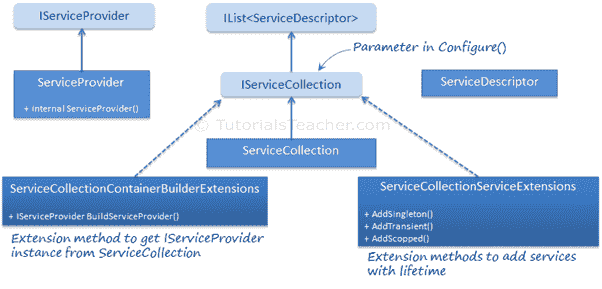

# ASP.NET 核心:内置国际奥委会容器

> 原文：<https://www.tutorialsteacher.com/core/internals-of-builtin-ioc-container-in-aspnet-core>

ASP.NET 核心框架包括用于自动依赖注入的内置 IoC 容器。内置的 IoC 容器是一个简单而有效的容器。让我们理解内置的 IoC 容器是如何在内部工作的。

以下是内置 IoC 容器的重要接口和类:

**界面:**

1.  构造器
2.  servicecollection

**班级:**

1.  互联网服务商
2.  ServiceCollection
3.  服务描述
4.  服务集合服务扩展
5.  service collectioncontainerbuildereextensions

下图说明了这些类之间的关系:

[](../../Content/images/core/builtin-ioc.png)

built-in IoC Container


## servicecollection

如您所知，我们可以使用 IServiceCollection 在 Startup 类的 Configure 方法中使用内置的 IoC 容器注册应用程序服务。IServiceCollection 接口是一个空接口。它只是继承`IList<servicedescriptor>`。参见这里的源代码[。](https://docs.microsoft.com/en-us/aspnet/core/api/microsoft.extensions.dependencyinjection.iservicecollection)

ServiceCollection 类实现了 IServiceCollection 接口。参见这里的 ServiceCollection 源代码[。](https://docs.microsoft.com/en-us/aspnet/core/api/microsoft.extensions.dependencyinjection.servicecollection)

因此，您在`IServiceCollection`类型实例中添加的服务实际上创建了一个[服务描述符](https://docs.microsoft.com/en-us/aspnet/core/api/microsoft.extensions.dependencyinjection.servicedescriptor)的实例，并将其添加到列表中。

## 构造器

`IServiceProvider`包括`GetService`法。`ServiceProvider`类实现了`IServiceProvider`接口，该接口使用容器返回注册的服务。 我们不能实例化`ServiceProvider`类，因为它的构造器用内部访问修饰符标记。

## 服务集合服务扩展

`ServiceCollectionServiceExtensions`类包括与服务注册相关的扩展方法，可用于添加具有生存期的服务。在这个类中定义的 AddSingleton、AddTransient、AddScoped 扩展方法。

## service collectioncontainerbuildereextensions

`ServiceCollectionContainerBuilderExtensions`类包括`BuildServiceProvider`扩展方法，该方法创建并返回一个`ServiceProvider`实例。

有三种方法可以获得`IServiceProvider`的实例:

### 使用应用程序生成器

我们可以使用 IApplicationBuilder 的`ApplicationServices`属性在 Configure 方法中获取服务，如下所示。

```
public void Configure(IServiceProvider pro, IApplicationBuilder app, IHostingEnvironment env)
{
    var services = app.ApplicationServices;
    var logger = services.GetService<ILog>() }

    //other code removed for clarity 
} 
```

### 使用 HttpContext

```
var services = HttpContext.RequestServices;
var log = (ILog)services.GetService(typeof(ILog)); 
```

### 使用 IServiceCollection

```
public void ConfigureServices(IServiceCollection services)
{
    var serviceProvider = services.BuildServiceProvider();

} 
```