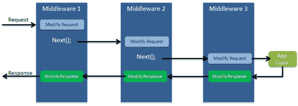

# ASP.NET Core 中间件

> 原文：<https://www.tutorialsteacher.com/core/aspnet-core-middleware>

ASP.NET 芯推出了一个新概念**中间件。**中间件只不过是一个组件(类)，它在 ASP.NET Core 应用的每个请求上执行。在经典的 ASP.NET 中，HttpHandlers 和 HttpModules 是请求管道的一部分。中间件类似于 HttpHandlers 和 HttpModules，两者都需要在每个请求中进行配置和执行。

通常，在 ASP.NET Core 网应用中会有多个中间件。它可以是框架提供的中间件，通过 NuGet 添加，也可以是您自己定制的中间件。我们可以在请求管道中设置中间件的执行顺序。每个中间件添加或修改 http 请求，并可选地将控制传递给下一个中间件组件。下图说明了中间件组件的执行。



ASP.NET Core Middleware


中间件构建请求管道。下图说明了 ASP.NET Core 请求的处理。


ASP.NET Core Request Processing


## 配置中间件

我们可以使用`IApplicationBuilder`实例在 Startup 类的`Configure`方法中配置中间件。以下示例使用 Run 方法添加了一个中间件，该方法返回一个字符串“Hello World！”每一个请求。

```cs
public class Startup
{
    public Startup()
    {
    } 
    public void Configure(IApplicationBuilder app, IHostingEnvironment env, ILoggerFactory loggerFactory)
    {
        //configure middleware using IApplicationBuilder here..

        app.Run(async (context) =>
        {              
            await context.Response.WriteAsync("Hello World!");

        });

        // other code removed for clarity.. 
    }
} 
```

在上面的例子中，`Run()`是`IApplicationBuilder`实例上的扩展方法，它将终端中间件添加到应用的请求管道中。 上面配置的中间件返回一个带有字符串“Hello World！”对于每个请求。

## 理解运行方法

我们使用了 Run 扩展方法来添加中间件。以下是 Run 方法的签名:

Method Signature:

```cs
public static void Run(this IApplicationBuilder app, RequestDelegate handler)

```

Run 方法是`IApplicationBuilder`上的扩展方法，接受`RequestDelegate`的参数。`RequestDelegate`是处理请求的委托方法。下面是一个 RequestDelegate 签名。

Method Signature:

```cs
public delegate Task RequestDelegate(HttpContext context);

```

如上图所示，`Run`方法接受一个方法作为参数，其签名应该与`RequestDelegate`匹配。因此，该方法应接受`HttpContext`参数并返回`Task`。 因此，您可以在 Run 方法中指定 lambda 表达式或指定函数。上面的 Run 方法中指定的 lambda 表达式类似于下面示例中的表达式。

```cs
public class Startup
{
    public Startup()
    {
    } 

    public void Configure(IApplicationBuilder app, IHostingEnvironment env)
    {
         app.Run(MyMiddleware);
    }

    private Task MyMiddleware(HttpContext context) 
    {
        return context.Response.WriteAsync("Hello World! ");
    }
} 
```

上面的`MyMiddleware`函数不是异步的，所以会阻塞线程，直到它完成执行。因此，通过使用`async`和`await`使其异步，以提高性能和可扩展性。

```cs
// other code removed for clarity

public void Configure(IApplicationBuilder app, IHostingEnvironment env)
{
     app.Run(MyMiddleware);
}

private async Task MyMiddleware(HttpContext context) 
{
    await context.Response.WriteAsync("Hello World! ");
} 
```

因此，上面的代码片段与下面的代码片段相同。

```cs
app.Run(async context => await context.Response.WriteAsync("Hello World!") );

//or 

app.Run(async (context) =>
{
    await context.Response.WriteAsync("Hello World!"); 
}); 
```

所以，这样我们就可以用`Run`的方法来配置中间件了。

## 配置多个中间件

大多数情况下，ASP.NET Core 应用中会有多个中间件组件，它们将按顺序执行。Run 方法添加了一个终端中间件，因此它不能调用下一个中间件，因为它将是序列中的最后一个中间件。下面将始终执行第一个运行方法，并且永远不会到达第二个运行方法。

```cs
public void Configure(IApplicationBuilder app, IHostingEnvironment env)
{
    app.Run(async (context) =>
    {
        await context.Response.WriteAsync("Hello World From 1st Middleware"); 
    });

    // the following will never be executed
    app.Run(async (context) =>
    {
        await context.Response.WriteAsync("Hello World From 2nd Middleware"); 
    });
} 
```

要配置多个中间件，使用`Use()`扩展方法。除了包含调用序列中下一个中间件的下一个参数外，与`Run()`方法类似。考虑下面的例子。

Example: Use() 

```cs
public void Configure(IApplicationBuilder app, IHostingEnvironment env)
{
    app.Use(async (context, next) =>
    {
        await context.Response.WriteAsync("Hello World From 1st Middleware!");

        await next();
    });

    app.Run(async (context) =>
    {
        await context.Response.WriteAsync("Hello World From 2nd Middleware"); 
    });
} 
```

以上示例将在浏览器中显示`Hello World From 1st Middleware!Hello World From 2nd Middleware!`。

因此，我们可以使用`Use()`方法按照我们喜欢的顺序配置多个中间件。

## 通过 NuGet 添加内置中间件

ASP.NET Core 是一个模块化框架。我们可以通过 NuGet 安装不同的插件，在应用中添加我们需要的服务器端功能。有许多可用的中间件插件可以在我们的应用中使用。

以下是一些内置的中间件:

| 中间件 | 描述 |
| --- | --- |
| 证明 | 添加认证支持。 |
| 克-奥二氏分级量表 | 配置跨来源资源共享。 |
| 选择途径 | 为 MVC 或 web 表单添加路由功能 |
| 会议 | 添加对用户会话的支持。 |
| 静态文件 | 增加了对服务静态文件和目录浏览的支持。 |
| 诊断学 | 增加了对报告和处理异常和错误的支持。 |

让我们看看如何使用诊断中间件。

## 诊断中间件

让我们安装并使用诊断中间件。诊断中间件用于报告和处理 ASP.NET Core 中的异常和错误，以及诊断实体框架核心迁移错误。

打开 project.json 并添加微软。如果未添加诊断依赖项，则为。等待一段时间，直到 Visual Studio 恢复包。

该包包括以下中间件及其扩展方法。

| 中间件 | 可拓方法 | 描述 |
| --- | --- | --- |
| DeveloperExceptionPageMiddleware 中间件 | UseDeveloperExceptionPage() | 从管道中捕获同步和异步异常，并生成 HTML 错误响应。 |
| ExceptionHandlerMiddleware | UseExceptionHandler() | 捕捉异常，记录它们，并在备用管道中重新执行。 |
| 状态显示软件中间件 | UseStatusCodePages() | 检查状态代码在 400 和 599 之间的响应。 |
| welcome page 中间件 | UseWelcomePage() | 显示根路径的欢迎页面。 |

我们可以在 Startup 类的配置方法中调用各自的 Use*扩展方法来使用上面的中间件。

让我们添加 welcomePage 中间件，它将显示根路径的欢迎页面。

Example: Add Diagnostics Middleware 

```cs
public void Configure(IApplicationBuilder app, IHostingEnvironment env)
{   
    app.UseWelcomePage(); 
    //other code removed for clarity 
} 
```

上面的示例将为每个请求显示下面的欢迎页面。


这样我们可以使用不同的 Use*扩展方法来包含不同的中间件。

接下来，学习如何在 ASP.NET Core 应用中实现日志功能。**