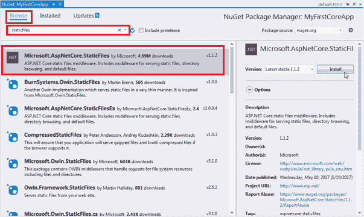
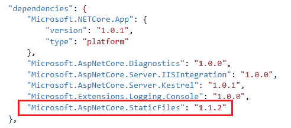
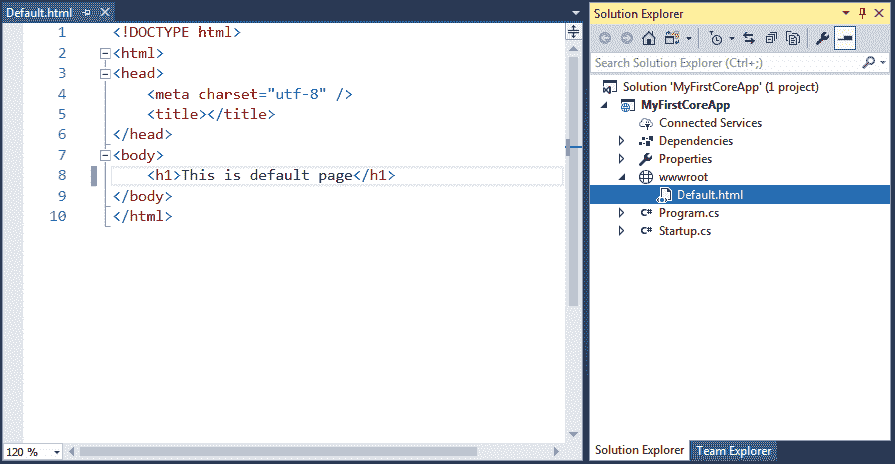
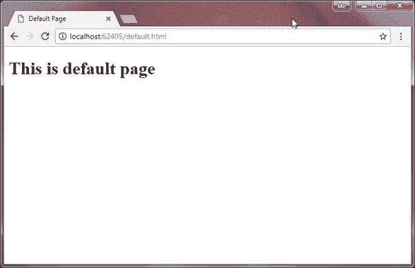
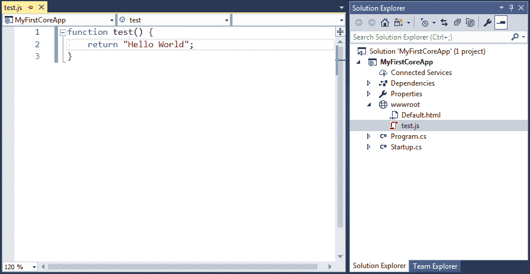
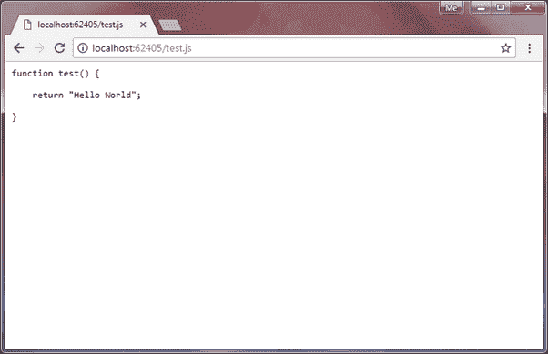
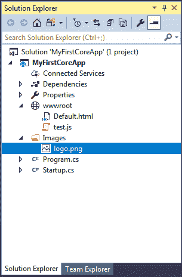
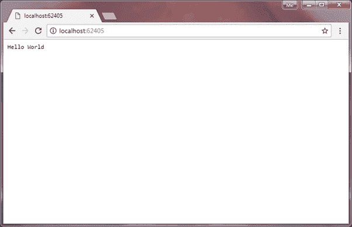
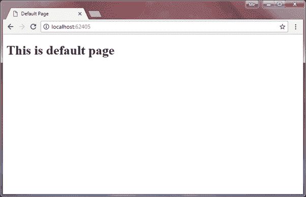

# ASP.NET Core 服务静态文件

> 原文：<https://www.tutorialsteacher.com/core/aspnet-core-static-file>

在这里，我们将学习如何在没有任何服务器端处理的情况下，根据 HTTP 请求提供静态文件，如 html、JavaScript、CSS 或图像文件。

默认情况下，ASP.NET Core 应用不能为静态文件提供服务。我们必须在请求管道中包含`Microsoft.AspNetCore.StaticFiles`中间件。

## 安装静态文件中间件

**微软。元包`Microsoft.AspNetCore.All`中已经包含了 AspNetCore.StaticFiles** 中间件包，所以我们不需要在 AspNetCore 应用中单独安装。

要在 ASP.NET Core 1 . x 应用中安装 StaticFiles 中间件，请在解决方案资源管理器中右键单击项目打开 NuGet 包管理器，然后选择**管理 NuGet 包..**。在浏览选项卡的搜索框中搜索静态文件。 这将显示**微软。AspNetCore.StaticFiles** 中间件如下图所示。

[](../../Content/images/core/install-staticfiles-middleware.png)

Install StaticFiles Middleware


点击右窗格的**安装**按钮进行安装。安装后，`Microsoft.AspNetCore.StaticFiles`会自动包含在项目的依赖项部分

[](../../Content/images/core/staticfiles.png)

StaticFiles Dependency in project.json


## 使用静态文件中间件

默认情况下，一个 web 应用的所有静态文件都应该位于 web 根文件夹 **wwwroot** 中。为了理解这一点，让我们在 `wwwroot`文件夹中用以下内容创建一个简单的 default.html。

[](../../Content/images/core/staticfile-html2.png)

Default.html


现在，为了服务上面的 Default.html 静态文件，我们必须在如下所示的启动文件的`Configure()`方法中添加 StaticFiles 中间件。

```cs
public class Startup
{
    public Startup()
    {
    } 

    public void Configure(IApplicationBuilder app, IHostingEnvironment env)
    {
        app.UseStaticFiles();

        app.Run(async (context) =>
        {
            await context.Response.WriteAsync("Hello World");
        });
    }
} 
```

如上图所示，`app.UseStaticFiles()`方法将 StaticFiles 中间件添加到请求管道中。`UseStaticFiles`是 StaticFiles 中间件中包含的一种扩展方法，这样我们就可以轻松配置它。

现在，打开浏览器，发送 http 请求 *http://localhost: <端口> /default.html* ，将显示 default.html 作为响应，如下图所示。

[](../../Content/images/core/staticfiles2.png)

Serving HTML File


这样，我们就可以为 `wwwroot`文件夹或子文件夹中存储的任何其他文件提供服务。例如，考虑 `wwwroot`文件夹中的以下 test.js 文件。

[](../../Content/images/core/staticfile-jscript.png)

test.js


现在，我们可以通过发送 http://localhost: <port>/test.js 请求来访问这个文件。</port>

[](../../Content/images/core/staticfiles3.png)

Serving JS File


假设，您想从 web 根文件夹(wwwroot)的外部提供文件。例如，您可以将图像包含在如下所示的“图像”文件夹中。

[](../../Content/images/core/staticfiles7.png)

Serving Static Files


现在，在`UseStaticFiles`方法中指定`StaticFileOptions`参数，从如下所示的图像文件夹中提供图像。

```cs
public void Configure(IApplicationBuilder app, IHostingEnvironment env)
{
    app.UseStaticFiles(); // For the wwwroot folder

    app.UseStaticFiles(new StaticFileOptions()
    {
        FileProvider = new PhysicalFileProvider(
                            Path.Combine(Directory.GetCurrentDirectory(), @"Images")),
                            RequestPath = new PathString("/app-images")
    });
} 
```

如您所见，我们使用`FileProvider`选项来指定图像文件夹，静态文件将从该文件夹中提供。RequestPath 选项指定 URL 中映射到静态文件夹的相对路径。

现在，对*的请求将为 MyImage.png 文件服务。*

## 设置默认文件

正如我们在上面看到的，default.html 或 test.js 是根据特定的请求提供的。然而，如果我们想在根请求上提供默认的 html 文件呢？

目前，当你发送 *http://localhost: <端口>* 请求时，会用 run 方法处理，并显示如下结果。

[](../../Content/images/core/staticfiles5.png)

要在根上服务 default.html 请求 *http://localhost: <端口>* ，在`Configure`方法中调用`UseStaticFiles()`之前的`UseDefaultFiles()`方法，如下所示。

```cs
public void Configure(IApplicationBuilder app, IHostingEnvironment env)
{
    app.UseDefaultFiles();
    app.UseStaticFiles();

    app.Run(async (context) =>
    {
            await context.Response.WriteAsync("Hello World");
    });
} 
```

`UseDefaultFiles`配置缺省文件中间件，缺省文件中间件是静态文件中间件的一部分。这将自动在 http 请求 *http://localhost: <端口>* 上提供名为 default.html、default.htm、index.html 或 index.htm 的 html 文件。 上例将在 *http://localhost: <端口>上显示 default.html 文件，如下图所示。*

[](../../Content/images/core/staticfiles6.png)

Serving Static Files


*Note:**Order of middleware is very important. `app.UseDefaultFiles()` should be added before `app.UseStaticFiles()` in the request pipeline.* *## 文件服务器

文件服务器中间件结合了 UseDefaultFiles 和 UseStaticFiles middlware 的功能。因此，不要同时使用这两种方法，只需在 Configure 方法中使用 UseFileServer 即可。

UseFileServer = UseDefaultFiles+UseStaticFiles

Example: UseFileServer 

```cs
public void Configure(IApplicationBuilder app, IHostingEnvironment env)
{
    app.UseFileServer();

    app.Run(async (context) =>
    {
        await context.Response.WriteAsync("Hello World");
    });
} 
```

因此，我们可以为 http 请求提供静态文件。**