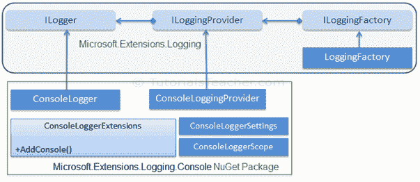
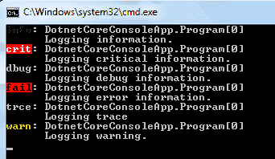

# .NET Core 日志基础

> 原文：<https://www.tutorialsteacher.com/core/fundamentals-of-logging-in-dotnet-core>

 .NET Core SDK 是一个轻量级的 SDK，它包含了构建应用所需的一组最少的功能。我们可以为应用所需的其他功能安装 NuGet 包。为此，微软提供了 .NET APIs 作为 .NET 扩展。

 .NET Extensions 是一组开源的、跨平台的 API，用于常用的编程模式和实用程序，如依赖注入、日志记录和应用配置。这个项目中的大多数 API 都可以在许多平台上运行 .NET 平台，例如 .NET Core， .NET 框架、Xamarin 和其他。虽然这些应用接口通常用于 ASP.NET Core 应用，但并不与 ASP.NET Core 应用模型相耦合。它们可以用于控制台应用、WinForms 和 WPF 等。您可以在[https://github.com/aspnet/Extensions](https://github.com/aspnet/Extensions)找到扩展的文档和源代码。

所有扩展都包含在`Microsoft.Extensions`名称空间下。您可以在[nuget.org/packages](https://www.nuget.org/packages?q=Microsoft.Extensions)找到所有内置和第三方分机。

日志 API 包含在`Microsoft.Extensions.Logging`包中。日志 API 不能独立工作。它与一个或多个将日志存储或显示到特定介质(如控制台、调试、跟踪侦听器等)的日志提供程序一起工作。

因此，在基于. NET Core 的应用中实现日志记录有两个重要的构建块:

1.  日志 API
2.  日志记录提供程序

下图说明了登录 .NET Core:

[](../../Content/images/core/logging-dotnet-core.png) 

.NET Frameworks


如上图所示，`Microsoft.Extensions.Logging`中的日志 API 工作在。基于 NET Core 的应用，无论是 ASP.NET Core 还是英孚 Core。您只需要将日志 API 与一个或多个日志提供程序一起使用，就可以在任何。基于. NET Core 的应用。

## 日志 API

如前所述，微软在包装[微软中提供了日志 API 作为扩展。扩展。日志](https://docs.microsoft.com/en-us/dotnet/api/microsoft.extensions.logging)作为 NuGet 包提供。

`Microsoft.Extensions.Logging`包括必要的日志记录类和接口。最重要的是 ILogger、ILoggerFactory、ILoggerProvider 接口和 LoggerFactory 类。

下图显示了日志类之间的关系。

[](../../Content/images/core/logging-api.png) 

Logging API


让我们对上面的每一节课都有一个概述。

### ILoggerFactory

`ILoggerFactory`是用于创建合适的`ILogger`类型实例以及添加`ILoggerProvider`实例的工厂界面。

```
public interface ILoggerFactory : IDisposable
{
    ILogger CreateLogger(string categoryName);
    void AddProvider(ILoggerProvider provider);
} 
```

日志 API 包括实现`ILoggerFactory`接口的内置`LoggerFactory`类。我们可以使用它来添加类型为`ILoggerProvider`的实例，并检索指定类别的`ILogger`实例。 更多信息请访问 [ILoggerFactory](https://docs.microsoft.com/en-us/dotnet/api/microsoft.extensions.logging.iloggerfactory) 和 [LoggerFactory](https://docs.microsoft.com/en-us/dotnet/api/microsoft.extensions.logging.loggerfactory) 。

### ILoggerProvider

`ILoggerProvider`管理并创建一个由日志类别指定的合适的日志记录程序。

```
public interface ILoggerProvider : IDisposable
{
    ILogger CreateLogger(string categoryName);
} 
```

我们可以通过实现`ILoggerProvider`接口来创建自己的日志提供者。 更多信息，请访问[iLoggprovider](https://docs.microsoft.com/en-us/dotnet/api/microsoft.extensions.logging.iloggerprovider)。

### 博客作者

`ILogger`接口包括登录底层存储的方法。有许多扩展方法使日志记录变得容易。 访问 [ILogger](https://docs.microsoft.com/en-us/dotnet/api/microsoft.extensions.logging.ilogger) 了解更多信息。

```
public interface ILogger
{
    void Log<TState>(LogLevel logLevel, EventId eventId, TState state, Exception exception, Func<TState, Exception, string> formatter);
    bool IsEnabled(LogLevel logLevel);
    IDisposable BeginScope<TState>(TState state);
} 
```

## 日志记录提供程序

日志记录提供程序将日志显示或存储到特定介质，如控制台、调试事件、事件日志、跟踪侦听器等。微软提供了各种日志提供程序作为 NuGet 包。

下表列出了重要的日志记录提供程序。

| 日志记录提供商的数字获取包 | 输出目标 |
| --- | --- |
| [微软。扩展.日志.控制台](https://www.nuget.org/packages/Microsoft.Extensions.Logging.Console/) | 安慰 |
| [微软。扩展。日志记录。AzureapServices](https://www.nuget.org/packages/Microsoft.Extensions.Logging.AzureAppServices/) | Azure 应用服务“诊断日志”和“日志流”功能 |
| [微软。扩展.记录.调试](https://www.nuget.org/packages/Microsoft.Extensions.Logging.Debug/) | 调试器监视器 |
| [微软。扩展日志事件日志](https://www.nuget.org/packages/Microsoft.Extensions.Logging.EventLog/) | Windows 事件日志 |
| [微软。扩展日志事件源](https://www.nuget.org/packages/Microsoft.Extensions.Logging.EventSource/) | EventSource/EventListener(事件源/事件侦听器) |
| [微软。扩展.日志.追踪源](https://www.nuget.org/packages/Microsoft.Extensions.Logging.TraceSource/) | 跟踪侦听器 |

微软还与各种日志框架团队(包括第三方，如 NLog、Serilog、Loggr、Log4Net 等)合作，扩展与`Microsoft.Extensions.Logging`兼容的提供者列表。 以下是一些第三方日志提供商:

| 日志记录提供程序 | 描述 |
| --- | --- |
| elma。我 | 埃尔马的供应商。Io 服务 |
| [日志](https://github.com/imobile3/Loggr.Extensions.Logging) | 记录器服务的提供者 |
| [【NLG】](https://github.com/NLog/NLog.Extensions.Logging) | NLog 库的提供程序 |
| [串行日志](https://github.com/serilog/serilog-framework-logging) | verilog 库的提供程序 |

让我们用在控制台上显示日志的`Microsoft.Extensions.Logging.Console`包来举一个例子。

## 控制台日志记录提供程序

让我们看看如何使用控制台提供程序的 NuGet 包在控制台上显示日志。

`Microsoft.Extensions.Logging.Console`包包括向控制台发送日志输出的日志类。

下图说明了日志 API 如何与控制台日志提供程序一起工作。

[](../../Content/images/core/console-logger.png) 

Logging API with Console Logging Provider


如上图所示，`ConsoleLogger`执行`ILogger`，而`ConsoleLoggingProvider`执行`ILoggingProvider`。`ConsoleLoggerExtensions`类包括扩展方法`AddConsole()`，它在`LoggerFactory`上增加了一个控制台记录器。

现在，让我们看看如何在控制台上显示日志 .NET Core 控制台应用。

首先，使用 Console App()创建一个新的控制台应用 .NET Core)模板。

现在，你需要安装一个`Microsoft.Extensions.Logging`的 NuGet 包。您可以使用“获取包管理器”或在包管理器控制台中执行以下命令来安装它。

```
PM> Install-Package Microsoft.Extensions.Logging
```

现在，您需要安装您选择的日志记录提供程序。这里，我们将在控制台上发送日志，因此，使用 NPM 安装`Microsoft.Extensions.Logging.Console`包，或者在 Visual Studio 的包管理器控制台中执行以下命令。

```
PM> Install-Package Microsoft.Extensions.Logging.Console
```

成功安装以上两个包后，您现在可以在 .NET Core 控制台应用，如下所示。

Example: Logging in .NET Core Console App 

```
namespace DotnetCoreConsoleApp
{
    class Program
    {
        static void Main(string[] args)
        {
            ILoggerFactory loggerFactory = new LoggerFactory(
                            new[] { new ConsoleLoggerProvider((_, __) => true, true) }
                        );
            //or
            //ILoggerFactory loggerFactory = new LoggerFactory().AddConsole();

            ILogger logger = loggerFactory.CreateLogger<Program>();
            logger.LogInformation("This is log message.");
        }
    }
} 
```

输出：

```
info: DotnetCoreConsoleApp.Program[0]
      This is log message.
```

在上面的例子中，我们创建了一个`LoggerFactory`类的对象，并将其分配给`ILoggerFactory`类型变量，如下所示。

```
ILoggerFactory loggerFactory = new LoggerFactory(
    new[] { new ConsoleLoggerProvider ((_, __) => true, true) }
);

```

`LoggerFactory`可以包含一个或多个日志提供者，可用于同时登录多个介质。 的构造器接受一组不同的记录器提供程序对象作为`new[] { }`。 我们想在控制台上显示日志，所以需要创建一个控制台日志提供者`ConsoleLoggerProvider`的对象。

`ConsoleLoggerProvider`有四个构造器。使用允许 lambda 表达式(Func < >)进行日志过滤，并包含一个操作布尔。 在这里，我们不想过滤任何信息，所以 lambda 表达式将总是返回 true `(_, __) => true`，如下所示。

```
new ConsoleLoggerProvider((_, __) => true, true)

```

然后，我们可以使用`LoggerFactory`的这个对象来创建一个记录器，使用它我们可以记录信息、错误、警告、跟踪、调试等。`loggerFactory.CreateLogger<Program>()`创建一个特定于`Program`类的记录器，以便记录器显示带有上下文信息的消息，例如 DotnetCoreConsoleApp。程序[0]。

大多数日志提供程序都包含`ILoggerFactory`的扩展方法，这是向日志工厂添加提供程序的快捷方式。 例如，要给`LoggerFactory`添加控制台记录器提供程序，只需调用与`ConsoleLoggerProvider`参数相同的`LoggerFactory.AddConsole()`扩展方法，如下所示。

```
public ILoggerFactory loggerFactory = new LoggerFactory().AddConsole(); 
```

这比手动创建记录器提供程序更易读和更易维护。上面的记录器工厂将显示与上面相同的输出。

## 日志级别

日志级别指示日志消息的重要性或严重性。内置日志提供程序包括指示日志级别的扩展方法。

下表列出了中的日志级别 .NET Core。

| 日志级别 | 严重 | 可拓方法 | 描述 |
| --- | --- | --- | --- |
| 微量 | Zero | LogTrace() | 仅为开发人员跟踪目的记录消息。 |
| 调试 | one | 日志调试() | 记录消息用于短期调试。 |
| 信息 | Two | 登录信息() | 记录应用流的消息。 |
| 警告 | three | 日志警告() | 记录应用流中异常或意外事件的消息。 |
| 错误 | four | LogError() | 记录错误消息。 |
| 批评的 | five | LogCritical() | 记录需要立即关注的故障消息。 |

我们可以使用扩展方法来指示日志消息的级别，如下所示。

```
namespace DotnetCoreConsoleApp
{
    class Program
    {
        static void Main(string[] args)
        {
            ILoggerFactory loggerFactory = new LoggerFactory().AddConsole((_, __) => true);
            ILogger logger = loggerFactory.CreateLogger<Program>();

            logger.LogInformation("Logging information.");
            logger.LogCritical("Logging critical information.");
            logger.LogDebug("Logging debug information.");
            logger.LogError("Logging error information.");
            logger.LogTrace("Logging trace");
            logger.LogWarning("Logging warning.");
        }
    }
} 
```

上面的示例将显示以下输出:

[](../../Content/images/core/example-output.png) 

登录时访问[ .NET Core](https://msdn.microsoft.com/magazine/mt694089) 获取更多详细信息。*