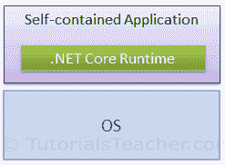
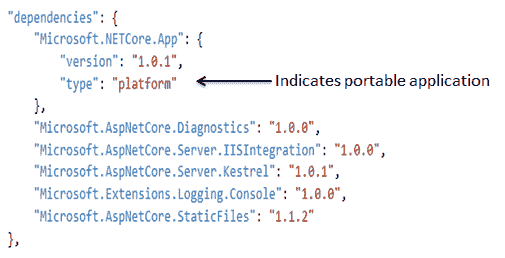

# 。NET Core 应用程序类型

> 原文：<https://www.tutorialsteacher.com/core/dotnet-core-application-types>

我们可以在。NET Core。

1.  便携式应用程序
2.  独立应用程序

## 便携式应用程序

便携式应用程序是期望。NET Core 运行时。它不能在没有的机器上运行。NET Core 运行时已安装。

.NET Core Portable Application

## 独立应用程序

独立应用程序包括。NET Core 运行时。它可以在没有的机器上运行。NET Core 运行时已安装。

.NET Core Self-contained Application

## 配置应用程序类型

我们可以在 project.json 中使用`Microsoft.NETCore.App`依赖的`type`属性，将 ASP.NET Core 应用配置为可移植或自包含的应用，“类型”:“平台”表示该应用期望。NET Core 在机器上。这使得它成为一个可移植的应用程序。

对于独立应用程序，从依赖项中移除类型平台。这使得它成为一个独立的应用程序，这意味着。NET Core 将在您构建和发布应用程序时包含在内。