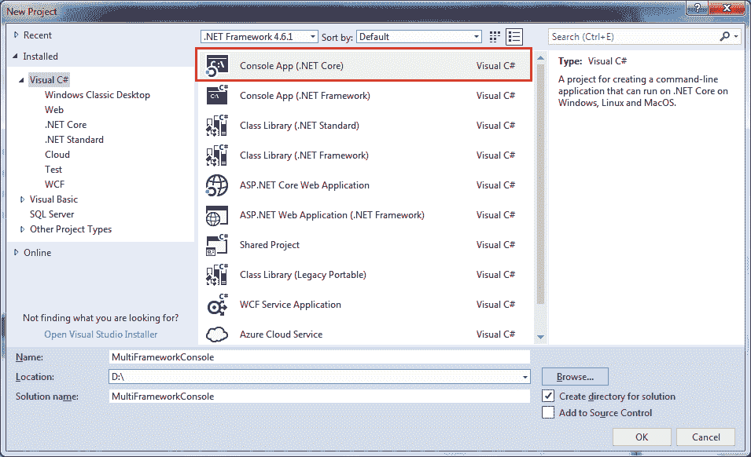
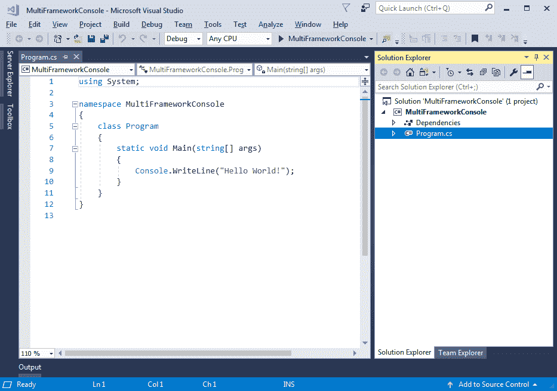
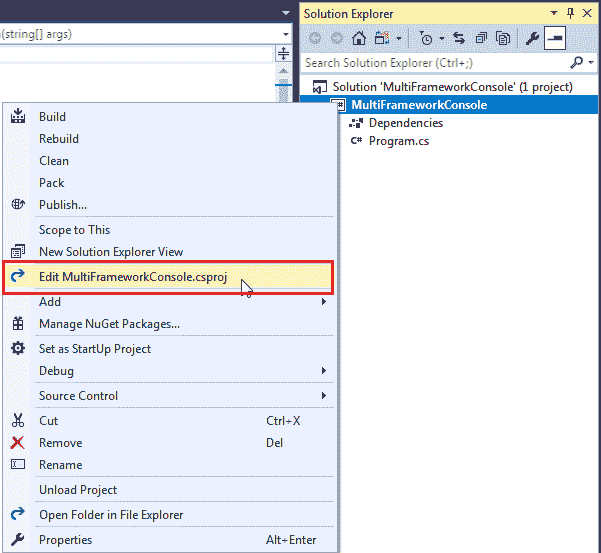
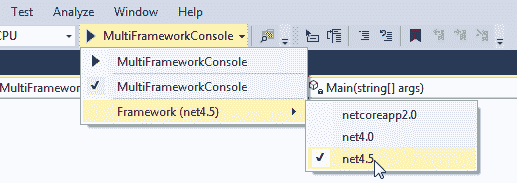

# 面向多个框架的 .NET Core 2.x 应用

> 原文：<https://www.tutorialsteacher.com/core/target-multiple-frameworks-in-aspnet-core2>

如前一章所述，创建一个面向多个框架的. NET Core 应用是代码共享的方法之一。

我们可以创造 .NET Core 应用，并为其配置多个目标框架，以便它可以与所有配置的目标框架一起运行。为了演示这一点，让我们创建。可以运行的. NET Core 2.0 控制台应用 .NET Core 以及传统的。Visual Studio 2017 中的. NET 框架。

第一步是在 Visual Studio 2017 中创建新项目，方法是单击文件->新建项目..这将打开新项目弹出窗口，如下所示。

[](../../Content/images/core/core2-console-project.png)

Create .NET Core 2.x Console Application


在新建项目弹出窗口中，选择控制台应用() .NET Core)，提供适当的名称，然后单击“确定”。这将创建新的控制台项目，如下所示。

[](../../Content/images/core/console-app.png)

Console Application


现在，我们可以通过编辑来配置多个框架。csproj 文件。因此，在解决方案资源管理器中右键单击项目并选择编辑<project-name>。如下所示。</project-name>

[](../../Content/images/core/edit-csproj2.png)

Edit .csproj


那个。csproj 如下所示。

.csproj: 

```cs
<Project Sdk="Microsoft.NET.Sdk">

  <PropertyGroup>
    <OutputType>Exe</OutputType>
    <TargetFramework>netcoreapp2.0</TargetFramework>
  </PropertyGroup>

</Project> 
```

如上图所示，`<TargetFramework>`是 netcoreapp2.0，表示目前这个应用可以运行 .NET Core 2.0 框架。 这里我们可以包含多个框架的多个名字，以便针对多个框架。

要定位多个框架，将`<TargetFramework>`改为复数`<TargetFrameworks>`，并包含您想要定位的不同框架的名字，用`;`隔开。

在这里，我们将支持另外两个框架 .NET 框架 4.0 和 4.6。因此，如下所示，分别包括 net40 和 net46 昵称。查看所有支持的目标框架的 TFMs】这里。

.csproj: 

```cs
<Project Sdk="Microsoft.NET.Sdk">

  <PropertyGroup>
    <OutputType>Exe</OutputType>
    <TargetFrameworks>netcoreapp2.0;net45;net46</TargetFrameworks>
  </PropertyGroup>

</Project> 
```

一旦你保存了上面的。，Visual Studio 将加载并包含的引用 .NET 4.5 和 .NET 4.6 进入如下所示的**依赖**部分。

[](../../Content/images/core/core2-multi-frameworks-ref.png)

Multi Frameworks Dependencies


现在，打开 program.cs，让我们使用预处理器条件#if 和#elif 添加框架特定的代码，如下所示。

Program.cs 

```cs
using System;

namespace MultiFrameworkConsole
{
    public class Program
    {
        public static void Main(string[] args)
        {

#if NET40
        Console.WriteLine("Target framework: .NET Framework 4.0");
#elif NET45
        Console.WriteLine("Target framework: .NET Framework 4.5");
#else
        Console.WriteLine("Target framework: .NET Core 2.0");
#endif
        Console.ReadKey();
        }
    }
} 
```

如上所述，要编写框架特定的代码，请使用带有条件的符号 .NET framework 名字对象，并用下划线替换圆点，并将小写字母改为大写。

要为特定框架运行应用，请单击运行下拉列表，并选择一个目标框架，如下所示。

[](../../Content/images/core/run-multi-framework-app.png)

Multi Frameworks Dependencies


现在，运行该应用，您将看到以下输出。

[](../../Content/images/core/core2-multi-frameworks-app.png)

## 框架特定参考

有时您可能需要包含特定框架的特定引用。例如， .NET Core 2.0 元包已经包含了`System.Net`引用，不包含在内 .NET 4.0 和 4.5。 所以，我们需要把它包含进去。使用条件引用的 csproj 文件如下所示。

.csproj: 

```cs
<Project Sdk="Microsoft.NET.Sdk">

  <PropertyGroup>
    <OutputType>Exe</OutputType>
    <TargetFrameworks>netcoreapp2.0;net45;net46</TargetFrameworks>
  </PropertyGroup>

<ItemGroup Condition=" '$(TargetFramework)' == 'net40' ">
    <Reference Include="System.Net" />
  </ItemGroup>
  <ItemGroup Condition=" '$(TargetFramework)' == 'net45' ">
    <Reference Include="System.Net" />
  </ItemGroup>

</Project> 
```

现在，`System.Net`引用将被添加到 .NET 4.0 & 4.5 和 System.Net 特定的代码将对所有框架执行。****