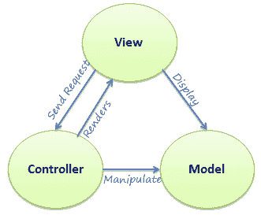

# ASP.NET MVC 架构

> 原文：<https://www.tutorialsteacher.com/mvc/mvc-architecture>

在这里，您将学习 MVC 架构的概述。

MVC 架构模式在软件工程中已经存在了很长时间。几乎所有的语言都使用 MVC，只是略有不同，但在概念上它保持不变。

让我们了解一下 ASP.NET 支持的 MVC 架构。

MVC 代表模型、视图和控制器。MVC 将应用分成三个组件——模型、视图和控制器。

**模型**:模型代表数据的形状。C# 中的一个类用来描述一个模型。模型对象存储从数据库中检索的数据。

**模型代表数据**。

**视图**:MVC 中的视图是一个用户界面。向用户查看显示模型数据，并允许他们修改这些数据。ASP.NET MVC 中的视图是 HTML、CSS 和一些特殊的语法(Razor 语法)，使得与模型和控制器的通信变得容易。

**视图是用户界面。**

**控制器**:控制器处理用户请求。通常，用户使用视图并引发一个 HTTP 请求，该请求将由控制器处理。控制器处理请求并返回适当的视图作为响应。

**控制器是请求处理程序。**

下图说明了模型、视图和控制器之间的交互。

 

MVC Architecture

下图展示了 ASP.NET MVC 中用户请求的流程。

 

Request Flow in MVC Architecture

如上图所示，当用户在浏览器中输入一个网址时，它会转到网络服务器并被路由到一个控制器。控制器为该请求执行相关的视图和模型，创建响应并将其发送回浏览器。

  Points to Remember

1.  MVC 代表模型、视图和控制器。
2.  模型代表数据
3.  视图是用户界面。
4.  控制器是请求处理程序。