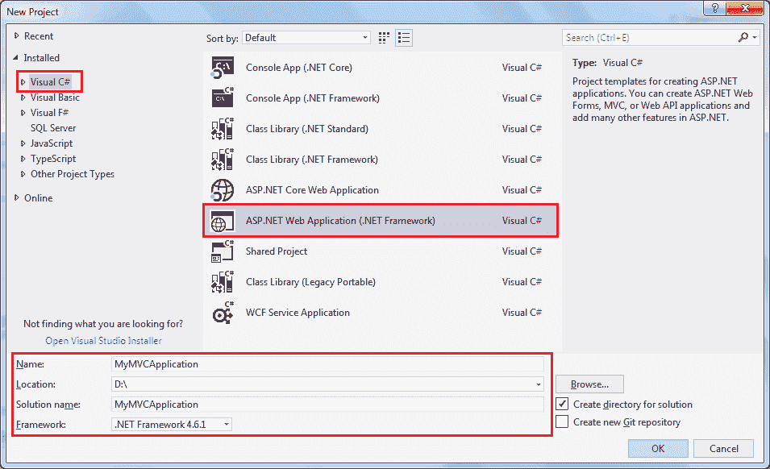
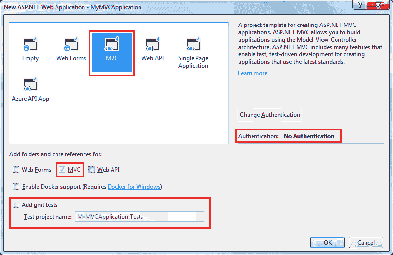
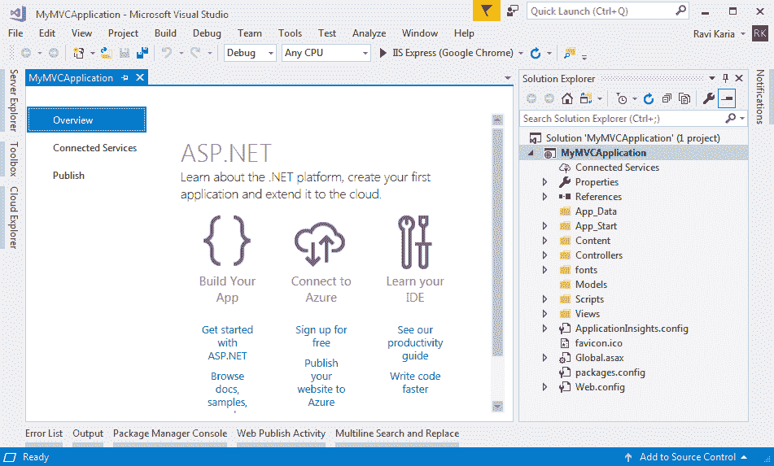
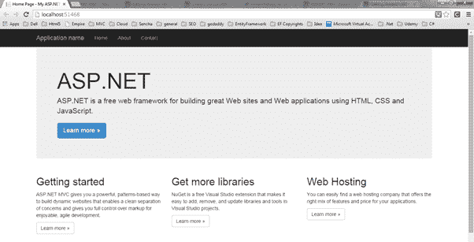
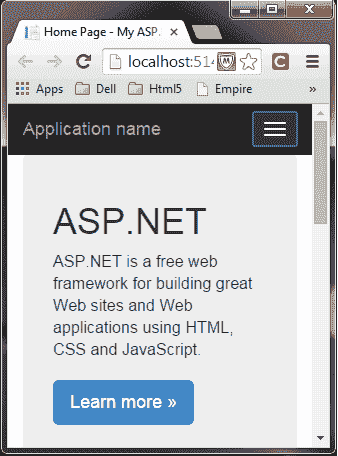

# 创建 ASP.NET MVC 应用

> 原文：<https://www.tutorialsteacher.com/mvc/create-first-asp.net-mvc-application>

在本节中，我们将使用 Visual Studio 创建一个新的 MVC web 应用，并了解 ASP.NET MVC 应用的基本构造块。

我们将使用 ASP.NET MVC 5.2 和 Visual Studio 2017 社区版，以及 .NET Framework 4.6 来创建我们的第一个 MVC 应用。

从[visualstudio.microsoft.com/downloads](https://visualstudio.microsoft.com/downloads/)下载最新版本的 Visual Studio。

打开 Visual Studio 2017，选择**文件菜单** - > **新建** - > **项目**，如下图。

Create a New Project in Visual Studio

如下图所示，在**新建项目**对话框中，展开 Visual C# 节点，在左窗格中选择 **Web** ，然后选择**ASP.NET Web 应用( .NET Framework)** 在中间窗格。 输入你的项目名称`MyMVCApplication`。(您可以为您的应用指定一个合适的名称)。此外，您可以通过点击**浏览来更改 MVC 应用的位置..**按钮。最后，点击**确定。**

从**新 ASP.NET 网络应用**对话框中，选择 MVC(如果尚未选择)，如下所示。

Select MVC Project Template

您也可以通过点击**更改认证**按钮来更改认证。您可以为您的应用选择适当的身份验证模式，如下所示。

Select Authenctication Type

这里，我们保留了应用的默认身份验证，即无身份验证。点击**确定**继续。

等待一段时间，直到 Visual Studio 使用默认模板创建一个简单的 MVC 项目，如下所示。

MVC Project in Visual Studio

现在，按 F5 在调试模式下运行项目，或按 Ctrl + F5 在不调试的情况下运行项目。它将在浏览器中打开主页，如下所示。

ASP.NET MVC Application

MVC 5 项目默认包含 bootstrap 3.0 的 JavaScript 和 CSS 文件。所以你可以创建有响应的网页。这种响应用户界面将根据不同设备的屏幕大小改变其外观和感觉。例如，顶部菜单栏将在移动设备中更改，如下所示。

 

Responsive MVC Application

这样，您就可以使用 Visual Studio 2017 创建您的 ASP.NET MVC 5 应用。

在下一节中了解 ASP.NET MVC 项目的文件夹结构。