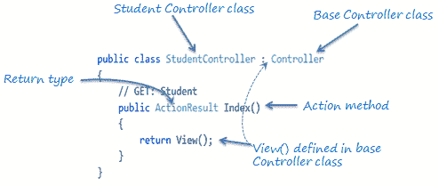

# MVC 中的动作方法

> 原文：<https://www.tutorialsteacher.com/mvc/action-method-in-mvc>

在本节中，您将了解控制器类的动作方法。

`Controller`类的所有公共方法都称为`Action`方法。它们像任何其他正常方法一样，有以下限制:

1.  动作方法必须公开。它不能是私有的或受保护的
2.  动作方法不能重载
3.  动作方法不能是静态方法。

下面举例说明`StudentController`类中的`Index()`动作方法。

[](../../Content/images/mvc/action-method.png)

Action Method


如上图所示，`Index()`方法是公共的，它使用`View()`方法返回`ActionResult`。 在`Controller`基类中定义了`View()`方法，该方法返回适当的`ActionResult`。

## 默认动作方法

根据`RouteConfig`类中配置的路由，每个控制器可以有一个默认的动作方法。默认情况下，`Index()`方法是任何控制器的默认动作方法，根据配置的默认根，如下所示。

Default Route 

```
routes.MapRoute(
    name: "Default",
    url: "{controller}/{action}/{id}/{name}",
    defaults: new { controller = "Home", 
                    action = "Index", 
                    id = UrlParameter.Optional
            }); 
```

但是，您可以在`RouteConfig`类中根据您的要求更改默认动作名称。

## 操作结果

MVC 框架包含各种`Result`类，可以从一个动作方法返回。结果类表示不同类型的响应，如 HTML、文件、字符串、JSON、javascript 等。下表列出了 ASP.NET MVC 中所有可用的结果类。

| 结果类 | 描述 |
| --- | --- |
| 查看结果 | 表示 HTML 和标记。 |
| EmptyResult | 代表无响应。 |
| ContentResult | 表示字符串字面值。 |
| 文件内容结果/文件路径结果/文件流结果 | 表示文件的内容。 |
| JavaScriptResult 结果 | 表示一个 JavaScript 脚本。 |
| JsonResult | 表示可以在 AJAX 中使用的 JSON。 |
| 重定向结果 | 表示重定向到新的网址。 |
| redirecttoroaureresult | 代表相同或其他控制器的另一个动作。 |
| PartialViewResult | 从部分视图返回 HTML。 |
| HttpUnauthorizedResult | 返回 HTTP 403 状态。 |

`ActionResult`类是上述所有结果类的基类，因此它可以是返回上面列出的任何结果的 action 方法的返回类型。 但是，您可以指定适当的结果类作为动作方法的返回类型。

上图中`StudentController`的`Index()`方法使用`View()`方法返回一个`ViewResult`(来源于`ActionResult`类)。基础`Controller`类包括`View()`方法以及返回特定类型结果的其他方法，如下表所示。

| 结果类 | 描述 | 基本控制器方法 |
| --- | --- | --- |
| 查看结果 | 表示 HTML 和标记。 | 视图() |
| EmptyResult | 代表无响应。 |  |
| ContentResult | 表示字符串字面值。 | 内容() |
| FileContentResult， FilePathResult，
T3【file stream result】 | 表示文件的内容。 | 文件() |
| JavaScriptResult 结果 | 表示一个 JavaScript 脚本。 | JavaScript() |
| JsonResult | 表示可以在 AJAX 中使用的 JSON。 | Json() |
| 重定向结果 | 表示重定向到新的网址。 | 重定向() |
| redirecttoroaureresult | 表示重定向到另一条路由。 | RedirectToRoute() |
| PartialViewResult | 表示局部视图结果。 | PartialView() |
| HttpUnauthorizedResult | 表示 HTTP 403 响应。 |  |

如上表所示，`View()`方法返回`ViewResult`，`Content()`方法返回字符串，`File()`方法返回文件内容，以此类推。 使用上表中提到的不同方法从动作方法返回不同类型的结果。

## 动作方法参数

每个动作方法都可以像普通方法一样有输入参数。它可以是基本数据类型或复杂类型参数，如下所示。

Example: Action Method Parameters 

```
[HttpPost]
public ActionResult Edit(Student std)
{
    // update student to the database

    return RedirectToAction("Index");
}

[HttpDelete]
public ActionResult Delete(int id)
{
    // delete student from the database whose id matches with specified id

    return RedirectToAction("Index");
} 
```

请注意，动作方法参数可以是[可空类型](/csharp/csharp-nullable-types)。

默认情况下，动作方法参数的值是从请求的数据集合中检索的。数据集合包括表单数据或查询字符串值或 cookie 值的名称/值对。如果两个名称匹配，ASP.NET MVC 中的模型绑定会自动将 URL 查询字符串或表单数据集合映射到动作方法参数。更多信息请访问[模型绑定](/mvc/model-binding-in-asp.net-mvc)部分。

  Points to Remember :

1.  控制器类中的所有公共方法都称为动作方法。
2.  动作方法有以下限制。
    ——动作方法必须公开。它不能是私有的或受保护的。
    -动作方法不能过载。
    -动作法不能是静态法。

3.  ActionResult 是从 Action 方法返回的所有结果类型的基类。
4.  基本控制器类包含返回适当结果类型的方法，例如视图()、内容()、文件()、JavaScript()等。
5.  动作方法可以包括[可空](/csharp/csharp-nullable-types)类型参数。**