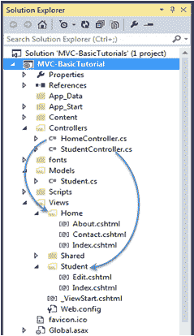
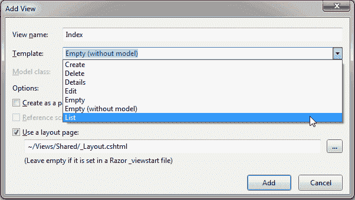
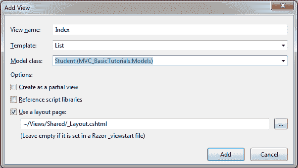
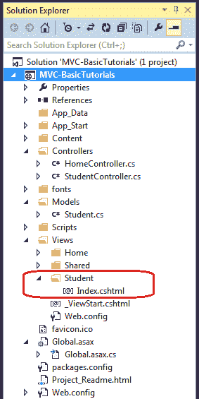
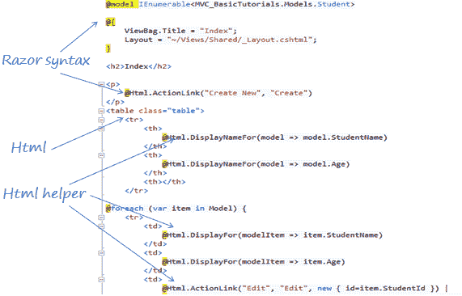

# 在 ASP.NET MVC 中创建视图

> 原文:[https://www.tutorialsteacher.com/mvc/mvc-view](https://www.tutorialsteacher.com/mvc/mvc-view)

在本节中，您将学习如何在 ASP.NET MVC 应用程序中创建视图并在其中使用模型类。

视图用于使用模型类对象显示数据。**视图**文件夹包含 ASP.NET MVC 应用程序中的所有视图文件。

控制器可以有一个或多个操作方法，每个操作方法可以返回不同的视图。简而言之，控制器可以呈现一个或多个视图。因此，为了便于维护，MVC 框架需要在**视图**文件夹下为每个与控制器同名的控制器创建一个单独的子文件夹。

例如，从`HomeController`渲染的所有视图将驻留在**视图** > **主页**文件夹中。 同样的，`StudentController`的视图将驻留在**视图** > **学生**文件夹中，如下所示。

[](../../Content/images/mvc/view-folder-for-controllers.png)

View folders for Controllers


*Note:**The **Shared** folder contains views, layout views, and partial views, which will be shared among multiple controllers.* *## 剃刀视图引擎

微软引入了 razor 视图引擎来编译一个混合了 HTML 标签和服务器端代码的视图。razor 视图的特殊语法通过最大限度地减少编写视图时所需的字符和击键数量，最大限度地提高了编写代码的速度。

razor 视图使用@字符来包含服务器端代码，而不是传统的 ASP。您可以使用 C# 或 Visual Basic 语法在 razor 视图中编写服务器端代码。

ASP.NET MVC 支持以下类型的 razor 视图文件:

| 文件扩展名 | 描述 |
| --- | --- |
| 。模板 | C# Razor 视图。支持带有 html 标记的 C# 代码。 |
| 。vbhtml | Visual Basic 剃刀视图。支持带有 html 标记的 Visual Basic 代码。 |
| 。文件 | ASP.Net 网络表单 |
| . ascx | ASP.NET 网络控制 |

下一节学习 [Razor 语法](/mvc/razor-syntax)。

## 创建视图

您可以通过在动作方法内单击鼠标右键并选择**添加视图，直接从中创建动作方法的视图..**。

下面从`StudentContoller`的`Index()`动作方法创建一个视图，如下所示。

[](../../Content/images/mvc/add-view-1.png)

Create a View from Action Method


这将打开**添加视图**对话框，如下所示。 保持视图名称与动作方法名称相同是一个很好的做法，这样在返回视图时就不必在动作方法中明确指定视图名称。

[](../../Content/images/mvc/addview2.png)

Add a View


选择脚手架模板。模板下拉列表将显示可用于创建、删除、详细信息、编辑、列表或空视图的默认模板。选择“列表”模板，因为我们希望在视图中显示学生列表。

现在，从模型类下拉列表中选择`Student`。模型类下拉列表自动显示`Model`文件夹中所有类的名称。 我们已经在前一节中创建了`Student`模型类，因此它将包含在下拉列表中。

[](../../Content/images/mvc/addview3.png)

Add a View


选中“使用布局页面”复选框，并为此视图选择默认的`_Layout.cshtml`页面，然后单击**添加**按钮。

这将在**视图** - > **学生**文件夹下创建`Index`视图，如下所示:

[](../../Content/images/mvc/addview4.png)

View


下面的代码片段显示了上面创建的一个 Index.cshtml。

Views\Student\Index.cshtml: 

```
@model IEnumerable<MVC_BasicTutorials.Models.Student>

@{
    ViewBag.Title = "Index";
    Layout = "~/Views/Shared/_Layout.cshtml";
}

<h2>Index</h2>

<p>
    @Html.ActionLink("Create New", "Create")
</p>
<table class="table">
    <tr>
        <th>
            @Html.DisplayNameFor(model => model.StudentName)
        </th>
        <th>
            @Html.DisplayNameFor(model => model.Age)
        </th>
        <th></th>
    </tr>

@foreach (var item in Model) {
    <tr>
        <td>
            @Html.DisplayFor(modelItem => item.StudentName)
        </td>
        <td>
            @Html.DisplayFor(modelItem => item.Age)
        </td>
        <td>
            @Html.ActionLink("Edit", "Edit", new { id=item.StudentId }) |
            @Html.ActionLink("Details", "Details", new { id=item.StudentId  }) |
            @Html.ActionLink("Delete", "Delete", new { id = item.StudentId })
        </td>
    </tr>
}

</table>
```

在上面的`Index`视图中可以看到，它包含 HTML 和 razor 代码。 直列剃刀表达式以@符号开头。@Html 是一个生成 Html 控件的助手类。在接下来的部分中，您将学习 razor 语法和 HTML 助手。

[](../../Content/images/mvc/razor-view.png)

Index.cshtml


当我们运行应用程序时，上面的索引视图将如下所示。

[](../../Content/images/mvc/index-view.png)

Index View


*Note:**Every view in the ASP.NET MVC is derived from `WebViewPage` class included in `System.Web.Mvc` namespace.* *我们需要将模型对象传递给视图，以便在视图上显示数据。在下一章中学习如何集成模型、视图和控制器。***