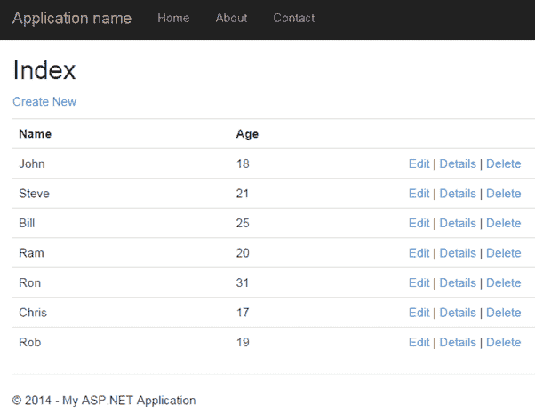

# 集成控制器、视图和模型

> 原文:[https://www . tutorial stearn . com/MVC/integrate-controller-view-model](https://www.tutorialsteacher.com/mvc/integrate-controller-view-model)

在前面的章节中，我们已经创建了[控制器](/mvc/mvc-controller)、[模型](/mvc/mvc-model)和[视图](/mvc/mvc-view)。 在这里，我们将集成它们来运行应用程序并查看结果。

下面的代码片段显示了在前面几节中创建的`StudentController`、`Student`模型和`Index.cshtml`视图。

Example: StudentController<button class="copy-btn pull-right" title="Copy example code">*Copy*</button> *```
public class StudentController : Controller
{
    // GET: Student
    public ActionResult Index()
    {
        return View();
    }
} 
```

Example: Student Model class<button class="copy-btn pull-right" title="Copy example code">*Copy*</button> *```
public class Student
{
    public int StudentId { get; set; }
    public string StudentName { get; set; }
    public int Age { get; set; }
} 
```

Example: Index.cshtml View<button class="copy-btn pull-right" title="Copy example code">*Copy*</button> *```
@model IEnumerable<MVC_BasicTutorials.Models.Student>

@{
    ViewBag.Title = "Index";
    Layout = "~/Views/Shared/_Layout.cshtml";
}

<h2>Index</h2>

<p>
    @Html.ActionLink("Create New", "Create")
</p>
<table class="table">
    <tr>
        <th>
            @Html.DisplayNameFor(model => model.StudentName)
        </th>
        <th>
            @Html.DisplayNameFor(model => model.Age)
        </th>
        <th></th>
    </tr>

@foreach (var item in Model) {
    <tr>
        <td>
            @Html.DisplayFor(modelItem => item.StudentName)
        </td>
        <td>
            @Html.DisplayFor(modelItem => item.Age)
        </td>
        <td>
            @Html.ActionLink("Edit", "Edit", new { id=item.StudentId }) |
            @Html.ActionLink("Details", "Details", new { id=item.StudentId  }) |
            @Html.ActionLink("Delete", "Delete", new { id = item.StudentId })
        </td>
    </tr>
}

</table>
```

现在，为了成功运行它，我们需要将一个模型对象从一个动作方法传递到一个视图。从上面的`Index.cshtml`中可以看到，它使用`IEnumerable<Student>`作为模型类型。 所以我们需要从`StudentController`类的`Index()`动作法传过来，如下图所示。

Example: Passing Model from Controller<button class="copy-btn pull-right" title="Copy example code">*Copy*</button> *```
public class StudentController : Controller
{
    static IList<Student> studentList = new List<Student>{ 
                new Student() { StudentId = 1, StudentName = "John", Age = 18 } ,
                new Student() { StudentId = 2, StudentName = "Steve",  Age = 21 } ,
                new Student() { StudentId = 3, StudentName = "Bill",  Age = 25 } ,
                new Student() { StudentId = 4, StudentName = "Ram" , Age = 20 } ,
                new Student() { StudentId = 5, StudentName = "Ron" , Age = 31 } ,
                new Student() { StudentId = 4, StudentName = "Chris" , Age = 17 } ,
                new Student() { StudentId = 4, StudentName = "Rob" , Age = 19 } 
            };
    // GET: Student
    public ActionResult Index()
    {
        //fetch students from the DB using Entity Framework here

        return View(studentList);
    }
} 
```*  *正如您在上面的代码中所看到的，我们已经创建了一个学生对象列表作为示例(在现实应用程序中，您可以从数据库中获取它)。然后，我们将这个列表对象作为参数传递给 View()方法。视图()方法是在基本控制器类中定义的，它自动将模型对象绑定到视图。

现在，您可以通过按 F5 并导航到`http://localhost/Student`来运行 MVC 项目。您将在浏览器中看到以下视图。

<figure>[](../../Content/images/mvc/index-view.png)</figure>****