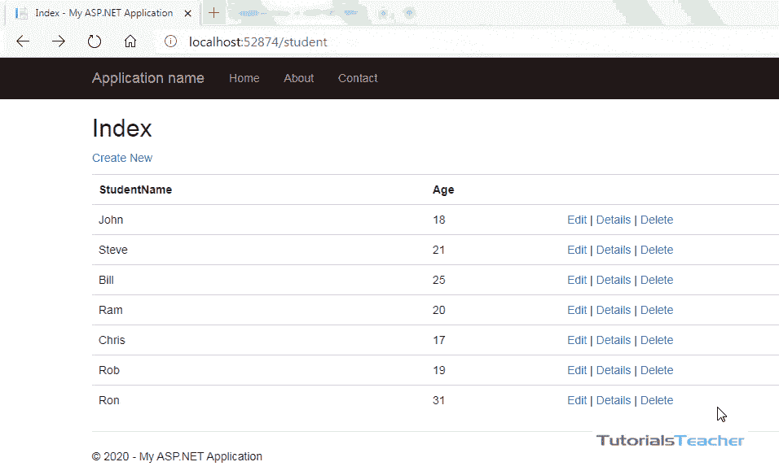
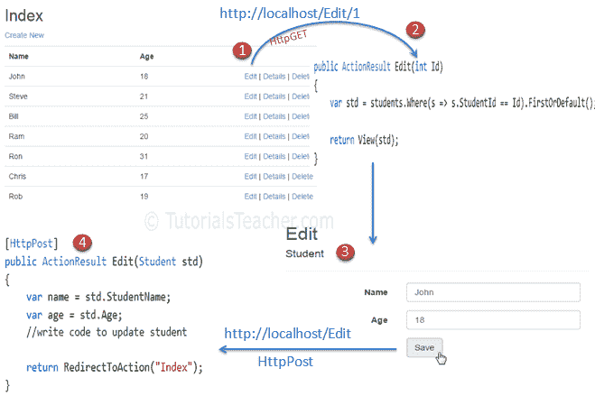
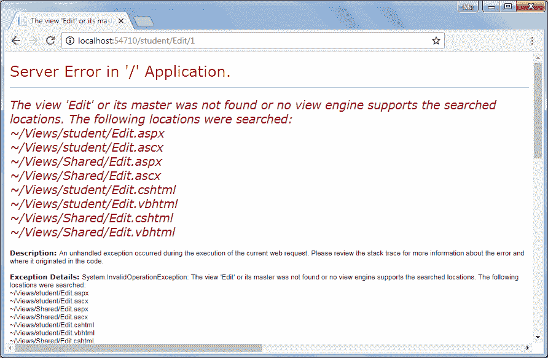
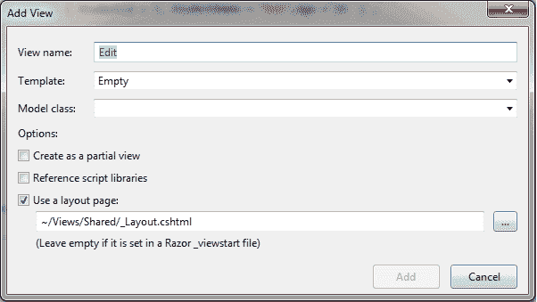
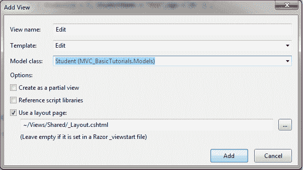

# 在 ASP.NET MVC 中创建编辑视图

> 原文：<https://www.tutorialsteacher.com/mvc/create-edit-view-in-asp.net-mvc>

我们在[集成模型、视图、控制器](/mvc/integrate-controller-view-model)一章中创建了列表视图。 在这里，您将学习如何创建用户可以编辑数据的编辑视图。下面举例说明编辑学生记录的步骤。

[](../../Content/images/mvc/MVC-edit-view.gif)

Editing Steps in ASP.NET MVC Application


编辑视图将在点击学生列表视图中的`Edit`链接时呈现，我们已经在[创建视图](/mvc/create-edit-view-in-asp.net-mvc)一章中创建了学生列表视图。 在这里，我们将构建以下编辑视图，以便编辑学生记录。

[](../../Content/images/mvc/editview.png)

Edit View


下图描述了编辑功能在 ASP.NET MVC 应用中的工作方式。

[](../../Content/images/mvc/edit-view-steps.png)

Editing Steps in ASP.NET MVC App


上图说明了以下步骤。

1.用户点击学生列表视图中的`Edit`链接，将发送查询字符串中对应`Id`参数的`HttpGET`请求`http://localhost/student/edit/{Id}`。 该请求将通过`Edit()`httpgetaction 方法处理。(默认情况下，如果没有指定属性，动作方法将处理`HttpGET`请求)

2.`HttpGet`动作方法`Edit()`将根据提供的`Id`参数从数据库中获取学生数据，并用该特定学生数据渲染编辑视图。

3.用户可以编辑数据，并在编辑视图中单击保存按钮。保存按钮将发送一个带有表单数据收集的 http 请求*。*

4.StudentController 中的 HttpPOST Edit 动作方法将最终将数据更新到数据库中，并使用 RedirectToAction 方法作为第四步，使用刷新的数据呈现索引页面。

因此，这将是使用 ASP.NET MVC 中的`Edit`视图编辑数据的完整过程。

所以让我们开始执行上面的步骤。

以下是`Student`模型类。

Example: Model Class 

```
namespace MVCTutorials.Controllers
{
    public class Student
    {
        public int StudentId { get; set; }

        [Display( Name="Name")]
        public string StudentName { get; set; }

        public int Age { get; set; }
    }
} 
```

**步骤:1**

我们已经在[创建视图](/mvc/mvc-view)一章中创建了学生列表视图，包括每个`Student`的编辑操作链接，如下所示。

[](../../Content/images/mvc/index-view.png)

List View


在上面的列表视图中，编辑链接将`HttpGet`请求发送到查询字符串中对应`StudentId`的`StudentController`的`Edit()`动作方法。 例如，与学生`John`的编辑链接会将`StudentId`附加到请求 url，因为约翰的`StudentId`是`1`，例如`http://localhost:<port number>/edit/1`。

**第二步:**

现在，在`StudentController`中创建一个 HttpGET action 方法`Edit(int id)`，如下图。

Example: HttpGet Edit() Action method - C# 

```
using MVCTutorials.Models;

namespace MVCTutorials.Controllers
{
    public class StudentController : Controller
    {
        static IList<Student> studentList = new List<Student>{ 
                new Student() { StudentId = 1, StudentName = "John", Age = 18 } ,
                new Student() { StudentId = 2, StudentName = "Steve",  Age = 21 } ,
                new Student() { StudentId = 3, StudentName = "Bill",  Age = 25 } ,
                new Student() { StudentId = 4, StudentName = "Ram" , Age = 20 } ,
                new Student() { StudentId = 5, StudentName = "Ron" , Age = 31 } ,
                new Student() { StudentId = 4, StudentName = "Chris" , Age = 17 } ,
                new Student() { StudentId = 4, StudentName = "Rob" , Age = 19 } 
            };

        // GET: Student
        public ActionResult Index()
        {
            //fetch students from the DB using Entity Framework here

            return View(studentList.OrderBy(s => s.StudentId).ToList());
        }

        public ActionResult Edit(int Id)
        { 
            //here, get the student from the database in the real application

            //getting a student from collection for demo purpose
            var std = studentList.Where(s => s.StudentId == Id).FirstOrDefault();

            return View(std);
        }
    }
} 
```

HttpGet `Edit()`动作方法必须执行两个任务。首先，它应该从底层数据源获取一个学生数据，其`StudentId`与参数`Id`匹配。 其次，它应该用数据渲染`Edit`视图，以便用户可以编辑它。

在上面的`Edit()`动作方法中，使用 LINQ 查询从`studentList`集合中获取一个`Student`，其`StudentId`与参数`Id`、 匹配，然后将该`std`对象传递到`View(std)`中，用该数据填充编辑视图。 在实际应用中，可以从数据库中获取数据，而不是从样本集合中获取数据。

此时，如果您运行应用并点击学生列表视图中的`Edit`链接，那么您将获得以下错误。

[](../../Content/images/mvc/editview-error.png)

Edit View Error


出现上述错误是因为我们还没有创建`Edit`视图。 默认情况下，MVC 框架会在 **/View/Student** 或 **/View/Shared** 文件夹中查找`Edit.cshtml`、`Edit.vbhtml`、`Edit.aspx`或`Edit.ascx`文件。

**第三步:**

要创建编辑视图，右键单击`Edit()`动作方法，然后单击**添加视图..**。 将打开添加视图对话框，如下图。

[](../../Content/images/mvc/edit-view-2.png)

Create Edit View


在添加视图对话框中，保持视图名称为`Edit`。

从下拉列表中选择`Edit`模板和`Student`模型类，如下图所示。

[](../../Content/images/mvc/edit-view-3.png)

Select Edit Template and Model


点击**添加**按钮，在**/查看/学生**文件夹下生成`Edit.cshtml`视图，如下图。

/View/Student/Edit.cshtml 

```
@model MVCTutorials.Models.Student
@{
    ViewBag.Title = "Edit";
    Layout = "~/Views/Shared/_Layout.cshtml";
}

<h2>Edit</h2>

@using (Html.BeginForm())
{
    @Html.AntiForgeryToken()

    <div class="form-horizontal">
        <h4>Student</h4>
        <hr />
        @Html.ValidationSummary(true, "", new { @class = "text-danger" })
        @Html.HiddenFor(model => model.StudentId)

        <div class="form-group">
            @Html.LabelFor(model => model.StudentName, htmlAttributes: new { @class = "control-label col-md-2" })
            <div class="col-md-10">
                @Html.EditorFor(model => model.StudentName, new { htmlAttributes = new { @class = "form-control" } })
                @Html.ValidationMessageFor(model => model.StudentName, "", new { @class = "text-danger" })
            </div>
        </div>

        <div class="form-group">
            @Html.LabelFor(model => model.Age, htmlAttributes: new { @class = "control-label col-md-2" })
            <div class="col-md-10">
                @Html.EditorFor(model => model.Age, new { htmlAttributes = new { @class = "form-control" } })
                @Html.ValidationMessageFor(model => model.Age, "", new { @class = "text-danger"< })
            </div>
        </div>

        <div class="form-group">
            <div class="col-md-offset-2 col-md-10">
                <input type="submit" value="Save" class="btn btn-default" />
            </div>
        </div>
    </div>
}

<div>
    @Html.ActionLink("Back to List", "Index")
</div>
```

请注意`Edit.cshtml`包含`HtmlHelper`方法`Html.BeginForm()`来创建 HTML 表单标签。 `Html.BeginForm` 默认发送`HttpPost`请求。当您点击学生列表视图中的编辑链接时，将显示`Student`数据，如下所示。

[](../../Content/images/mvc/editview.png)

Edit View


您现在可以编辑数据并点击保存按钮。保存按钮应该发送 HttpPOST 请求，因为我们需要将表单数据作为请求主体的一部分作为`Student`对象提交。

**第四步:**

现在，编写 HttpPost 动作方法`Edit()`保存编辑好的学生对象，如下图。 所以，会有两种`Edit()`的动作方法，HttpGet 和 HttpGet 的动作方法。

Example: Controller Class in C# 

```
using MVCTutorials.Models;

namespace MVCTutorials.Controllers
{
    public class StudentController : Controller
    {
        IList<Student> studentList = new List<Student>() { 
                    new Student(){ StudentId=1, StudentName="John", Age = 18 },
                    new Student(){ StudentId=2, StudentName="Steve", Age = 21 },
                    new Student(){ StudentId=3, StudentName="Bill", Age = 25 },
                    new Student(){ StudentId=4, StudentName="Ram", Age = 20 },
                    new Student(){ StudentId=5, StudentName="Ron", Age = 31 },
                    new Student(){ StudentId=6, StudentName="Chris", Age = 17 },
                    new Student(){ StudentId=7, StudentName="Rob", Age = 19 }
                };
        // GET: Student
        public ActionResult Index()
        {
            return View(studentList.OrderBy(s => s.StudentId).ToList());
        }

        public ActionResult Edit(int Id)
        { 
            //here, get the student from the database in the real application

            //getting a student from collection for demo purpose
            var std = studentList.Where(s => s.StudentId == Id).FirstOrDefault();

            return View(std);
        }

        [HttpPost]
        public ActionResult Edit(Student std)
        {
            //update student in DB using EntityFramework in real-life application

            //update list by removing old student and adding updated student for demo purpose
            var student = studentList.Where(s => s.StudentId == std.StudentId).FirstOrDefault();
            studentList.Remove(student);
            studentList.Add(std);

            return RedirectToAction("Index");
        }
    }
} 
```

在上例中，httpset`Edit()`动作方法需要`Student`的一个对象作为参数。 `Edit()`视图将表单的数据集合绑定到学生模型参数，因为它为每个属性使用 HTML 帮助方法`@Html.EditorFor()`来显示输入文本框。 访问[模型绑定](/mvc/model-binding-in-asp.net-mvc)部分，了解 MVC 框架如何将表单数据绑定到动作方法参数。

更新数据库中的数据后，重定向回`Index()`动作方式，显示更新后的学生列表。

通过这种方式，您可以使用默认的脚手架编辑模板来提供编辑功能。****