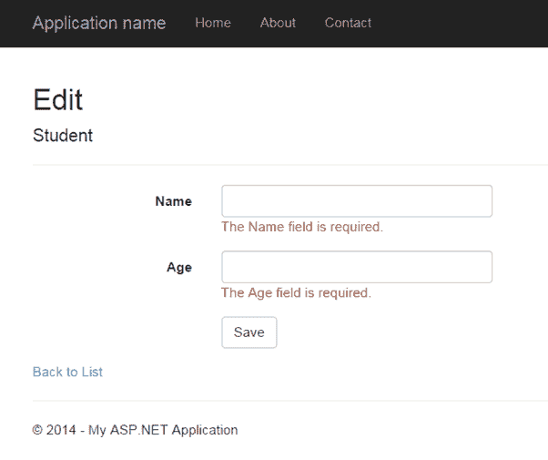

# 在 MVC 中实现数据验证

> 原文:[https://www . tutorial stearner . com/MVC/implement-validation-in-ASP . net-MVC](https://www.tutorialsteacher.com/mvc/implement-validation-in-asp.net-mvc)

在这里，您将学习如何在 ASP.NET MVC 应用程序中实现数据验证并显示违反业务规则的验证消息。

下图显示了在创建或编辑数据时，如果`Name`或`Age`字段为空，验证消息将如何显示。

<figure>[](../../Content/images/mvc/validation.png)</figure>

## 使用数据注释属性进行验证

ASP.NET MVC 在[系统中包含内置属性类。component model . DataAnnotations](https://docs.microsoft.com/en-us/dotnet/api/system.componentmodel.dataannotations?view=netframework-4.8)命名空间。 这些属性用于定义 ASP.NET MVC 和 ASP.NET 数据控件的元数据。 您可以将这些属性应用于模型类的属性，以向用户显示适当的验证消息。

下表列出了可用于验证的所有数据注释属性。

| 属性 | 使用 |
| --- | --- |
| 需要 | 指定需要属性值。 |
| 字符串长度 | 指定字符串类型属性中允许的最小和最大字符长度。 |
| 范围 | 指定属性值的数值范围约束。 |
| 正则表达式 | 指定属性值必须与指定的正则表达式匹配。 |
| 信用卡呢 | 指定属性值是信用卡号。 |
| 自定义验证 | 指定用于验证属性的自定义验证方法。 |
| 电子邮件地址 | 验证电子邮件地址。 |
| 文件扩展名 | 验证文件扩展名。 |
| 最大长度 | 指定属性中允许的数组或字符串数据的最大长度。 |
| 最小长度 | 指定属性中允许的数组或字符串数据的最小长度。 |
| 电话 | 指定属性值是格式良好的电话号码。 |

让我们看看如何使用这些属性在视图上显示验证消息。

以下是`Student`模型类。

Example: Apply DataAnnotation Attributes 

```
public class Student
{
    public int StudentId { get; set; }
    public string StudentName { get; set; }
    public int Age { get; set; }
} 
```

我们希望实现`StudentName`和`Age`属性值的验证。 我们要确保用户不存空`StudentName`或`Age`值。另外，年龄应该在 10 到 20 岁之间。

`Required`属性用于指定该值不能为空。 `Range`属性用于指定属性可以具有的值的范围。 我们将使用`StudentName`上的`Required`属性强制用户提供值，`Range`属性确保用户输入的值在 10 到 20 之间，如下所示。

Example: Apply DataAnnotation Attributes 

```
public class Student
{
    public int StudentId { get; set; }

    [Required]
    public string StudentName { get; set; }

    [Range(10, 20)]
    public int Age { get; set; }
} 
```

以上属性定义了`Student`类验证的元数据。 仅这一点不足以进行验证。您需要在控制器中检查提交的数据是否有效。换句话说，您需要检查模型状态。

使用`ModelState.IsValid`检查提交的模型对象是否满足所有数据标注属性指定的要求。 以下 POST 动作方法在保存数据前检查模型状态。

Example: Edit Action methods: 

```
public class StudentController : Controller
{
    public ActionResult Edit(int id)
    {
        var stud = ... get the data from the DB using Entity Framework

        return View(stud);
    }

    [HttpPost]
    public ActionResult Edit(Student std)
    {
        if (ModelState.IsValid) { //checking model state

            //update student to db

            return RedirectToAction("Index");
        }
        return View(std);
    }
} 
```

现在，创建一个编辑视图，如图所示。 以下是使用默认脚手架模板生成的编辑视图。

Edit View: Edit.cshtml 

```
@model MVC_BasicTutorials.Models.Student

@{
    ViewBag.Title = "Edit";
    Layout = "~/Views/Shared/_Layout.cshtml";
}

<h2>Edit</h2>

@using (Html.BeginForm())
{
    @Html.AntiForgeryToken()

    <div class="form-horizontal">
        <h4>Student</h4>
        <hr />
        **@Html.ValidationSummary(true, "", new { @class = "text-danger" })**
        @Html.HiddenFor(model => model.StudentId)

        <div class="form-group">
            @Html.LabelFor(model => model.StudentName, htmlAttributes: new { @class = "control-label col-md-2" })
            <div class="col-md-10">
                @Html.EditorFor(model => model.StudentName, new { htmlAttributes = new { @class = "form-control" } })
                **@Html.ValidationMessageFor(model => model.StudentName, "", new { @class = "text-danger" })**
            </div>
        </div>

        <div class="form-group">
            @Html.LabelFor(model => model.Age, htmlAttributes: new { @class = "control-label col-md-2" })
            <div class="col-md-10">
                @Html.EditorFor(model => model.Age, new { htmlAttributes = new { @class = "form-control" } })
                **@Html.ValidationMessageFor(model => model.Age, "", new { @class = "text-danger" })**
            </div>
        </div>

        <div class="form-group">
            <div class="col-md-offset-2 col-md-10">
                <input type="submit" value="Save" class="btn btn-default" />
            </div>
        </div>
    </div>
}

<div>
    @Html.ActionLink("Back to List", "Index")
</div>
```

在上面的视图中，它为每个字段调用 HTML Helper 方法 **ValidationMessageFor()** ，并在顶部调用 **ValidationSummary()** 方法。 [验证消息为()](/mvc/htmlhelper-validationmessagefor)显示指定字段的错误消息。 [有效性摘要()](/mvc/htmlhelper-validationsummary)显示所有字段的所有错误信息列表。

这样，提交表单时无需输入`StudentName`或`Age`，即可显示默认的验证消息，如下图所示。

<figure>[](../../Content/images/mvc/validation-editview.png)

<figcaption>Validation</figcaption>

</figure>

了解如何在 ASP.NET MVC 中[实现客户端验证。](/articles/enable-client-side-valiation-in-mvc)****