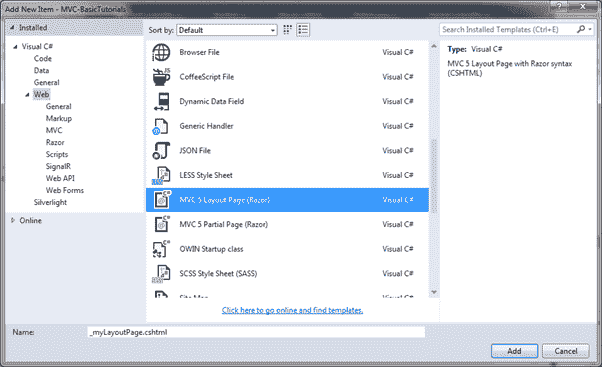
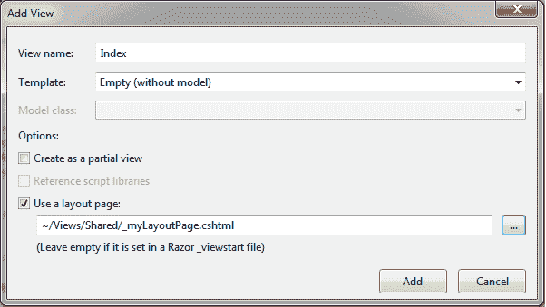
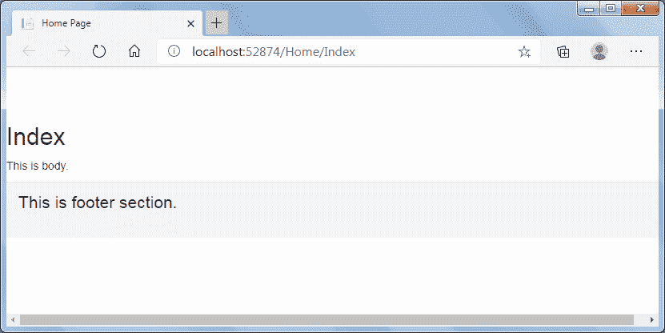

# 创建布局视图

> 原文:[https://www . tutorial stearn . com/MVC/create-layout-view-in-MVC](https://www.tutorialsteacher.com/mvc/create-layout-view-in-mvc)

您学习了什么是 ASP.NET MVC 中的布局视图。在这里，您将学习如何使用 Visual Studio 创建布局视图。

您可以在`Views`文件夹下的任何文件夹中创建布局视图。但是，为了便于维护，建议在`Shared`文件夹中创建所有布局视图。

要在 Visual Studio 中创建新布局视图，请右键单击`Shared`文件夹- >选择添加- >单击**新建项目..**。 这将打开**添加新项目**弹出窗口，如下所示。

<figure>[](../../Content/images/mvc/create-layout-view-1.png)

<figcaption>Create Layout View</figcaption>

</figure>

在**新增项目**对话框中，选择`MVC 5 Layout Page (Razor)`模板，指定一个布局视图名称为`_myLayoutPage.cshtml`，点击**新增**创建，如下图所示。 在布局视图名称前加上下划线`_`是 ASP.NET MVC 中常见的命名约定。

_myLayoutPage.cshtml<button class="copy-btn pull-right" title="Copy example code">*Copy*</button> *```
<!DOCTYPE html>
<html>
<head>
    <meta name="viewport" content="width=device-width" />
    <title>@ViewBag.Title</title>
</head>
<body>
    <div>
        @RenderBody()
    </div>
</body>
</html>
```

现在，让我们用`RenderSection("footer",true)`方法添加常用的`<footer>`标签，如下图所示。 请注意，我们按要求制作了此部分。这意味着任何使用`_myLayoutPage`作为布局视图的视图都必须包含页脚部分。

Example: Adding RenderSection<button class="copy-btn pull-right" title="Copy example code">*Copy*</button> *```
<!DOCTYPE html>
<html>
<head>
    <meta name="viewport" content="width=device-width" />
    <title>@ViewBag.Title</title>
        @Styles.Render("~/Content/css")
        @Scripts.Render("~/bundles/modernizr")
</head>
<body>
    <div>
        @RenderBody()
    </div>
    <footer class="panel-footer">
        @RenderSection("footer", true)
    </footer>
</body>
</html>
```

现在，[新建一个子视图](/mvc/mvc-view)，选择`_myLayoutPage.cshtml`作为布局视图，如下图所示。

<figure>[](../../Content/images/mvc/layout-view-4.png)</figure>

这将创建一个新的`Index.cshtml`，如下所示。

Index.cshtml<button class="copy-btn pull-right" title="Copy example code">*Copy*</button> *```
@{
    ViewBag.Title = "Home Page";
    Layout = "~/Views/Shared/_myLayoutPage.cshtml";
}

<h2>Index</h2> 
```

现在，添加页脚部分，因为`_myLayoutPage.cshtml`包含强制页脚部分，如下图所示。

Index.cshtml<button class="copy-btn pull-right" title="Copy example code">*Copy*</button> *```
@{
    ViewBag.Title = "Home Page";
    Layout = "~/Views/Shared/_myLayoutPage.cshtml";
}

<h2>Index</h2>
<div class="row">
    <div class="col-md-4">
        <p>This is body.</p>
    </div>
    @section footer{
        <p class="lead">
            This is footer section.
        </p>
    }
</div> 
```

现在，运行应用程序，你会看到`Index`视图将显示在`RenderBody()`方法中，页脚部分将显示在`RenderSection("footer", true)`中，如下所示。

<figure>[](../../Content/images/mvc/layout-view.png)</figure>

因此，您可以创建一个包含主体和不同部分的新布局视图。****