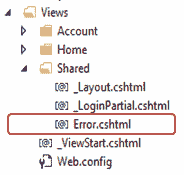
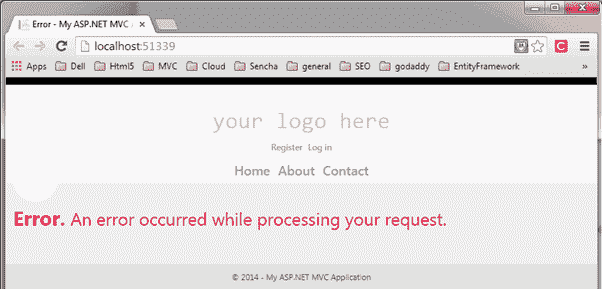

# ASP.NET MVC 过滤器

> 原文：<https://www.tutorialsteacher.com/mvc/filters-in-asp.net-mvc>

在 ASP.NET MVC 中，用户请求被路由到适当的控制器和动作方法。但是，在某些情况下，您可能希望在动作方法执行之前或之后执行一些逻辑。ASP.NET MVC 为此提供了过滤器。

ASP.NET MVC Filter 是一个自定义类，您可以在其中编写自定义逻辑，以便在动作方法执行之前或之后执行。过滤器可以通过声明性或编程方式应用于动作方法或控制器。声明性意味着通过将过滤器属性应用于动作方法或控制器类，而编程性意味着通过实现相应的接口。

MVC 提供了不同类型的过滤器。下表列出了创建自定义筛选器必须实现的筛选器类型、内置筛选器和接口。

| **过滤类型** | **描述**T2】 | **内置过滤器** | **界面**T2】 |
| --- | --- | --- | --- |
| 授权过滤器 | 在执行动作方法之前执行认证和授权。 | [授权]，[要求 Https] | IAuthorizationFilter |
| 动作过滤器 | 在动作方法执行前后执行一些操作。 |  | IActionFilter |
| 结果过滤器 | 在视图执行之前或之后执行一些操作。 | [输出缓存] | IResultFilter |
| 异常过滤器 | 如果在执行 ASP.NET MVC 管道期间引发了未处理的异常，则执行一些操作。 | [处理错误] | IExceptionFilter |

为了详细了解过滤器，让我们举一个内置异常过滤器的例子。当应用中发生未处理的异常时，异常筛选器执行。`HandleErrorAttribute`类是一个内置的异常过滤器类，当发生未处理的异常时，默认呈现`Error.cshtml`。



下面的例子演示了在控制器类上使用`[HandError]`属性。

Example: Exception Filter 

```cs
[HandleError]
public class HomeController : Controller
{
    public ActionResult Index()
    {
        //throw exception for demo
        throw new Exception("This is unhandled exception");

        return View();
    }

    public ActionResult About()
    {
        return View();
    }

    public ActionResult Contact()
    {
        return View();
    }        
} 
```

以上，`[HandleError]`属性应用于`HomeController`。因此，如果`HomeController`的任何动作方法引发未处理的异常，将显示错误页面`Error.cshtml`。 请注意，未处理的异常是指不被 try-catch 块处理的异常。

应用于控制器的过滤器将自动应用于控制器的所有动作方法。

请确保在 web . config 的`System.web`部分开启`CustomError`模式

Example: Set CustomError Mode in web.config 

```cs
<customErrors mode="On" /> 
```

现在，如果您运行该应用，您将获得以下错误页面，因为出于演示目的，我们在`Index()`动作方法中抛出了一个异常。



## 注册过滤器

过滤器可以应用于三个级别。

### 全局级别过滤器

您可以使用默认的`FilterConfig.RegisterGlobalFilters()`方法在`global.asax.cs`文件的`Application_Start`事件中应用全局级别的过滤器。 全局过滤器将应用于应用的所有控制器和动作方法。

`[HandleError]`过滤器默认在使用 Visual Studio 创建的每个 MVC 应用中全局应用于 MVC 应用，如下所示。

Example: Register Global Filters 

```cs
// MvcApplication class contains in Global.asax.cs file 
public class MvcApplication : System.Web.HttpApplication
{
    protected void Application_Start()
    {
        FilterConfig.RegisterGlobalFilters(GlobalFilters.Filters);
    }
}

// FilterConfig.cs located in App_Start folder 
public class FilterConfig
{
    public static void RegisterGlobalFilters(GlobalFilterCollection filters)
    {
        filters.Add(new HandleErrorAttribute());
    }
} 
```

### 控制器级过滤器

过滤器也可以应用于控制器类。控制器级过滤器适用于所有动作方法。以下过滤器适用于`HomeController`的所有动作方法，但不适用于其他控制器。

Example: Action Filters on Controller 

```cs
 [HandleError]
public class HomeController : Controller
{
    public ActionResult Index()
    {
        return View();
    }

    public ActionResult About()
    {
        return View();
    }

    public ActionResult Contact()
    {
        return View();
    }

}
```

### 动作方法过滤器

一个或多个筛选器也可以应用于单个动作方法。以下过滤器仅适用于`Index()`动作方法。

Example: Filters on Action Method 

```cs
public class HomeController : Controller
{
    [HandleError]
    public ActionResult Index()
    {
        return View();
    }

    public ActionResult About()
    {
        return View();
    }

    public ActionResult Contact()
    {
        return View();
    }

}
```

了解[如何创建自定义过滤器](/articles/create-custom-filters)。*****