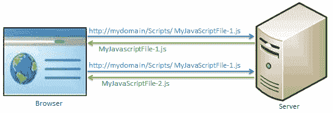
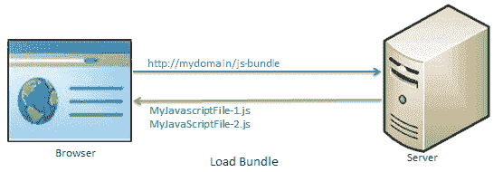

# 捆绑和缩小

> 原文:[https://www . tutorial stearn . com/MVC/捆绑和缩小-in-asp.net-mvc](https://www.tutorialsteacher.com/mvc/bundling-and-minification-in-asp.net-mvc)

在 MVC 4 中引入了捆绑和缩小技术来改善请求加载时间。捆绑允许我们在一个 HTTP 请求中从服务器加载一堆静态文件。

下图说明了捆绑技术:

<figure>[](../../Content/images/mvc/bundling-1.png)

<figcaption>Loading script files in separate requests</figcaption>

</figure>

在上图中，浏览器发送两个单独的请求来加载两个不同的 JavaScript 文件`MyJavaScriptFile-1.js`和`MyJavaScriptFile-2.js`。

ASP.NET MVC 中的捆绑技术允许我们在一个请求中加载多个 JavaScript 文件`MyJavaScriptFile-1.js`和`MyJavaScriptFile-2.js`，如下所示。

<figure>[](../../Content/images/mvc/bundling-2.png)</figure>

## 缩小

缩小技术通过删除不必要的空白和注释以及将变量名缩短为一个字符来优化脚本或 CSS 文件的大小。

例如，考虑下面的 JavaScript 函数。

Example: JavaScript<button class="copy-btn pull-right" title="Copy example code">*Copy*</button> *```
sayHello = function(name){
    //this is comment
    var msg = "Hello" + name;
    alert(msg);
} 
```

缩小将删除不必要的空格、注释和缩短变量名以减少字符，这将减少 JavaScript 文件的大小。上面的 JavaScript 将被最小化为下面的脚本。

Example: Minified JavaScript<button class="copy-btn pull-right" title="Copy example code">*Copy*</button> *```
sayHello=function(n){var t="Hello"+n;alert(t)} 
```

捆绑和缩小会影响页面的加载时间。

## 捆绑类型

MVC 5 在`System.web.Optimization`命名空间中包括以下捆绑类:

**script bundle**:script bundle 负责单个或多个脚本文件的 JavaScript 缩小。

**StyleBundle** : StyleBundle 负责单个或多个样式表文件的 CSS 缩小。

**DynamicFolderBundle** :表示 ASP.NET 从包含相同类型文件的文件夹中创建的 Bundle 对象。

在下一节中了解 ScriptBundle。**