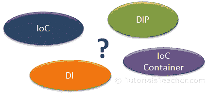
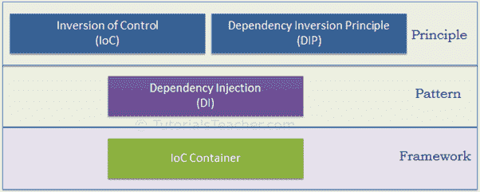
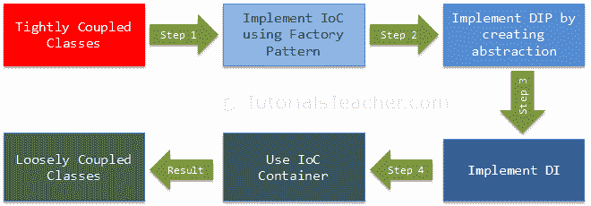

# 国际奥委会简介

> 原文:[https://www.tutorialsteacher.com/ioc/introduction](https://www.tutorialsteacher.com/ioc/introduction)

术语控制反转(IoC)、依赖反转原理(DIP)、依赖注入(DI)和 IoC 容器可能很熟悉。但是你清楚每个术语的含义吗？

<figure></figure>

在这里，您将学习每个术语，使用简单和真实的例子来消除您的困惑。在你更进一步之前，理解原理和模式之间的[区别是很重要的。](/articles/difference-between-design-principle-and-design-pattern "Design Principle vs Design Pattern")

现在，让我们理解上面的流行语。下图阐明了它们是原则还是模式。

<figure></figure>

如上图所示，IoC 和 DIP 是设计应用程序类时应该使用的高级设计原则。因为它们是原则，所以它们推荐某些最佳实践，但不提供任何具体的实现细节。依赖注入(DI)是一种模式，IoC 容器是一个框架。

在详细讨论之前，让我们先对每个术语进行概述。

### 控制反转

IoC 是一种设计原则，它建议在面向对象设计中反转不同种类的控件，以实现应用程序类之间的松散耦合。在这种情况下，控制指的是一个类除了它的主要职责之外的任何附加职责，例如对应用程序流的控制，或者对依赖对象创建和绑定的控制(记住 SRP -单一职责原则)。如果你想做 TDD(测试驱动开发)，那么你必须使用 IoC 原则，没有这个原则 TDD 是不可能的。下一章详细了解 IoC。

### 依赖倒置原则

DIP 原则也有助于实现类之间的松散耦合。强烈建议将 DIP 和 IoC 一起使用，以实现松耦合。

DIP 建议高级模块不要依赖低级模块。两者都应该依赖于抽象。

DIP 原理是由罗伯特·马丁(又名鲍勃叔叔)发明的。他是坚实原则的创始人。在 [DIP](/ioc/dependency-inversion-principle "Learn Dependency Inversion Principle") 章节中了解更多关于 DIP 的信息。

### 依赖注入

依赖注入(DI)是一种设计模式，它实现了 IoC 原则来反转依赖对象的创建。我们将在 [DI](/ioc/dependency-injection "Learn Dependency Injection") 一章中了解。

### IoC 容器

IoC 容器是一个用于在整个应用程序中管理自动依赖注入的框架，因此我们作为程序员不需要投入更多的时间和精力。有各种各样的 IoC 容器。NET，如 [Unity](https://github.com/unitycontainer/unity) 、[nineject](https://github.com/ninject)、 [StructureMap](https://structuremap.github.io) 、[autopac](https://autofac.org)等。 我们将在 [IoC 容器](/ioc/ioc-container "Learn IoC Container")一章中了解更多。

我们不能通过单独使用 IoC 来实现松散耦合的类。除了 IoC，我们还需要使用 DIP、DI 和 IoC 容器。下图说明了我们将如何在接下来的几章中逐步实现松耦合设计。

<figure></figure>

让我们了解一下上面的每个步骤，从下一章的第一步 IoC 开始。