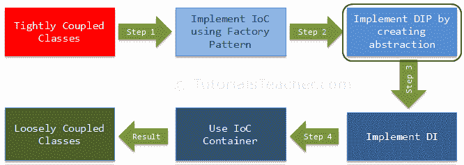

# 依赖倒置原则

> 原文:[https://www . tutorial stearn . com/IOC/dependency-inversion-principle](https://www.tutorialsteacher.com/ioc/dependency-inversion-principle)

在前一章中，我们学习了使用工厂模式实现 IoC 原则，并实现了松耦合设计的第一层。在这里，我们将学习如何实现依赖反转原则，作为实现松散耦合类的第二步。

[](../../Content/images/ioc/ioc-step2.png)

首先，让我们了解什么是依赖反转原理(DIP)？

DIP 是[罗伯特·马丁](https://en.wikipedia.org/wiki/Robert_Cecil_Martin)(又名鲍勃叔叔) 发明的面向对象原则之一

## DIP 定义

1.  高级模块不应该依赖于低级模块。两者都应该依赖于抽象。
2.  抽象不应该依赖于细节。细节应该依赖于抽象。

为了理解 DIP，让我们举一个上一章的例子，如下所示。

```
public class CustomerBusinessLogic
{
    public CustomerBusinessLogic()
    {
    }

    public string GetCustomerName(int id)
    {
        DataAccess _dataAccess = DataAccessFactory.GetDataAccessObj();

        return _dataAccess.GetCustomerName(id);
    }
}

public class DataAccessFactory
{
    public static DataAccess GetDataAccessObj() 
    {
        return new DataAccess();
    }
}

public class DataAccess
{
    public DataAccess()
    {
    }

    public string GetCustomerName(int id) {
        return "Dummy Customer Name"; // get it from DB in real app
    }
} 
```

在上面的例子中，我们实现了工厂模式来实现 IoC。但是，`CustomerBusinessLogic`类使用具体的`DataAccess`类。因此，它仍然是紧密耦合的，即使我们已经将依赖对象的创建反转为工厂类。

让我们在`CustomerBusinessLogic`和`DataAccess`类上使用 DIP，使它们更加松散耦合。

根据 DIP 定义，高级模块不应依赖于低级模块。两者都应该依赖于抽象。因此，首先，决定哪个是高级模块(类)和低级模块。高级模块是依赖于其他模块的模块。在我们的例子中，`CustomerBusinessLogic`依赖于`DataAccess`类，所以`CustomerBusinessLogic`是高级模块，`DataAccess`是低级模块。 所以，按照 DIP 的第一条规则，`CustomerBusinessLogic`不应该依赖于具体的`DataAccess`类，相反两个类都应该依赖于抽象。

DIP 中的第二条规则是“抽象不应该依赖于细节。细节应该依赖于抽象”。

### 什么是抽象？

抽象和封装是面向对象编程的重要原则。不同的人有很多不同的定义，但是让我们用上面的例子来理解抽象。

在英语中，抽象意味着非具体的东西。在编程术语中，上面的`CustomerBusinessLogic`和`DataAccess`是具体的类，意味着我们可以创建它们的对象。 因此，编程中的抽象意味着创建一个非具体的接口或抽象类。这意味着我们不能创建接口或抽象类的对象。根据 DIP，`CustomerBusinessLogic`(高级模块)不应依赖于具体的`DataAccess`级(低级模块)。 两个类都应该依赖于抽象，这意味着两个类都应该依赖于一个接口或者一个抽象类。

现在，接口(或抽象类)中应该有什么？可以看到，`CustomerBusinessLogic`使用的是`DataAccess`类的`GetCustomerName()`方法(现实生活中，`DataAccess`类会有很多客户相关的方法)。 那么，我们在界面中声明`GetCustomerName(int id)`方法，如下图所示。

```
public interface ICustomerDataAccess
{
    string GetCustomerName(int id);
} 
```

现在，在`CustomerDataAccess`类中实现`ICustomerDataAccess`，如下图所示(因此，让我们定义新的`CustomerDataAccess`类，而不是`DataAccess`类)。

```
public class CustomerDataAccess: ICustomerDataAccess
{
    public CustomerDataAccess()
    {
    }

    public string GetCustomerName(int id) {
        return "Dummy Customer Name";        
    }
} 
```

现在，我们需要更改返回`ICustomerDataAccess`的工厂类，而不是具体的`DataAccess`类，如下所示。

```
public class DataAccessFactory
{
    public static ICustomerDataAccess GetCustomerDataAccessObj() 
    {
        return new CustomerDataAccess();
    }
} 
```

现在，将使用`ICustomerDataAccess`的`CustomerBusinessLogic`类改为具体的`DataAccess`类，如下图所示。

```
public class CustomerBusinessLogic
{
    ICustomerDataAccess _custDataAccess;

    public CustomerBusinessLogic()
    {
        _custDataAccess = DataAccessFactory.GetCustomerDataAccessObj();
    }

    public string GetCustomerName(int id)
    {
        return _custDataAccess.GetCustomerName(id);
    }
} 
```

因此，我们在示例中实现了 DIP，其中高级模块(CustomerBusinessLogic)和低级模块(CustomerDataAccess)依赖于抽象(ICustomerDataAccess)。此外，抽象(ICustomerDataAccess)不依赖于细节(CustomerDataAccess)，但是细节依赖于抽象。

以下是到目前为止讨论的完整的 DIP 示例。

Example: DIP Implementation - C# 

```
public interface ICustomerDataAccess
{
    string GetCustomerName(int id);
}

public class CustomerDataAccess: ICustomerDataAccess
{
    public CustomerDataAccess() {
    }

    public string GetCustomerName(int id) {
        return "Dummy Customer Name";        
    }
}

public class DataAccessFactory
{
    public static ICustomerDataAccess GetCustomerDataAccessObj() 
    {
        return new CustomerDataAccess();
    }
}

public class CustomerBusinessLogic
{
    ICustomerDataAccess _custDataAccess;

    public CustomerBusinessLogic()
    {
        _custDataAccess = DataAccessFactory.GetCustomerDataAccessObj();
    }

    public string GetCustomerName(int id)
    {
        return _custDataAccess.GetCustomerName(id);
    }
} 
```

在上面的例子中实现 DIP 的优点是`CustomerBusinessLogic`和`CustomerDataAccess`类是松散耦合的类，因为`CustomerBusinessLogic`不依赖于具体的`DataAccess`类，而是包含了对`ICustomerDataAccess`接口的引用。 所以现在，我们可以很容易地使用另一个实现了不同实现的类`ICustomerDataAccess`。

尽管如此，我们还没有实现完全松散耦合的类，因为`CustomerBusinessLogic`类包含一个工厂类来获取`ICustomerDataAccess`的引用。 这就是依赖注入模式帮助我们的地方。 在下一章中，我们将学习如何使用依赖注入(DI)和使用上述示例的策略模式。*