# 创建网络应用编程接口项目

> 原文：<https://www.tutorialsteacher.com/webapi/create-web-api-project>

在这里，您将学习如何使用 Visual Studio 创建一个新的 ASP.NET 网络应用编程接口项目。

您可以通过两种方式创建网络应用编程接口项目。

1.  基于 MVC 项目的网络应用编程接口
2.  独立网络应用编程接口项目

## 基于 MVC 项目的网络应用编程接口

Visual Studio (2013/2015/2017)包含网络应用编程接口模板，该模板使用 ASP.NET MVC 应用程序创建了一个新的网络应用编程接口项目，并包含了开始使用所需的所有参考。

为此，打开 Visual Studio，点击**文件**菜单，点击**新建项目。**这将打开如下所示的新项目弹出窗口。

[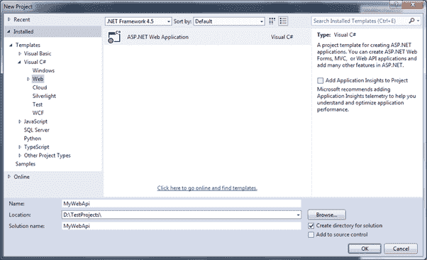](../../Content/images/webapi/create-webapi-project1.png)

Create Web API project


在新建项目弹出窗口中，展开 **Visual C#** 并在左窗格中选择**网站**节点。在中间窗格选择**ASP.NET Web 应用**模板，输入项目名称，点击**确定**。 (ASP.NET 网络应用(。NET 框架)模板。)

这将打开新 ASP.NET 项目弹出窗口，如下所示。

[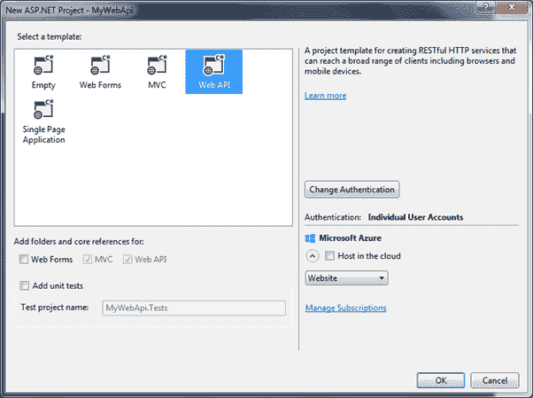](../../Content/images/webapi/create-webapi-project2.png)

Select Web API Template


在上面的弹出窗口中选择网络应用编程接口。请注意，这已经选中并禁用了 MVC 和 Web API 复选框。这意味着它将为 MVC 和网络应用编程接口添加必要的文件夹和引用。

单击“确定”创建一个新的网络应用编程接口+ MVC 项目，如下所示。

[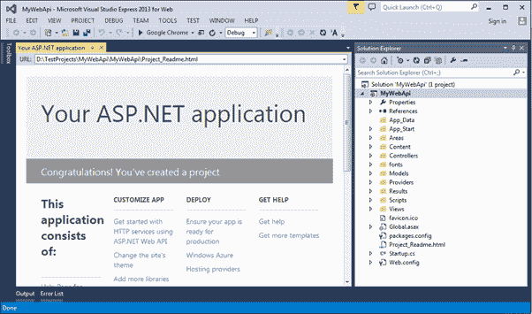](../../Content/images/webapi/create-webapi-project3.png)

Web API project


该项目与默认 MVC 项目相同，有两个特定的 Web API 文件， **App_Start** 文件夹中的 WebApiConfig.cs 和**控制器**文件夹中的 ValuesController.cs，如下图所示。

[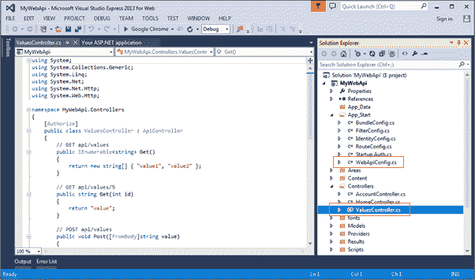](../../Content/images/webapi/create-webapi-project4.png)

Web API project


WebApiConfig.cs 是 Web API 的配置文件。你可以为网络应用编程接口配置路由和其他东西，就像 RouteConfig.cs 被用来配置 MVC 路由一样。默认情况下，它还创建网络应用编程接口控制器值。在下一节中，您将了解网络配置和控制器。

因此，您可以用 MVC 创建 Web API 项目来开始您的应用程序。

## 独立网络应用编程接口项目

在这里，我们将创建一个没有 MVC 项目的新的独立的 Web API 项目。

为此，打开 Visual Studio 2013 进行网页->转到**文件**菜单，选择**新项目..**这将打开如下所示的**新项目**弹出窗口。

[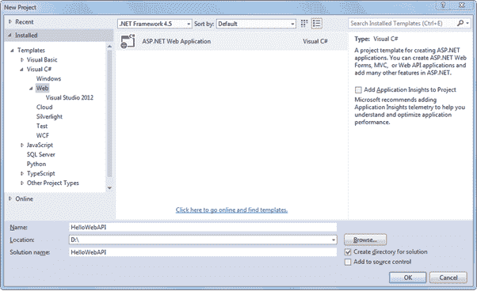](../../Content/images/webapi/create-webapi-project.png)

Create Web API Project


在左窗格中选择**网页**模板，在中间窗格中选择**ASP.NET 网页应用**。如上所示，输入项目名称、位置和解决方案名称。点击**确定**会弹出如下图。

[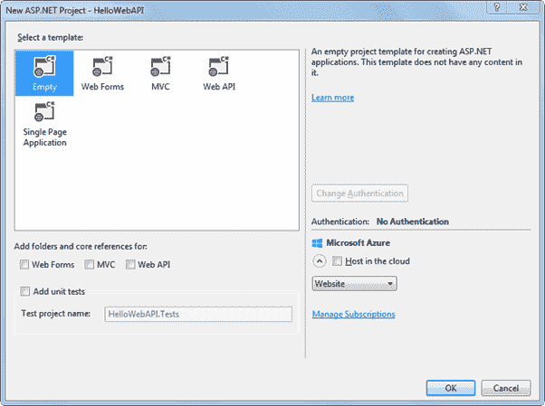](../../Content/images/webapi/webapi-project-template.png)

Select Project Template


在上面的弹出窗口中，选择**清空**作为模板，点击确定。这将创建一个空的“HelloWebAPI”项目。

现在，我们需要使用 **NuGet 包管理器**添加最新的 Web API 引用。右键单击项目，然后单击**管理新包..**如下图。

[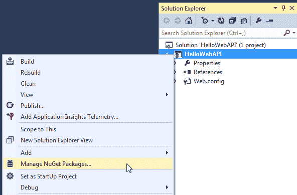](../../Content/images/webapi/open-nuget.png)

Open NuGet


这将打开管理新包弹出窗口。在左窗格中选择**在线**并搜索 webapi(确保互联网连接打开)。这将显示所有与网络应用编程接口相关的包。选择**微软 ASP.NET 网 API2.2** 包，点击**安装**，如下图。

[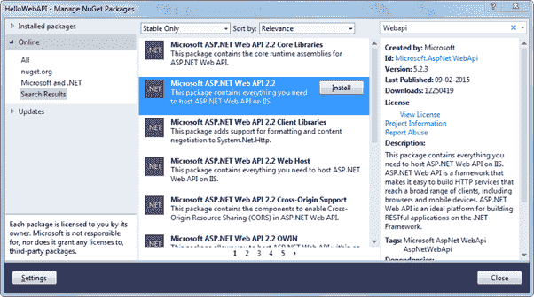](../../Content/images/webapi/install-webapi-package1.png)

Install Web API Package


接受许可协议并继续。

[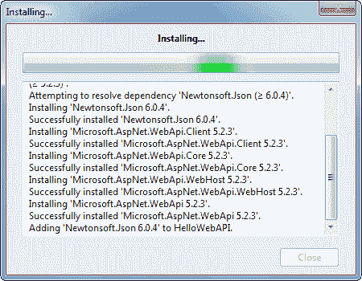](../../Content/images/webapi/install-webapi-package2.png)

Install Web API Package


成功安装后，将显示以下网络应用编程接口包。

[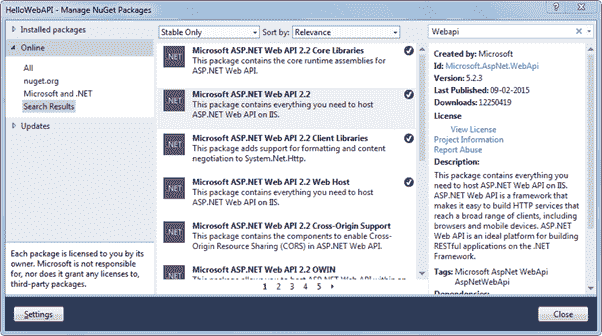](../../Content/images/webapi/webapi-packages.png)

Web API Packages


现在，在 HelloWebAPI 项目中创建控制器和配置文件夹，如下所示。我们将在控制器文件夹中添加网络应用编程接口控制器，并在配置文件夹中添加配置类。

[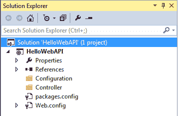](../../Content/images/webapi/hellowebapi-project.png)

Web API Project


现在，在配置文件夹中添加一个新类，并用以下内容将其命名为“HelloWebAPIConfig”。(您可以给出任何合适的名称)

Example: Web API Configuration 

```
using System;
using System.Collections.Generic;
using System.Linq;
using System.Web;
using System.Web.Http;

namespace HelloWebAPI.Configuration
{
    public static class HelloWebAPIConfig
    {
        public static void Register(HttpConfiguration config)
        {
            // Web API routes
            config.MapHttpAttributeRoutes();

            config.Routes.MapHttpRoute(
                name: "DefaultApi",
                routeTemplate: "api/{controller}/{id}",
                defaults: new { id = RouteParameter.Optional }
            );
        }
    }
} 
```

现在，通过右键单击项目->选择添加->单击新建项目来添加 Global.asax..打开如下所示的添加新项目弹出窗口。选择全局应用程序类，然后单击确定。

[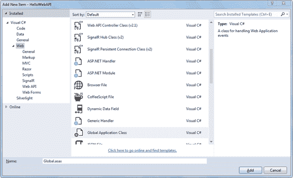](../../Content/images/webapi/global.png)

Add Global.asax


这将把 Global.asax 文件添加到项目中。当应用程序启动时，我们需要配置我们的网络应用编程接口路由。所以叫 HelloWebAPIConfig。在全局变量中的 Application_Start 事件中注册()方法，如下所示。

Global.asax 

```
public class Global : System.Web.HttpApplication
{
    protected void Application_Start(object sender, EventArgs e)
    {
        GlobalConfiguration.Configure(HelloWebAPIConfig.Register);
    }
} 
```

Web API 仅使用基于代码的配置进行配置，该配置使用全局配置类。Configure()方法需要一个回调方法，您已经在该方法中配置了您的网络应用编程接口。

因此，当应用程序启动时，它将调用 Application_Start 事件，该事件又调用 HelloWebAPIConfig。注册()方法来配置您的网络应用编程接口。

现在，让我们通过右键单击控制器文件夹->选择控制器来添加网络应用编程接口控制器..这将打开如下弹出窗口。

[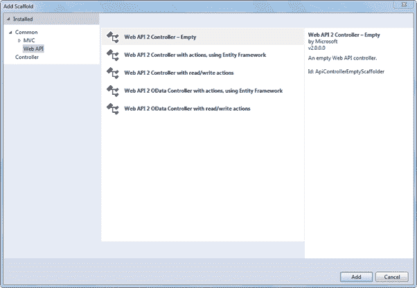](../../Content/images/webapi/add-webapi-controller1.png)

Add Web API Controller


在左窗格选择 Web API，在中间窗格选择 Web API 2 控制器-空，点击**添加**。这将打开另一个弹出窗口，输入控制器的名称，如下所示。输入控制器名称，点击**添加**。

[](../../Content/images/webapi/add-webapi-controller2.png)

Enter Controller Name


这将在控制器文件夹中创建以下空的 HelloController 类。

Example: Web API Controller 

```
using System;
using System.Collections.Generic;
using System.Linq;
using System.Net;
using System.Net.Http;
using System.Web.Http;

namespace HelloWebAPI.Controller
{
    public class HelloController : ApiController
    {

    }
} 
```

现在，我们需要添加行动方法。在这里，我们将添加简单的 Get 操作方法，如下所示。

Example: Web API Controller 

```
using System;
using System.Collections.Generic;
using System.Linq;
using System.Net;
using System.Net.Http;
using System.Web.Http;

namespace HelloWebAPI.Controller
{
    public class HelloController : ApiController
    {
        public string Get()
        {
            return "Hello World";
        }
    }
} 
```

现在，编译并运行项目，在浏览器中导航至`http://localhost:xxxx/api/hello`。它将显示以下结果。(用本地端口号替换 xxxx)

[](../../Content/images/webapi/access-hellowebapi.png)

Access Web API in the Browser


因此，通过这种方式，您可以用配置和控制器类从头开始创建一个简单的网络应用编程接口。

在开发过程中，程序员经常需要对 Web API 的结果进行测试和检查。在下一节中学习如何测试网络应用编程接口进行开发。****