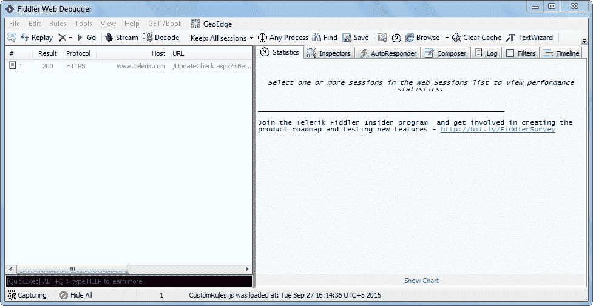
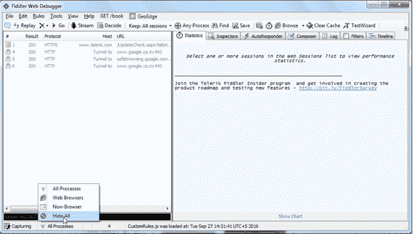
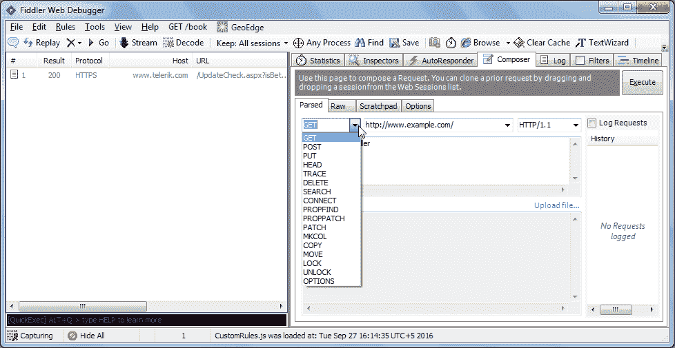
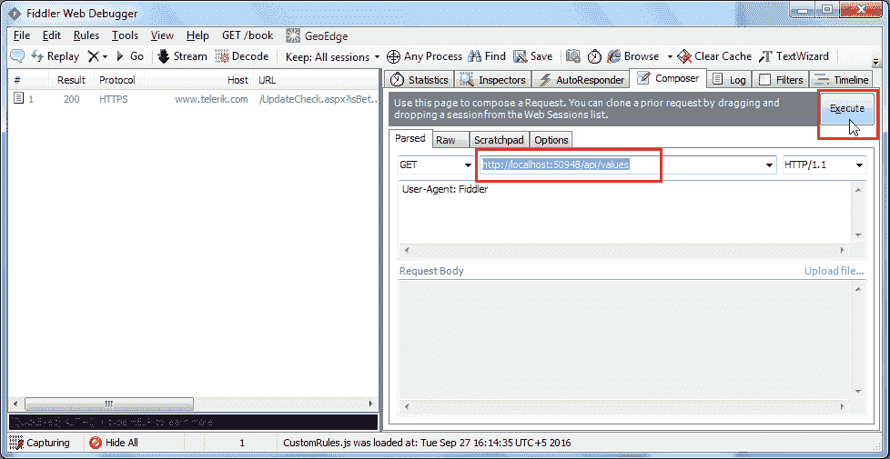
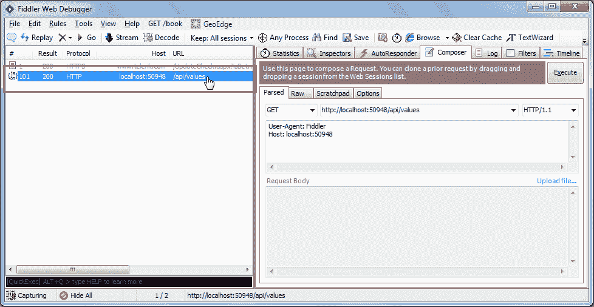
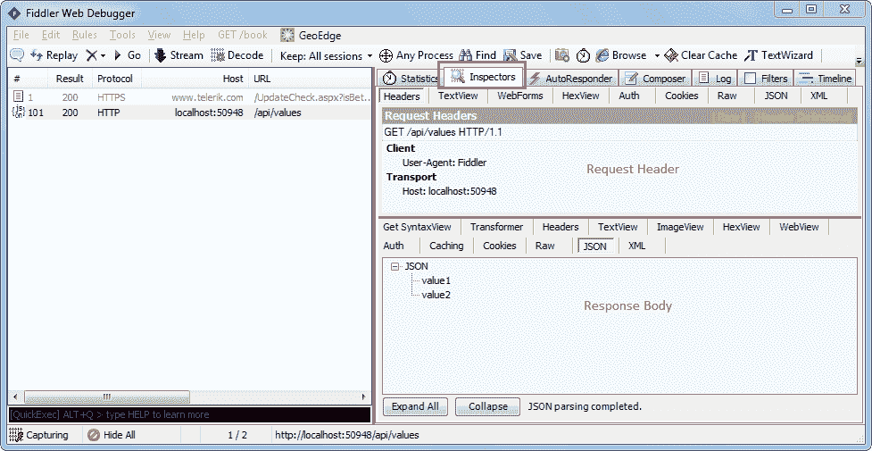
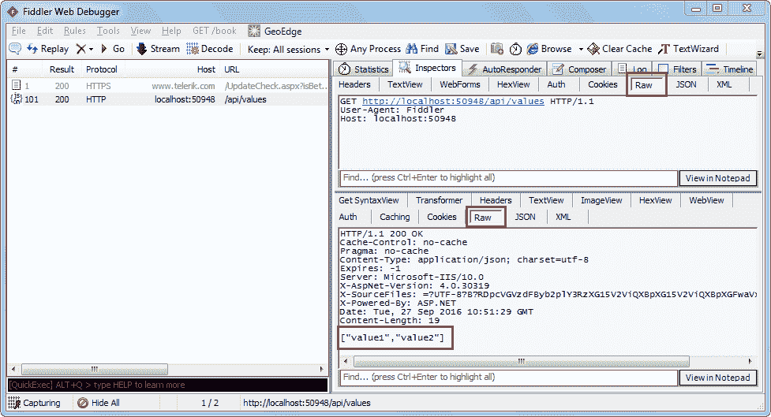
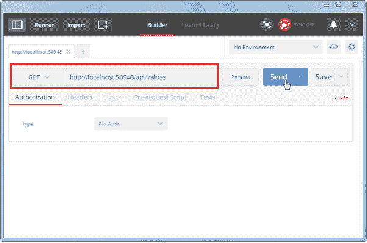
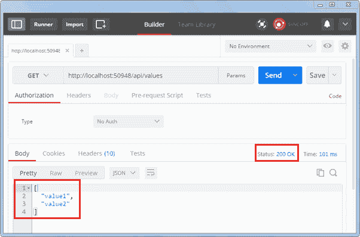

# 测试网络应用编程接口

> 原文：<https://www.tutorialsteacher.com/webapi/test-web-api>

在前一节中，我们创建了第一个简单的网络应用编程接口项目。现在我们将学习如何在本地测试网络应用编程接口，以在开发过程中检查请求和响应。

我们可以使用以下第三方工具来测试网络应用编程接口。

*   [提琴手](http://www.telerik.com/fiddler)T2】
*   [邮递员](https://www.getpostman.com/)T2】

## 游手好闲的人

Fiddler 是任何浏览器的免费调试代理。我们可以使用它来编写和执行对我们的网络应用编程接口的不同的 HTTP 请求，并检查 HTTP 响应。

让我们看看如何使用 Fiddler 向我们本地的网络应用编程接口发送一个 HTTP 请求，并检查响应。

**第一步:**

从[这里](https://www.telerik.com/download/fiddler)下载安装 Fiddler。

**第二步:**

安装成功后，点击 Fiddler.exe 打开提琴手。它看起来像下图。

Fiddler

默认情况下，Fiddler 捕获所有进程。我们只对拦截我们的本地进程感兴趣。所以点击左下角的**全部进程**，选择**全部隐藏**。

Hide All Processes in Fiddler

**第三步:**

单击“编写器”选项卡。Composer 选项卡中的第一个选项卡是 Parsed 选项卡，在这里我们可以配置 HTTP 请求并执行它。第一个下拉列表包括所有的 HTTP 方法。为要执行的请求选择特定的 HTTP 方法。在这里，我们将选择 GET 来执行 HTTP GET 请求，如下所示。

Select HTTP Method

现在，在相邻的文本框中输入请求的网址。在这里，我们将对我们在上一节中创建的网络应用编程接口执行 HTTP 请求`http://localhost:xxxx/api/values`，如下所示。

Enter URL and Execute

单击执行按钮发送这个 HTTP 请求，它将立即在左窗格中显示响应，如下所示。

Response in Fiddler

双击上面的结果行，打开请求的检查器选项卡，如下所示。

Fiddler Request & Response

如上所述，顶部窗格显示请求标题，底部窗格显示响应。

您还可以通过单击请求和响应的原始选项卡来查看原始请求标题和响应，如下所示。

Fiddler Request & Response in Raw Format

您还可以在 Fiddler 中看到其他形式的请求和响应，但这是执行 HTTP 请求和检查响应的基本方式。

## 邮递员

Postman 是一个免费的 API 调试工具。您可以将其安装在您的 Chrome 浏览器或 Mac 上。从[这里](https://chrome.google.com/webstore/detail/postman-rest-client/fhbjgbiflinjbdggehcddcbncdddomop)开始为 Chrome 安装。

安装成功后，打开它并选择 HTTP 方法，然后输入您的网络应用编程接口的网址，如下所示。

Test Web API in Postman

单击发送按钮向提供的网址发送一个 HTTP 请求。响应如下所示。

Response in Postman

如上所述，HTTP 响应显示数据和响应状态。因此，您可以使用邮递员来测试您的网络应用编程接口。

我们将在整个教程系列中使用 Fiddler。