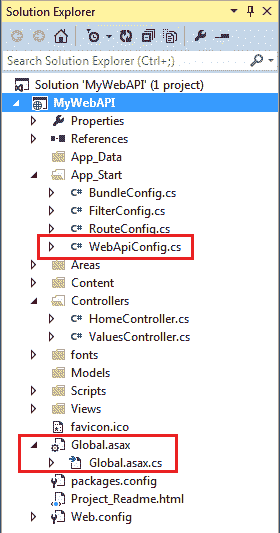

# 配置网络应用编程接口

> 原文:[https://www.tutorialsteacher.com/webapi/configure-web-api](https://www.tutorialsteacher.com/webapi/configure-web-api)

Web API 支持基于代码的配置。它不能在 web.config 文件中配置。我们可以配置网络应用编程接口来定制网络应用编程接口托管基础设施和组件的行为，如路由、格式化程序、过滤器、依赖关系解决程序、消息处理程序、参数、属性、服务等。

我们在[创建网络应用编程接口项目](/webapi/create-web-api-project)部分创建了一个简单的网络应用编程接口项目。Web API 项目在 App_Start 文件夹中包含默认的 WebApiConfig 类，还包含如下所示的 Global.asax。

[](../../Content/images/webapi/webapiconfig.png)

Configure Web API


Global.asax 

```
public class WebAPIApplication : System.Web.HttpApplication
{
    protected void Application_Start()
    {
        GlobalConfiguration.Configure(WebApiConfig.Register);

        //other configuration
    }
} 
```

WebApiConfig 

```
public static class WebApiConfig
{
    public static void Register(HttpConfiguration config)
    {

        config.MapHttpAttributeRoutes();

        config.Routes.MapHttpRoute(
            name: "DefaultApi",
            routeTemplate: "api/{controller}/{id}",
            defaults: new { id = RouteParameter.Optional }
        );

        // configure additional webapi settings here..
    }
} 
```

Web API 配置过程在应用程序启动时开始。它在 Application_Start 方法中调用`GlobalConfiguration.Configure(WebApiConfig.Register)`。 Configure()方法需要回调方法，其中已经在代码中配置了 Web API。默认情况下，这是静态的网络配置。Register()方法。

如上所述，`WebApiConfig.Register()`方法包括一个`HttpConfiguration`类型的参数，然后用于配置网络应用编程接口。`HttpConfiguration`是主要的类，它包括以下属性，使用这些属性可以覆盖网络应用编程接口的默认行为。

| 财产 | 描述 |
| --- | --- |
| DependencyResolver | 获取或设置依赖项注入的依赖项解析器。 |
| 过滤 | 获取或设置筛选器。 |
| 格式化程序 | 获取或设置媒体类型格式化程序。 |
| 包括铁路脱轨政策 | 获取或设置一个值，该值指示错误信息中是否应包含错误详细信息。 |
| 消息处理器 | 获取或设置消息处理程序。 |
| 参数绑定规则 | 获取应如何绑定参数的规则集合。 |
| 性能 | 获取与此网站应用编程接口实例关联的属性。 |
| 路线 | 获取为网络应用编程接口配置的路由集合。 |
| 服务 | 获取网络应用编程接口服务。 |

访问 MSDN，了解 [HttpConfiguration](https://msdn.microsoft.com/en-us/library/system.web.http.httpconfiguration(v=vs.118).aspx) 的所有成员。

在下一节中学习如何配置网络应用编程接口路由。**