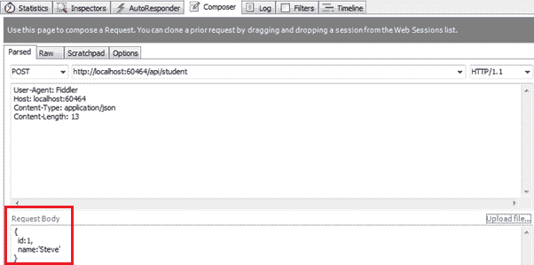
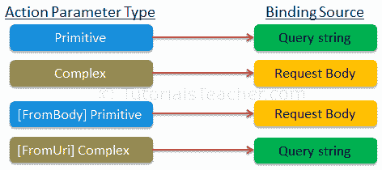

# ASP.NET Web API 中的参数绑定

> 原文：<https://www.tutorialsteacher.com/webapi/parameter-binding-in-web-api>

在前一节中，我们学习了 Web API 如何将 HTTP 请求路由到控制器和动作方法。在这里，我们将学习 Web API 如何将 HTTP 请求数据绑定到动作方法的参数。

Web API 控制器中的动作方法可以有一个或多个不同类型的参数。它可以是基本类型，也可以是复杂类型。根据参数类型，Web API 将动作方法参数与 URL 的查询字符串或请求正文绑定在一起。

默认情况下，如果参数类型为 .NET 基本类型，如 int、bool、double、string、GUID、DateTime、decimal 或任何其他可以从字符串类型转换的类型，然后它从查询字符串中设置参数的值。如果参数类型是复杂类型，那么默认情况下，Web API 会尝试从请求体中获取值。

下表列出了参数绑定的默认规则。

| HTTP 方法 | 查询字符串 | 请求正文 |
| --- | --- | --- |
| 得到 | 原始类型，
复杂类型 | 钠 |
| 邮政 | 原语类型 | 复数型 |
| 放 | 原语类型 | 复数型 |
| 修补 | 原语类型 | 复数型 |
| 删除 | 原始类型，
复杂类型 | 钠 |

让我们看看 Web API 如何从 HTTP 请求中获取动作方法参数的值。

## 获取带有原始参数的动作方法

考虑以下包含单个图元类型参数的`GET`动作方法的示例。

Example: Primitive Parameter Binding 

```cs
public class StudentController : ApiController
{
    public Student Get(int id) 
    {

    }
} 
```

可以看到，上面的 HTTP `GET`动作方法包含了`int`类型的`id`参数。因此，Web API 将尝试从请求的网址的查询字符串中提取 id 的值，将其转换为 int，并将其分配给`GET`动作方法的`id`参数。 例如，如果一个 HTTP 请求是`http://localhost/api/student?id=1`，那么`id`参数的值将是 1。

以下是上述动作方法的有效 HTTP `GET`请求。

`http://localhost/api/student?id=1`

`http://localhost/api/student?ID=1`

*Note:**Query string parameter name and action method parameter name must be the same (case-insensitive). If names do not match, then the values of the parameters will not be set. The order of the parameters can be different.* *## 多个基本参数

考虑以下具有多个图元参数的`GET`动作方法的示例。

Example: Multiple Parameters Binding 

```cs
public class StudentController : ApiController
{
    public Student Get(int id, string name) 
    {

    }
} 
```

如上图所示，一个 HTTP `GET`方法包含多个原语类型参数。因此，Web API 将尝试从请求的网址的查询字符串中提取值。 例如，如果一个 HTTP 请求是`http://localhost/api/student?id=1&name=steve`，那么`id`参数的值将是 1，`name`参数将是`"steve"`。

以下是上述动作方法的有效 HTTP GET 请求。

`http://localhost/api/student?id=1&name=steve`

`http://localhost/api/student?ID=1&NAME=steve`

`http://localhost/api/student?name=steve&id=1`

*Note:**Query string parameter names must match with the name of an action method parameter. However, they can be in a different order.* *## 具有原始参数的后动作方法

一个 HTTP `POST`请求被用来创建一个新的资源。它可以将请求数据包含在 HTTP 请求正文和查询字符串中。

考虑下面的后动作方法。

Example: Post Method with Primitive Parameter 

```cs
public class StudentController : ApiController
{
    public Student Post(id id, string name)
    {

    }
} 
```

如上图所示，`Post()`动作方法包括图元类型参数 id 和名称。因此，默认情况下，Web API 将从查询字符串中获取值。 例如，如果一个 HTTP POST 请求是`http://localhost/api/student?id=1&name=steve`，那么在上面的`Post()`方法中，`id`参数的值将是 1，`name`参数将是`"steve"`。

现在，考虑以下带有复杂类型参数的`Post()`方法。

Example: Post Method with Complex Type Parameter 

```cs
public class Student
{
    public int Id { get; set; }
    public string Name { get; set; }
}

public class StudentController : ApiController
{
    public Student Post(Student stud)
    {

    }
} 
```

上述`Post()`方法包括`Student`类型参数。因此，作为默认规则，Web API 将尝试从 HTTP 请求正文中获取`stud`参数的值。

以下是提琴手中针对上述动作方法的有效 HTTP POST 请求。

[](../../Content/images/webapi/fiddler-example1.png) 

Parameter Binding


Web API 将从上面的 HTTP 请求体中提取 JSON 对象，并自动将其转换为`Student`对象，因为 JSON 对象的属性名称与`Student`类属性的名称匹配(不区分大小写)。

## 混合参数的开机自检方法

HTTP `Post`动作方法可以包括原语和复杂类型参数。考虑下面的例子。

Example: Post Method with Primitive and Complex Type Parameters 

```cs
public class Student
{
    public int Id { get; set; }
    public string Name { get; set; }
}

public class StudentController : ApiController
{
    public Student Post(int age, Student student)
    {

    }
} 
```

上面的 Post 方法包括基元和复杂类型参数。所以，默认情况下，Web API 会从查询字符串中获取`age`参数，从请求体中获取`student`参数。

以下是提琴手中针对上述动作方法的有效 HTTP POST 请求。

[](../../Content/images/webapi/post-request-fiddler.png) 

Parameter Binding


*Note:**Post action method cannot include multiple complex type parameters because, at most, one parameter is allowed to be read from the request body.* *Put 和 Patch 方法的参数绑定将与 Web API 中的`POST`方法相同。

## [FromUri]和[FromBody]

您已经看到，默认情况下，ASP.NET Web API 从查询字符串中获取基本参数的值，从请求体中获取复杂类型参数的值。但是，如果我们想改变这种默认行为呢？

使用`[FromUri]`属性强制 Web API 从查询字符串中获取复杂类型的值，`[FromBody]`属性从请求体中获取原语类型的值，与默认规则相反。

比如考虑以下`GET`方法。

Example: FormUri 

```cs
public class StudentController : ApiController
{
    public Student Get([FromUri] Student stud)
    {

    }
} 
```

在上例中，`Get()`方法包含一个带有`[FromUri]`属性的复杂类型参数。因此，Web API 将尝试从查询字符串中获取`Student`类型参数的值。 例如，如果一个 HTTP GET 请求`http://localhost:xxxx/api/student?id=1&name=steve`那么 Web API 将创建一个`Student`类型的对象，并将其`id`和`name`属性值设置为`id`和`name`查询字符串参数的值。

*Note:**The name of the complex type's properties and the query string parameters must match.* *同样，考虑以下`Post()`方法的例子。

Example: FromUri 

```cs
public class StudentController : ApiController
{
    public Student Post([FromUri]Student stud)
    {

    }
} 
```

如上图所示，我们已经应用了带有`Student`参数的`[FromUri]`属性。默认情况下，Web API 从请求体中提取复杂类型的值，但是在这里，我们应用了`[FromUri]`属性。 所以现在，Web API 将从查询字符串而不是请求正文中提取`Student`属性的值。

同样，应用`[FromBody]`属性从请求体而不是查询字符串中获取原语数据类型的值，如下所示。

Example: FromBody 

```cs
public class StudentController : ApiController
{
    public Student Post([FromBody]string name)
    {

    }
} 
```

以下是提琴手中针对上述动作方法的有效 HTTP POST 请求。

[](../../Content/images/webapi/post-request-fiddler2.png) 

Parameter Binding


*Note:**The `[FromBody]` attribute can be applied on only one primitive parameter of an action method. It cannot be applied to multiple primitive parameters of the same action method.* *下图总结了参数绑定规则。

[](../../Content/images/webapi/parameter-binding.png) 

Web API Parameter Bindings

*************