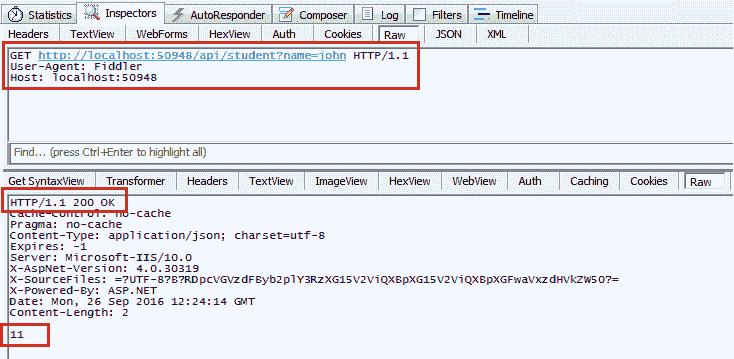
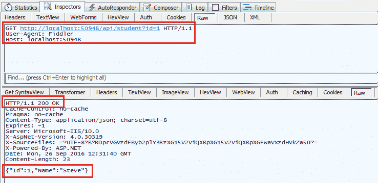
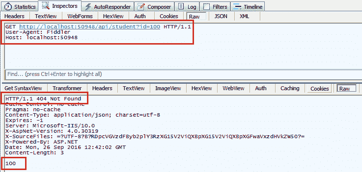
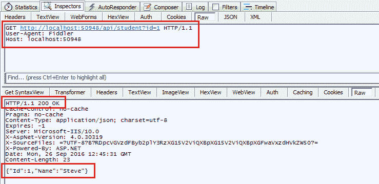

# 操作方法返回类型

> 原文:[https://www . tutorial stearn . com/web API/action-method-return-type-in-web-API](https://www.tutorialsteacher.com/webapi/action-method-return-type-in-web-api)

在上一节中，您学习了使用网络应用编程接口动作方法进行参数绑定。在这里，您将了解操作方法的返回类型，这些返回类型又将嵌入到发送给客户端的网络应用编程接口响应中。

网络应用编程接口操作方法可以有以下返回类型。

1.  空的
2.  基本类型或复杂类型
3.  http 响应消息
4.  IHttpActionResult

## 空的

不是所有的动作方法都一定要返回什么。它可以有 void 返回类型。

例如，考虑下面的删除操作方法，它只是从数据源中删除学生，并且不返回任何内容。

Example: Void Return Type 

```
public class StudentController : ApiController
{
    public void Delete(int id)
    {
        DeleteStudentFromDB(id);
    }
} 
```

如上图所示，删除操作方法返回 void。当您发送 HTTP DELETE 请求时，它将发送 204“无内容”状态代码作为响应，如下所示。

<figure>[](../../Content/images/webapi/void-response-status.png)

<figcaption>Void Response Status</figcaption>

</figure>

## 基本或复杂类型

动作方法可以像其他普通方法一样返回原语或其他自定义复杂类型。

请考虑以下获取操作方法。

Example: Primitive or Complex Return Type 

```
public class Student
{
    public int Id { get; set; }
    public string Name { get; set; }
}

public class StudentController : ApiController
{
    public int GetId(string name)
    {
        int id = GetStudentId(name);

        return id;
    }

    public Student GetStudent(int id)
    {
        var student = GetStudentFromDB(id);

        return student;
    }
} 
```

如上图所示，GetId 动作方法返回一个整数，GetStudent 动作方法返回一个 Student 类型。

一个 HTTP GET 请求`http://localhost:xxxx/api/student?name=john`将在 Fiddler 中返回以下响应。

<figure>[](../../Content/images/webapi/primitive-return-type-response.png)

<figcaption>Primitive Return Type in Response</figcaption>

</figure>

一个 HTTP GET 请求`http://localhost:xxxx/api/student?id=1`将在 Fiddler 中返回以下响应。

<figure>[](../../Content/images/webapi/primitive-return-type-response2.png)

<figcaption>Complex Return Type in Response</figcaption>

</figure>

## http 响应消息

Web API 控制器总是向宿主基础结构返回一个 HttpResponseMessage 对象。下图说明了整个网络应用编程接口请求/响应管道。

<figure>[](../../Content/images/webapi/webapi-request-pipeline.png)

<figcaption>Web API Request Pipeline</figcaption>

</figure>

更多详情请访问 [Web API HTTP 消息生命周期海报](https://www.asp.net/media/4071077/aspnet-web-api-poster.pdf)。

如上图所示，Web API 控制器返回了一个 HttpResponseMessage 对象。您也可以直接从操作方法创建并返回一个 HttpResponseMessage 对象。

从操作方法发送 HttpResponseMessage 的优势在于，您可以按照自己的方式配置响应。您可以根据需要设置状态代码、内容或错误消息(如果有)。

Example: Return HttpResponseMessage 

```
public HttpResponseMessage Get(int id)
{
    Student stud = GetStudentFromDB(id); 

    if (stud == null) {
        return Request.CreateResponse(HttpStatusCode.NotFound, id);
    }

    return Request.CreateResponse(HttpStatusCode.OK, stud);
} 
```

在上面的操作方法中，如果数据库中没有指定 id 的学生，那么它将返回 HTTP 404 未找到状态代码，否则它将返回 200 OK 状态和学生数据。

例如，考虑到数据库中不存在 id=100 的学生，http GET 请求`http://localhost:xxxx/api/student?id=100`将获得以下响应。

<figure>[](../../Content/images/webapi/httpresponsemessage1.png)

<figcaption>Web API Response in Fiddler</figcaption>

</figure>

同样，考虑到数据库中存在 id=1 的学生，HTTP GET 请求`http://localhost:60464/api/student?id=1`将获得以下响应。

<figure>[](../../Content/images/webapi/httpresponsemessage2.png)

<figcaption>Web API Response in Fiddler</figcaption>

</figure>

## IHttpActionResult

在 Web API 2 中引入了 *IHttpActionResult* 。NET 4.5)。Web API 2 中的一个动作方法可以返回一个 IHttpActionResult 类的实现，它或多或少类似于 ASP.NET MVC 中的 ActionResult 类。

您可以创建自己的实现 IHttpActionResult 的类，或者使用`ApiController`类的各种方法返回一个实现 IHttpActionResult 的对象。

Example: Return IHttpActionResult Type using Ok() and NotFound() Methods 

```
public IHttpActionResult Get(int id)
{
    Student stud = GetStudentFromDB(id);

    if (stud == null)
    {
        return NotFound();
    }

    return Ok(stud);
} 
```

在上面的例子中，如果数据库中不存在具有指定 id 的学生，那么它将返回具有状态代码 404 的响应，否则它发送具有状态代码 200 的学生数据作为响应。如您所见，我们不需要编写太多代码，因为 NotFound()和 Ok()方法为我们做了所有的事情。

下表列出了 ApiController 类的所有方法，该类返回实现 IHttpActionResult 接口的类的对象。

| **ApiController 法**T4】 | **描述**T2】 |
| --- | --- |
| 巴德 Request() | 创建状态代码为 400 的 BadRequestResult 对象。 |
| 冲突() | 创建状态代码为 409 的冲突结果对象。 |
| 内容() | 使用指定的状态代码和数据创建一个协商内容结果。 |
| 已创建() | 创建一个状态代码为 201 已创建的 CreatedNegotiatedContentResult。 |
| CreatedAtRoute() | 创建一个状态代码为 201 的 createdroutenegatedcontentresult。 |
| InternalServerError() | 创建状态代码为 500 的内部服务器错误结果。 |
| NotFound() | 创建状态代码为 404 的 NotFoundResult。 |
| Ok() | 创建状态代码为 200 的确定结果。 |
| 重定向() | 创建状态代码为 302 的重定向结果。 |
| RedirectToRoute() | 创建状态代码为 302 的 RedirectToRouteResult。 |
| 响应消息() | 使用指定的 Httpresponsemessageresult 创建响应消息。 |
| 状态码（） | 使用指定的 http 状态代码创建一个 StatusCodeResult。 |
| 未授权() | 创建状态代码为 401 的未授权结果。 |

访问 MSDN，了解 [ApiController](https://msdn.microsoft.com/en-us/library/system.web.http.apicontroller(v=vs.118).aspx ) 的所有成员。

## 创建自定义结果类型

您可以创建自己的自定义类作为实现 IHttpActionResult 接口的结果类型。

下面的示例演示了如何实现 IHttpActionResult 类。

Example: Create Custom Result Type 

```
public class TextResult : IHttpActionResult
{
    string _value;
    HttpRequestMessage _request;

    public TextResult(string value, HttpRequestMessage request)
    {
        _value = value;
        _request = request;
    }

    public Task<HttpResponseMessage> ExecuteAsync(CancellationToken cancellationToken)
    {
        var response = new HttpResponseMessage()
        {
            Content = new StringContent(_value),
            RequestMessage = _request
        };
        return Task.FromResult(response);
    }
} 
```

现在，您可以从如下所示的操作方法返回 TextResult 对象。

Example: Return Custom Result Type 

```
public IHttpActionResult GetName(int id)
{
    string name = GetStudentName(id);

    if (String.IsNullOrEmpty(name))
    {
        return NotFound();
    }

    return new TextResult(name, Request);
} 
```

