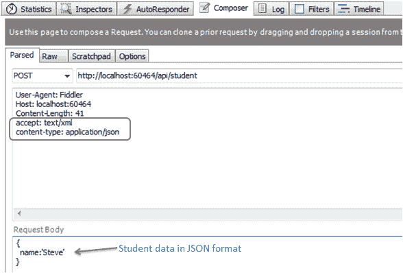
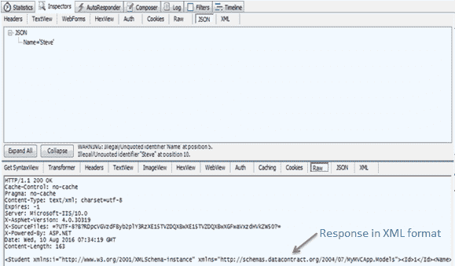
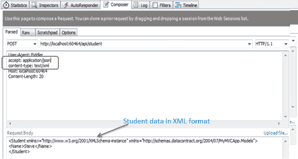
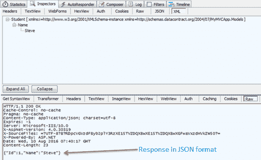

# Web API 请求/响应数据格式

> 原文：<https://www.tutorialsteacher.com/webapi/request-response-data-formats-in-web-api>

在这里，您将学习 Web API 如何处理不同格式的请求和响应数据。

## 媒体类型

媒体类型(又称 MIME 类型)将数据的格式指定为类型/子类型，例如文本/html、文本/xml、应用/json、图像/jpeg 等。

在 HTTP 请求中，使用**接受**和**内容类型**属性在请求头中指定 MIME 类型。“接受”标头属性指定客户端期望的响应数据的格式，而“内容类型”标头属性指定请求正文中数据的格式，以便接收方可以将其解析为适当的格式。

例如，如果一个客户端想要 JSON 格式的响应数据，那么它将向 Web API 发送以下带有接受头的 GET HTTP 请求。

HTTP GET Request:

```
GET http://localhost:60464/api/student HTTP/1.1
User-Agent: Fiddler
Host: localhost:1234
Accept: application/json

```

同样，如果客户端在请求正文中包含 JSON 数据并将其发送给接收方，那么它将发送以下带有内容类型头的 POST HTTP 请求，正文中包含 JSON 数据。

HTTP POST Request:

```
POST http://localhost:60464/api/student?age=15 HTTP/1.1
User-Agent: Fiddler
Host: localhost:60464
Content-Type: application/json
Content-Length: 13

{
  id:1,
  name:'Steve'
}

```

Web API 将请求数据转换为 CLR 对象，并基于接受和内容类型头将 CLR 对象序列化为响应数据。Web API 包括对 JSON、XML、BSON 和表单 URL 编码数据的内置支持。这意味着它会自动将请求/响应数据转换为这些格式 OOB(开箱即用)。

Example: Post Action Method 

```
public class Student
{
    public int Id { get; set; }
    public string Name { get; set; }
}

public class StudentController : ApiController
{
    public Student Post(Student student)
    {
        // save student into db
        var insertedStudent = SaveStudent(student);

        return insertedStudent;
    }
} 
```

正如您在上面看到的，Post()动作方法接受 Student 类型参数，将该学生保存到 DB 中，并使用生成的 id 返回插入的学生。上面的 Web API 处理带有 JSON 或 XML 数据的 HTTP POST 请求，并基于内容类型头值将其解析为学生对象，同样，它基于接受头值将插入的学生对象转换为 JSON 或 XML。

下图说明了 fiddler 中的 HTTP POST 请求。

[](../../Content/images/webapi/webapi-req-response1.png)

Request-Response Data Format


在上图中，Accept 头指定它需要 XML 格式的响应数据，Content-Type 指定请求体中的学生数据是 JSON 格式的。以下是执行上述请求时的响应。

[](../../Content/images/webapi/webapi-req-response2.png)

Request-Response Data Format


同样，您可以使用接受和内容类型头指定不同的请求和响应格式，并且 Web API 将在没有任何额外更改的情况下处理它们。

下面的 HTTP POST 请求以 XML 格式发送数据，以 JSON 格式接收数据。

[](../../Content/images/webapi/fiddler-req2.png)

Web API Request


上面的 HTTP POST 请求在执行时会得到如下响应。

[](../../Content/images/webapi/fiddler-response2.png)

Web API Response


因此，默认情况下，Web API 处理 JSON 和 XML 数据。在下一节中，了解 Web API 如何使用格式化器格式化请求/响应数据。*