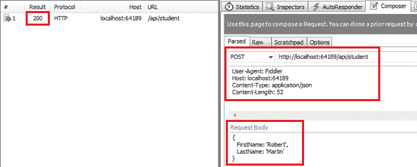

# 为 CRUD 操作创建网络应用编程接口——第 3 部分:实现发布方法

> 原文：<https://www.tutorialsteacher.com/webapi/implement-post-method-in-web-api>

本节是前两节的延续，在这两节中，我们为网络应用编程接口创建了必要的基础设施，并实现了 GET 方法。这里，我们将在 Web API 中实现 POST 方法。

HTTP POST 请求用于在 RESTful 架构中的数据源中创建新记录。因此，让我们在学生控制器中创建一个操作方法，使用实体框架在数据库中插入新的学生记录。

处理 HTTP POST 请求的操作方法必须以一个单词 POST 开始。它可以被命名为 POST，也可以带有任何后缀，例如 Post()，Post()，PostNewStudent()，PostStudents()是处理 HTTP POST 请求的操作方法的有效名称。

下面的示例演示了处理 HTTP POST 请求的 Post 操作方法。

Example: Post Method in Web API Controller 

```
public class StudentController : ApiController
{
    public StudentController()
    {
    }

    //Get action methods of the previous section
    public IHttpActionResult PostNewStudent(StudentViewModel student)
    {
        if (!ModelState.IsValid)
            return BadRequest("Invalid data.");

        using (var ctx = new SchoolDBEntities())
        {
            ctx.Students.Add(new Student()
            {
                StudentID = student.Id,
                FirstName = student.FirstName,
                LastName = student.LastName
            });

            ctx.SaveChanges();
        }

        return Ok();
    }
} 
```

如上图所示，我们将动作方法命名为 PostNewStudent。你可以根据自己的要求给出任何名字，但必须以“邮政”这个词开头。PostNewStudent()动作方法包含 StudentViewModel 类型的参数，该参数包含新学员的所有信息。

在 Post 方法中，我们首先需要使用 ModelState.IsValid 验证模型。这将确保学生对象包含所有必要的信息。如果无效，您可以返回 BadRequest 响应。如果有效，则使用实体框架上下文添加学生，并返回 200 OK 状态响应。

*Note:**This is just a demo project. However, you can return newly created student object with Id in the response.* *现在，您可以使用 Fiddler 发送 HTTP POST 请求，如下所示，并查看响应。

[](../../Content/images/webapi/fiddler-post-request.png) 

Execute HTTP POST request in Fiddler


从上图可以看到，HTTP POST 请求在请求体中包含 *StudentViewModel* 对象成 JSON 格式。成功执行后，响应状态为 200 正常。

接下来，在 Web API 中实现 Put 动作方法来处理 HTTP PUT 请求。**