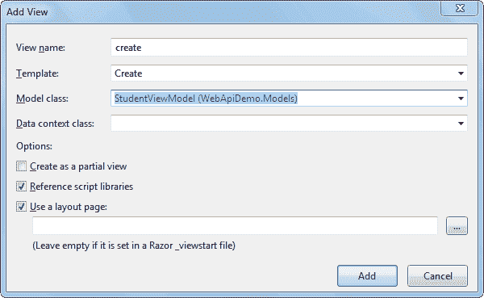
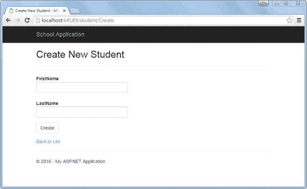
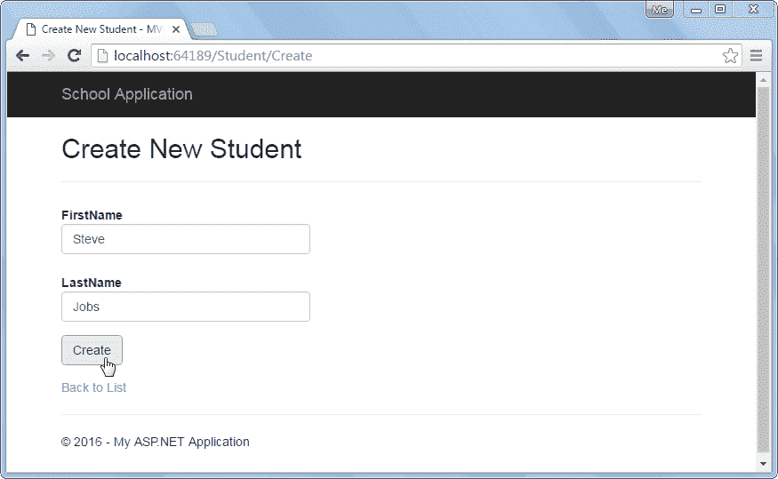
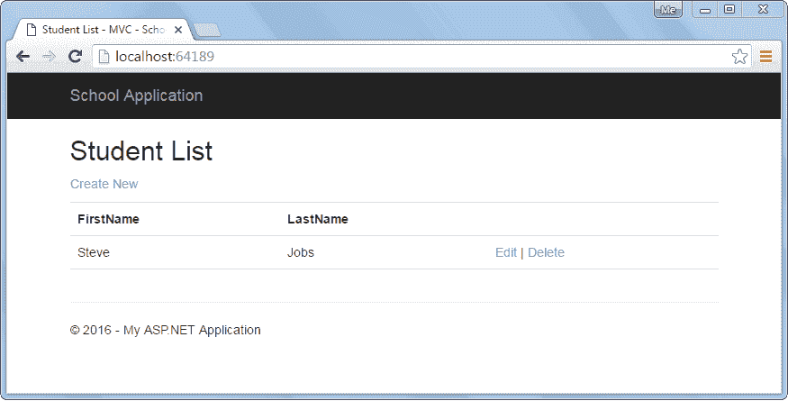
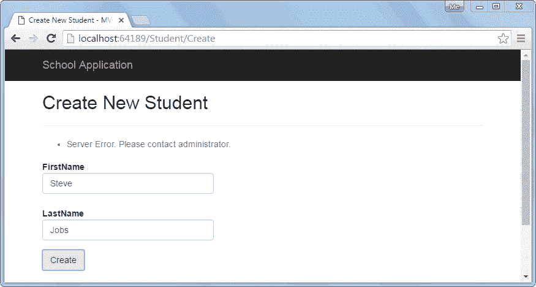

# ASP.NET MVC 中的消费类网页API发布方法

> 原文：<https://www.tutorialsteacher.com/webapi/consume-web-api-post-method-in-aspnet-mvc>

在前一节中，我们学习了如何使用Web API获取方法并在 ASP.NET 视图中显示记录。在这里，我们将看到如何使用 Web API 的 Post 方法在数据源中创建新记录。

我们已经在下面显示的[实现发布方法](/webapi/implement-post-method-in-web-api)部分中用发布方法创建了Web API。

Example: Sample Web API with Post Method 

```
public class StudentController : ApiController
{
    public StudentController()
    {
    }

    //Get action methods of the previous section
    public IHttpActionResult PostNewStudent(StudentViewModel student)
    {
        if (!ModelState.IsValid)
            return BadRequest("Not a valid model");

        using (var ctx = new SchoolDBEntities())
        {
            ctx.Students.Add(new Student()
            {
                StudentID = student.Id,
                FirstName = student.FirstName,
                LastName = student.LastName
            });

            ctx.SaveChanges();
        }

        return Ok();
    }
} 
```

在上面的 Web API 中，`PostNewStudent`方法将处理 HTTP POST 请求`http://localhost:64189/api/student`。它将使用实体框架在数据库中插入新记录，并将返回 200 OK 响应状态。

下面是在前几节中创建的 Web API + MVC 项目结构。我们将在这个项目中添加必要的类。

[](../../Content/images/webapi/project-structure.png)

Web API Project


我们已经在“模型”文件夹下创建了以下 StudentViewModel 类。

Example: Model Class 

```
public class StudentViewModel
{
    public int Id { get; set; }
    public string FirstName { get; set; }
    public string LastName { get; set; }

    public AddressViewModel Address { get; set; }

    public StandardViewModel Standard { get; set; }
} 
```

现在，让我们创建 MVC 视图，通过使用上面的 Web API Post 方法来创建一个新的记录。

**第一步:**

首先，我们需要添加动作方法“创建”，它将呈现“创建新学生”视图，用户可以在其中输入数据并提交它。我们已经在前一节中创建了 StudentController 类来显示学生列表视图。在这里，添加“创建”动作方法来呈现如下所示的“创建新学生”视图。

Example: MVC Controller 

```
public class StudentController : Controller
{
    public ActionResult Index()
    {
        //consume Web API Get method here.. 

        return View();
    }

    public ActionResult create()
    {
        return View();
    }
} 
```

现在，在上面的动作方式中右击，选择**添加视图..**这将打开以下添加视图弹出窗口。

[](../../Content/images/webapi/add-create-view.png)

Add View in ASP.NET MVC


现在，选择创建模板， StudentViewModel 类作为模型，点击如上图所示的添加按钮。这将在视图>学生文件夹中生成如下所示的 createcshtml。

create.cshtml 

```
@model WebApiDemo.Models.StudentViewModel

@{
    ViewBag.Title = "Create New Student - MVC";
    Layout = "~/Views/Shared/_Layout.cshtml";
}

<h2>Create New Student</h2>

@using (Html.BeginForm()) 
{
    @Html.AntiForgeryToken()

    <div class="form-horizontal">
        <hr />
            @Html.ValidationSummary(true, "", new { @class = "text-danger" })
        <div class="form-group">
            @Html.LabelFor(model => model.FirstName, htmlAttributes: new { @class = "control-label col-md-2" })
            <div class="col-md-10">
                @Html.EditorFor(model => model.FirstName, new { htmlAttributes = new { @class = "form-control" } })
                @Html.ValidationMessageFor(model => model.FirstName, "", new { @class = "text-danger" })
            </div>
        </div>

        <div class="form-group">
            @Html.LabelFor(model => model.LastName, htmlAttributes: new { @class = "control-label col-md-2" })
            <div class="col-md-10">
                @Html.EditorFor(model => model.LastName, new { htmlAttributes = new { @class = "form-control" } })
                @Html.ValidationMessageFor(model => model.LastName, "", new { @class = "text-danger" })
            </div>
        </div>

        <div class="form-group">
            <div class="col-md-offset-2 col-md-10">
                <input type="submit" value="Create" class="btn btn-default" />
            </div>
        </div>
    </div>
}

<div>
    @Html.ActionLink("Back to List", "Index")
</div>
```

在上图中，`Html.BeginForm()`生成 HTML 表单标签`<form> action="/Student/Create" method="post" </form>`，当用户点击创建按钮时，该标签将发送 post 请求。

现在，运行项目并导航至`http://localhost:64189/student/create`。它将显示如下所示的简单数据输入视图。

[](../../Content/images/webapi/create-new-student-ui.png)

Create New Student View


用户一输入学生数据，点击上图**创建**按钮，就会向学生 MVC 控制器发送 Post 请求。要处理此帖子请求，请添加动作方法“创建”，如下所示。

Example: Post Method in MVC Controller 

```
public class StudentController : Controller
{
    public ActionResult Index()
    {
        //consume Web API Get method here.. 

        return View();
    }

    public ActionResult create()
    {
        return View();
    }

    [HttpPost]
    public ActionResult create(StudentViewModel student)
    {
        using (var client = new HttpClient())
        {
            client.BaseAddress = new Uri("http://localhost:64189/api/student");

            //HTTP POST
            var postTask = client.PostAsJsonAsync<StudentViewModel>("student", student);
            postTask.Wait();

            var result = postTask.Result;
            if (result.IsSuccessStatusCode)
            {
                return RedirectToAction("Index");
            }
        }

        ModelState.AddModelError(string.Empty, "Server Error. Please contact administrator.");

        return View(student);
    }
} 
```

正如您在上面的 HttpPost 动作方法 create()中看到的，它使用`HttpClient`向带有 StudentViewModel 对象的 Web API 发送 HTTP POST 请求。如果响应返回成功状态，那么它将重定向到列表视图。访问 [HttpClient](/webapi/consuming-web-api-in-dotnet-using-httpclient) 部分了解更多信息。

现在，运行项目并导航至`http://localhost:64189/student/create`，输入如下所示的学生信息。

[](../../Content/images/webapi/post-record.png)

Create a New Student


现在，点击上面的创建按钮，它将在数据库中插入一条新记录，并重定向到如下所示的列表视图。

[](../../Content/images/webapi/list-view.png)

Redirect to Student List View


此外，如果Web API发送如下所示的错误响应，上面的创建视图将显示一条错误消息。

[](../../Content/images/webapi/error-message-in-post-view.png)

Display Error Message


这样我们就可以使用 Web API 的 Post 方法来执行 HTTP POST 请求来创建一个新的记录。

接下来，使用Web API的 Put 方法编辑现有记录。*****