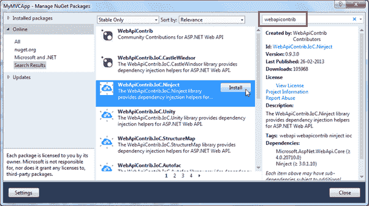
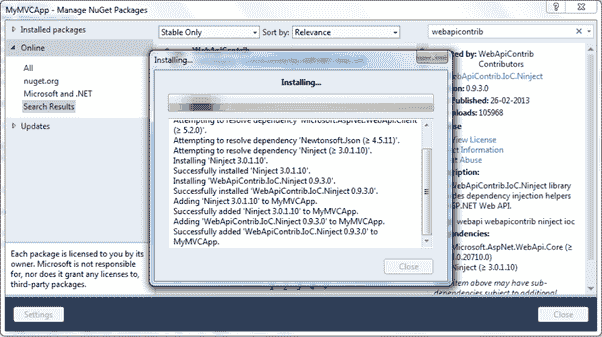

# 使用Web API配置依赖注入

> 原文：<https://www.tutorialsteacher.com/webapi/configure-dependency-injection-with-web-api>

在这里，您将学习如何使用Web API配置和使用 IoC 容器进行依赖注入。

有许多 IoC 容器可用于依赖注入，如 Ninject、Unity、castleWidsor、structuremap 等。这里我们将使用 Ninject 进行依赖注入。

下面是我们的示例Web API，它使用一个实现艾瑞定位的类的实例。

Example: Simple Web API Controller 

```
public class StudentController : ApiController
{
    private IRepository _repo = null;

    public StudentController(IRepository repo)
    {
        _repo = repo;
    }

    public IList<Student> Get()
    {
        return  _repo.GetAll();
    }
} 
```

以下是就业和学生就业类。

Example: Repository 

```
public interface IRepository
{
    IList<Student> GetAll();
}

public class StudentRepository : IRepository
{
    public IList<Student> GetAll()
    {
        //return students from db here
    }
} 
```

现在，让我们使用将在 StudentController 中注入 StudentRepository 类的 Ninject。

首先，您需要使用 NuGet 为Web API安装 Ninject 库。为此，在解决方案资源管理器中右键单击您的项目->单击**管理 NuGet 包..**。这将打开 NuGet 弹出窗口。现在在搜索框中搜索 webapicontrib，如下所示。

[](../../Content/images/webapi/configure-DI-1.png)

Web API Configuration


如您所见，这将列出Web API的所有 IoC 容器。选择 WebApiContrib。输入并点击**安装**。

[](../../Content/images/webapi/configure-DI-2.png)

Web API Configuration


现在，您需要安装它。搜索并安装它。

[](../../Content/images/webapi/configure-DI-3.png)

Web API Configuration


所以现在在为 Ninject 安装了必要的包之后，我们需要对它进行配置。

为了在 Web API 中使用依赖注入，我们需要创建一个实现 IDependencyResolver 接口的解析器类。在这里，我们已经在我们的Web API项目的基础设施文件夹中创建了一个项目解析器类，如下所示。

Example: DI Resolver 

```
public class NinjectResolver : IDependencyResolver
{
    private IKernel kernel;

    public NinjectResolver() : this(new StandardKernel()) 
    { 
    }

    public NinjectResolver(IKernel ninjectKernel, bool scope = false)
    {
        kernel = ninjectKernel;
        if (!scope)
        {
            AddBindings(kernel);
        }
    }

    public IDependencyScope BeginScope()
    {
        return new NinjectResolver(AddRequestBindings(new ChildKernel(kernel)), true);
    }

    public object GetService(Type serviceType)
    {
        return kernel.TryGet(serviceType);
    }

    public IEnumerable<object> GetServices(Type serviceType)
    {
        return kernel.GetAll(serviceType);
    }

    public void Dispose()
    {

    }

    private void AddBindings(IKernel kernel)
    {
        // singleton and transient bindings go here
    }

    private IKernel AddRequestBindings(IKernel kernel)
    {
        kernel.Bind<IRepository>().To<StudentRepository>().InSingletonScope();
        return kernel;
    }
} 
```

现在，我们需要在 WebApiConfig 类中用 Web API 配置 NijectResolver，如下所示。

Example: Set DI Resolver 

```
public static class WebApiConfig
{
    public static void Register(HttpConfiguration config)
    {
        config.DependencyResolver = new NinjectResolver();

        config.MapHttpAttributeRoutes();

        config.Routes.MapHttpRoute(
            name: "DefaultApi",
            routeTemplate: "api/{controller}/{id}",
            defaults: new { id = RouteParameter.Optional }
        );

    }
} 
```

如上所述，HttpConfiguration。DependencyResolver 设置为 NinjectResolver。所以现在，Web API将使用 NinjectResolver 类来创建它需要的对象。

因此，您可以使用Web API配置 IoC 容器。****