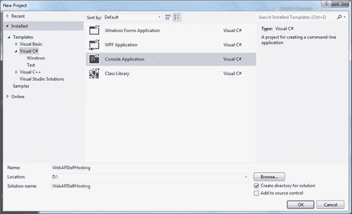
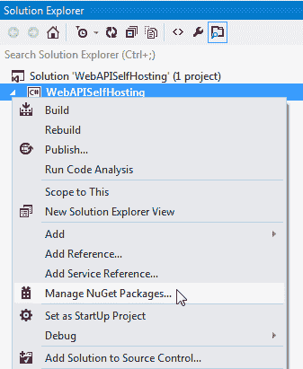
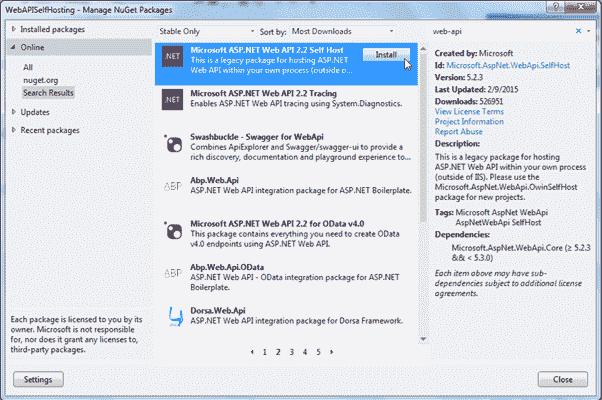
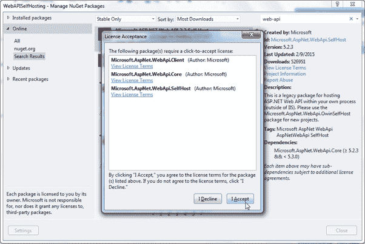
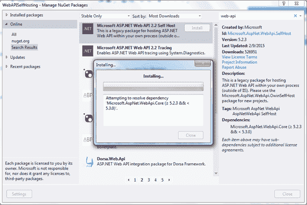
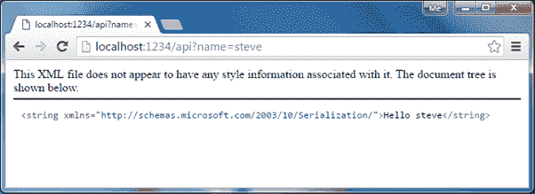

# 网络应用编程接口托管

> 原文:[https://www.tutorialsteacher.com/webapi/web-api-hosting](https://www.tutorialsteacher.com/webapi/web-api-hosting)

在本节中，您将学习如何托管网络应用编程接口。

网络应用编程接口应用程序可以通过两种方式托管。

*   IIS 托管
*   自我托管

## IIS 托管

Web API 可以在 IIS 下托管，就像 Web 应用程序一样。在上一节中，您已经学习了创建网络应用编程接口。正如您在那里看到的，默认情况下，使用 ASP.NET MVC 项目创建了一个网络应用编程接口。因此，当您在 IIS 下托管您的 MVC web 应用程序时，它也将托管使用相同基地址的 Web API。

## 自我托管

您可以将网络应用编程接口作为一个独立的进程托管，而不是 ASP.NET。这意味着您可以在控制台应用程序或窗口服务或 OWIN 或任何其他由管理的进程中托管一个网络应用编程接口。NET 框架。

您需要执行以下步骤来自行托管网络应用编程接口。

1.  使用 HttpConfiguration 配置网络应用编程接口
2.  创建 httpServer 并开始侦听传入的 Http 请求

让我们看看如何在控制台应用程序中托管一个简单的网络应用编程接口。

首先，在 Visual Studio 2012 中为 Desktop(或后者版本)创建一个控制台项目。

注意:您必须在管理模式下打开 Visual Studio。

<figure>[](../../Content/images/webapi/create-console-app.png)

<figcaption>Create Console Application</figcaption>

</figure>

现在，您需要使用 NuGet 添加微软 ASP.NET 网络应用编程接口 2.x 自助主机包。在解决方案资源管理器窗口中右键单击项目，然后选择**管理项目包..**

<figure>[](../../Content/images/webapi/manage-nuget.png)

<figcaption>Open NuGet Manager</figcaption>

</figure>

在“管理新包”窗口中，选择左平移中的“在线”选项，并搜索网络应用编程接口。这将列出网络应用编程接口的所有包。现在，寻找**微软 ASP.NET Web API 2.2 自主机**包，点击**安装**。

<figure>[](../../Content/images/webapi/install-selfhost.png)

<figcaption>Install Web API Self Host Package</figcaption>

</figure>

点击许可接受窗口中的**接受**按钮。

<figure>[](../../Content/images/webapi/accept-selfhost.png)

<figcaption>Accept License Agreement</figcaption>

</figure>

这将把包安装到您的项目中。

<figure>[](../../Content/images/webapi/installing-selfhost.png)

<figcaption>Install Web API self Hosting Package</figcaption>

</figure>

现在在 Program 类的 Main()方法中编写以下代码。

Example: Self-Hosting Web API<button class="copy-btn pull-right" title="Copy example code">*Copy*</button> *```
class Program
{
    static void Main(string[] args)
    {
        var config = new HttpSelfHostConfiguration("http://localhost:1234");

        var server = new HttpSelfHostServer(config, new MyWebAPIMessageHandler());
        var task = server.OpenAsync();
        task.Wait();

        Console.WriteLine("Web API Server has started at http://localhost:1234");
        Console.ReadLine();
    }
} 
```

在上面的代码中，我们首先通过传递 uri 位置创建了一个 HttpSelfHostConfiguration 类的对象。然后，我们通过传递 config 和 HttpMessageHandler 对象创建了一个 HttpSelfHostServer 的对象。然后我们开始监听呼叫服务器传入的请求。OpenAsync()方法。这将异步侦听请求，因此它将返回 Task 对象。

创建`MyWebAPIMessageHandler`类并编写以下代码。

Example: MessageHandler<button class="copy-btn pull-right" title="Copy example code">*Copy*</button> *```
class MyWebAPIMessageHandler : HttpMessageHandler
{
    protected override Task<HttpResponseMessage> SendAsync(HttpRequestMessage request, System.Threading.CancellationToken cancellationToken)
    {
        var task = new Task<HttpResponseMessage>(() => {
            var resMsg = new HttpResponseMessage();
            resMsg.Content = new StringContent("Hello World!");
            return resMsg;
        });

        task.Start();
        return task;
    }
} 
```

因此，您可以创建简单的控制台应用程序和主机简单的网络应用编程接口，返回“你好世界！”每一个请求。

使用 Ctrl + F5 运行控制台应用程序。

<figure>[](../../Content/images/webapi/run-console-app.png)

<figcaption>Run Console Application</figcaption>

</figure>

打开网页浏览器，进入`http://localhost:1234/`查看结果。

<figure>[](../../Content/images/webapi/response-in-browser.png)

<figcaption>Response in Browser</figcaption>

</figure>

## 托管控制器基础架构

您可以在自我托管中使用与 ASP.NET 托管相同的 ASP.NET 路由和 ApiController 功能。

在同一个自托管控制台应用程序中，创建如下所示的简单 HomeController 类。

Example: Web API Controller<button class="copy-btn pull-right" title="Copy example code">*Copy*</button> *```
public class HomeController : ApiController
{
    public string Get() {
        return "Hello World!";
    }

    public string Get(string name) {
        return "Hello " + name;
    }
} 
```

现在，在 Main()方法中，使用配置对象配置默认路由，如下所示。

Example: Self Hosting Web API<button class="copy-btn pull-right" title="Copy example code">*Copy*</button> *```
static void Main(string[] args)
{
    var config = new HttpSelfHostConfiguration("http://localhost:1234");
    config.Routes.MapHttpRoute("default",
                                "api/{controller}/{id}",
                                new { controller = "Home", id = RouteParameter.Optional });

    var server = new HttpSelfHostServer(config);            
    var task = server.OpenAsync();
    task.Wait();

    Console.WriteLine("Web API Server has started at http://localhost:1234");
    Console.ReadLine();
} 
```

请注意，我们在创建 HttpSelfHostServer 对象时删除了 MessageHandler 的一个对象。

现在，按下 *Ctrl + F5* 运行控制台应用程序。打开浏览器，输入`http://localhost:1234/api`或`http://localhost:1234/api?name=steve`，看到如下图的结果。

<figure>[](../../Content/images/webapi/self-hosting.png)

<figcaption>Web API Response</figcaption>

</figure>****