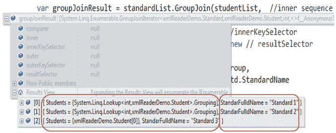

# LINQ 连接运算符`GroupJoin`

> 原文：<https://www.tutorialsteacher.com/linq/linq-joining-operator-groupjoin>

我们在上一节中已经看到了 Join 运算符。GroupJoin 运算符执行与 Join 运算符相同的任务，只是 GroupJoin 根据指定的组键在组中返回一个结果。GroupJoin 运算符基于关键字连接两个序列，并通过匹配关键字对结果进行分组，然后返回分组结果和关键字的集合。

GroupJoin 需要与 Join 相同的参数。GroupJoin 有以下两种重载方法:

GroupJoin Overload Methods:

```cs
public static IEnumerable<TResult> GroupJoin<TOuter, TInner, TKey, TResult>(this IEnumerable<TOuter> outer, IEnumerable<TInner> inner, Func<TOuter, TKey> outerKeySelector, Func<TInner, TKey> innerKeySelector, Func<TOuter, IEnumerable<TInner>, TResult> resultSelector);

public static IEnumerable<TResult> GroupJoin<TOuter, TInner, TKey, TResult>(this IEnumerable<TOuter> outer, IEnumerable<TInner> inner, Func<TOuter, TKey> outerKeySelector, Func<TInner, TKey> innerKeySelector, Func<TOuter, IEnumerable<TInner>, TResult> resultSelector, IEqualityComparer<TKey> comparer);

```

如您所见，第一个重载方法接受五个输入参数(除了第一个“this”参数):1)外部 2)内部 3)外部关键字选择器 4)内部关键字选择器 5)结果选择器。请注意，结果选择器属于 Func 委托类型，其第二个输入参数为内部序列的 IEnumerable 类型。

现在，让我们使用以下学生和标准类来理解组连接，其中学生类包括与标准类的标准标识相匹配的标准标识。

Example Classes

```cs
public class Student{ 
    public int StudentID { get; set; }
    public string StudentName { get; set; }
    public int StandardID { get; set; }
}

public class Standard{ 
    public int StandardID { get; set; }
    public string StandardName { get; set; }
}
```

考虑下面的 GroupJoin 查询示例。

Example: GroupJoin in Method syntax C#

```cs
IList<Student> studentList = new List<Student>() { 
    new Student() { StudentID = 1, StudentName = "John", StandardID =1 },
    new Student() { StudentID = 2, StudentName = "Moin", StandardID =1 },
    new Student() { StudentID = 3, StudentName = "Bill", StandardID =2 },
    new Student() { StudentID = 4, StudentName = "Ram",  StandardID =2 },
    new Student() { StudentID = 5, StudentName = "Ron" } 
};

IList<Standard> standardList = new List<Standard>() { 
    new Standard(){ StandardID = 1, StandardName="Standard 1"},
    new Standard(){ StandardID = 2, StandardName="Standard 2"},
    new Standard(){ StandardID = 3, StandardName="Standard 3"}
};

var groupJoin = standardList.GroupJoin(studentList,  //inner sequence
                                std => std.StandardID, //outerKeySelector 
                                s => s.StandardID,     //innerKeySelector
                                (std, studentsGroup) => new // resultSelector 
                                {
                                    Students = studentsGroup,
                                    StandarFulldName = std.StandardName
                                });

foreach (var item in groupJoin)
{ 
    Console.WriteLine(item.StandarFulldName );

    foreach(var stud in item.Students)
        Console.WriteLine(stud.StudentName);
}
```

输出：

```cs
Standard 1:
John,
Moin,
Standard 2:
Bill,
Ram,
Standard 3:
```

在上面的 GroupJoin 查询示例中，standardList 是外部序列，因为查询是从它开始的。GroupJoin 方法中的第一个参数是指定内部序列，在上面的例子中是 studentList。GroupJoin()方法的第二个和第三个参数是指定一个字段，该字段的值应该使用 lambda 表达式进行匹配，以便在结果中包含元素。外部序列的键选择器`standard => standard.StandardID`指示标准列表中每个元素的标准标识字段应与内部序列学生列表`student => student.StandardID`的键相匹配。如果两个关键字字段的值都匹配，则将该元素包括到分组集合中，其中的关键字将是标准标识。

Join 方法中的最后一个参数是一个表达式，用于表示结果。在上面的示例中，结果选择器包括分组集合 studentGroup 和 StandardName。

下图说明了分组到学生组集合中用于匹配标准标识键的内部序列，以及可以用来表示结果的分组集合。


Grouping Operator - GroupJoin


结果集将包括具有学生和标准全名属性的匿名对象。学生属性将是标准标识与标准匹配的学生的集合



GroupJoin Result in Debug View


您可以使用“foreach”循环访问结果。每个元素都有一个标准全名&学生属性，学生就是其中的一个集合。

Example: Access GroupJoin Result in C#

```cs
foreach (var item in groupJoinResult)
{ 
    Console.WriteLine(item.StandarFulldName );

    foreach(var stud in item.Students)
        Console.WriteLine(stud.StudentName);
}
```

下面是 VB 中的 GroupJoin 的一个例子 .NET:

Example: GroupJoin in Method VB.Net

```cs
Dim groupJoin = standardList.GroupJoin(  ' outer sequence 
                    studentList, ' inner sequence 
                    Function(s) s.StandardID, ' outerKeySelector  
                    Function(stud) stud.StandardID, ' innerKeySelector 
                    Function(s, studentGroup) New With { ' result selector
                            .students = studentGroup, 
                            .standardName = s.StandardName
                    })

For Each item In groupJoin

    Console.WriteLine(item.standardName)

    For Each std In item.students
            Console.WriteLine( std.StudentName)
    Next

Next
```

输出：

```cs
Standard 1:
John,
Moin,
Standard 2:
Bill,
Ram,
Standard 3:
```

## 查询语法中的组连接

查询语法中的 GroupJoin 运算符的工作原理与方法语法略有不同。它需要一个外部序列、内部序列、键选择器和结果选择器。“on”关键字用于键选择器，其中“equals”运算符的左侧是外部键选择符，“equals”的右侧是内部键选择符。使用**进入**关键字创建分组集合。

Syntax: GroupJoin in Query Syntax

```cs
from ... in outerSequence

join ... in innerSequence  

on outerKey equals innerKey

into groupedCollection    

select ...
```

下面的示例演示了查询语法中的 GroupJoin。

Example: GroupJoin Query Syntax C#

```cs
IList<Student> studentList = new List<Student>() { 
                    new Student() { StudentID = 1, StudentName = "John", Age = 13, StandardID =1 },
                    new Student() { StudentID = 2, StudentName = "Moin",  Age = 21, StandardID =1 },
                    new Student() { StudentID = 3, StudentName = "Bill",  Age = 18, StandardID =2 },
                    new Student() { StudentID = 4, StudentName = "Ram" , Age = 20, StandardID =2 },
                    new Student() { StudentID = 5, StudentName = "Ron" , Age = 15 } 
};

IList<Standard> standardList = new List<Standard>() { 
                    new Standard(){ StandardID = 1, StandardName="Standard 1"},
                    new Standard(){ StandardID = 2, StandardName="Standard 2"},
                    new Standard(){ StandardID = 3, StandardName="Standard 3"}
};

var groupJoin = from std in standardList 
                    join s in studentList 
                    on std.StandardID equals s.StandardID
                    into studentGroup
                    select new { 
                              Students = studentGroup , 
                              StandardName = std.StandardName 
                          };

foreach (var item in groupJoin)
{ 
                    Console.WriteLine(item.StandarFulldName );

                    foreach(var stud in item.Students)
                    Console.WriteLine(stud.StudentName);
}
```

Example: GroupJoin Query Syntax VB.Net

```cs
Dim groupJoin = From s In standardList
                Group Join stud In studentList 
                On stud.StandardID Equals s.StandardID
                Into Group _
                Select _
                StudentsGroup = Group,
                StandardName = s.StandardName
```

输出：

```cs
Standard 1:
John,
Moin,
Standard 2:
Bill,
Ram,
Standard 3:
```

在 VB.Net， **InTo** 关键字将创建一个所有学生标准相同的组，并将其分配给**组**关键字。因此，在投影结果中使用“组”。

*Note:**Use of the **equals** operator to match key selector. `==` is not valid.Want to check how much you know LINQ?[Start LINQ Test](/online-test/linq-test "Test your LINQ knowledge")

**   [*推文*](https://twitter.com/share?url=https://www.tutorialsteacher.com/linq/linq-joining-operator-groupjoin&text=GroupJoin - Joining Operator)**   [*分享*](https://www.linkedin.com/shareArticle?mini=true&url=https://www.tutorialsteacher.com/linq/linq-joining-operator-groupjoin&title=GroupJoin - Joining Operator&summary=&source=)**   [*Whatsapp*](https://wa.me/?text=https%3a%2f%2fwww.tutorialsteacher.com%2flinq%2flinq-joining-operator-groupjoin)***

 ***** * *

[*Previous*](/linq/linq-joining-operator-join)*[Next](/linq/linq-projection-operators)******