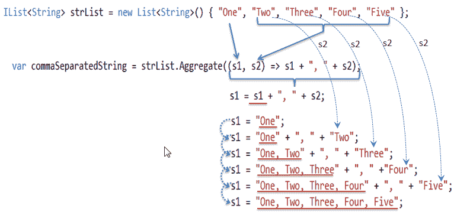

# LINQ 聚合运算符`Aggregate`

> 原文：<https://www.tutorialsteacher.com/linq/linq-aggregation-operator-aggregate>

聚合运算符对集合中元素的数值属性执行数学运算，如平均值、聚合、计数、最大值、最小值和总和。

| 方法 | 描述 |
| --- | --- |
| [合计](#aggregate)T2】 | 对集合中的值执行自定义聚合操作。 |
| [平均值](/linq/linq-aggregation-operator-average) | 计算集合中数字项的平均值。 |
| [计数](/linq/linq-aggregation-operator-count)T2】 | 对集合中的元素进行计数。 |
| 长计数 | 对集合中的元素进行计数。 |
| [最大](/linq/linq-aggregation-operator-max)T2】 | 查找集合中最大的值。 |
| 福建话 | 查找集合中的最小值。 |
| [求和](/linq/linq-aggregation-operator-sum)T2】 | 计算集合中值的总和。 |

## 总计

聚合方法执行累加操作。聚合扩展方法有以下重载方法:

Aggregate() Overloads:

```cs
public static TSource Aggregate<TSource>(this IEnumerable<TSource> source, 
                                         Func<TSource, TSource, TSource> func);

public static TAccumulate Aggregate<TSource, TAccumulate>(this IEnumerable<TSource> source, 
                                         TAccumulate seed, 
                                         Func<TAccumulate, TSource, TAccumulate> func);

public static TResult Aggregate<TSource, TAccumulate, TResult>(this IEnumerable<TSource> source, 
                                         TAccumulate seed, 
                                         Func<TAccumulate, TSource, TAccumulate> func, 
                                         Func<TAccumulate, TResult> resultSelector);

```

下面的示例演示了返回字符串列表中逗号分隔元素的聚合方法。

Example: Aggregate in Method Syntax C#

```cs
IList<String> strList = new List<String>() { "One", "Two", "Three", "Four", "Five"};

var commaSeperatedString = strList.Aggregate((s1, s2) => s1 + ", " + s2);

Console.WriteLine(commaSeperatedString);
```

输出：

```cs
One, Two, Three, Four, Five
```

在上面的示例中，聚合扩展方法从 strList 集合中返回逗号分隔的字符串。下图说明了在上述示例中执行的整个聚合操作。

[](../../Content/images/linq/linq-aggregate-1.png)

Aggregate extension method


根据上图，列表“一”的第一项将作为 s1 传递，其余项将作为 s2 传递。lambda 表达式`(s1, s2) => s1 + ", " + s2`将被视为`s1 = s1 + ", " + s1`，其中 s1 将针对集合中的每个项目进行累积。因此，聚合方法将返回逗号分隔的字符串。

Example: Aggregate in Method Syntax VB.Net

```cs
Dim strList As IList(Of String) = New List(Of String) From {
                                                            "One", 
                                                            "Two", 
                                                            "Three", 
                                                            "Four", 
                                                            "Five"
                                                        }

Dim commaSeparatedString = strList.Aggregate(Function(s1, s2) s1 + ", " + s2)
```

## 具有种子值的聚合方法

Aggregate 的第二个重载方法需要第一个参数来累积种子值。第二个参数是 Func 类型委托:
`TAccumulate Aggregate<TSource, TAccumulate>(**TAccumulate seed, Func<TAccumulate, TSource, TAccumulate> func**);` 。

以下示例在聚合扩展方法中使用字符串作为种子值。

Example: Aggregate with Seed Value C#

```cs
// Student collection
IList<Student> studentList = new List<Student>>() { 
        new Student() { StudentID = 1, StudentName = "John", Age = 13} ,
        new Student() { StudentID = 2, StudentName = "Moin",  Age = 21 } ,
        new Student() { StudentID = 3, StudentName = "Bill",  Age = 18 } ,
        new Student() { StudentID = 4, StudentName = "Ram" , Age = 20} ,
        new Student() { StudentID = 5, StudentName = "Ron" , Age = 15 } 
    };

string commaSeparatedStudentNames = studentList.Aggregate<Student, string>(
                                        "Student Names: ",  // seed value
                                        (str, s) => str += s.StudentName + "," ); 

Console.WriteLine(commaSeparatedStudentNames);
```

Example: Aggregate with Seed Value VB.Net

```cs
// Student collection
Dim studentList = New List(Of Student) From {
        New Student() With {.StudentID = 1, .StudentName = "John", .Age = 13},
        New Student() With {.StudentID = 2, .StudentName = "Moin", .Age = 21},
        New Student() With {.StudentID = 3, .StudentName = "Bill", .Age = 18},
        New Student() With {.StudentID = 4, .StudentName = "Ram", .Age = 20},
        New Student() With {.StudentID = 5, .StudentName = "Ron", .Age = 15}
    }
 Dim commaSeparatedStudentNames = studentList.Aggregate(Of String)(
               "Student Names: ", 
               Function(str, s) str + s.StudentName + ",")

Console.WriteLine(commaSeparatedStudentNames);
```

输出：

```cs
Student Names: John, Moin, Bill, Ram, Ron,
```

在上面的示例中，聚合方法的第一个参数是“学生姓名:”字符串，它将与所有学生姓名累加。lambda 表达式中的逗号将作为第二个参数传递。

以下示例使用聚合运算符添加所有学生的年龄。

Example: Aggregate with Seed Value C#

```cs
// Student collection
IList<Student> studentList = new List<Student>>() { 
        new Student() { StudentID = 1, StudentName = "John", Age = 13} ,
        new Student() { StudentID = 2, StudentName = "Moin",  Age = 21 } ,
        new Student() { StudentID = 3, StudentName = "Bill",  Age = 18 } ,
        new Student() { StudentID = 4, StudentName = "Ram" , Age = 20} ,
        new Student() { StudentID = 5, StudentName = "Ron" , Age = 15 } 
    };

int SumOfStudentsAge = studentList.Aggregate<Student, int>(0, 
                                                (totalAge, s) => totalAge += s.Age  );
```

## 带有结果选择器的聚合方法

现在，让我们看看第三个重载方法，它需要结果选择器的 Func 委托表达式的第三个参数，这样您就可以表达结果。

Example: Aggregate with Result Selector C#

```cs
IList<Student> studentList = new List<Student>>() { 
        new Student() { StudentID = 1, StudentName = "John", Age = 13} ,
        new Student() { StudentID = 2, StudentName = "Moin",  Age = 21 } ,
        new Student() { StudentID = 3, StudentName = "Bill",  Age = 18 } ,
        new Student() { StudentID = 4, StudentName = "Ram" , Age = 20} ,
        new Student() { StudentID = 5, StudentName = "Ron" , Age = 15 } 
    };

string commaSeparatedStudentNames = studentList.Aggregate<Student, string,string>(
                                            String.Empty, // seed value
                                            (str, s) => str += s.StudentName + ",", // returns result using seed value, String.Empty goes to lambda expression as str
                                            str => str.Substring(0,str.Length - 1 )); // result selector that removes last comma

Console.WriteLine(commaSeparatedStudentNames);
```

在上面的例子中，我们指定了一个 lambda 表达式`str => str.Substring(0,str.Length - 1 )`，它将删除字符串结果中的最后一个逗号。下面是 VB.Net 的同一个例子。

Example: Aggregate with Result Selector VB.Net

```cs
// Student collection
Dim studentList = New List(Of Student) From {
        New Student() With {.StudentID = 1, .StudentName = "John", .Age = 13},
        New Student() With {.StudentID = 2, .StudentName = "Moin", .Age = 21},
        New Student() With {.StudentID = 3, .StudentName = "Bill", .Age = 18},
        New Student() With {.StudentID = 4, .StudentName = "Ram", .Age = 20},
        New Student() With {.StudentID = 5, .StudentName = "Ron", .Age = 15}
    }

Dim commaSeparatedStudentNames = studentList.Aggregate(Of String, String)(
               String.Empty, 
               Function(str, s) str + s.StudentName + ",", 
               Function(str) str.Substring(0, str.Length - 1)) 

Console.WriteLine(commaSeparatedStudentNames);
```

输出：

```cs
John, Moin, Bill, Ram, Ron
```*Note:**Aggregate operator is **Not Supported** with query syntax in C# or VB.Net.* *在下一节中了解另一个聚合运算符-平均值。*