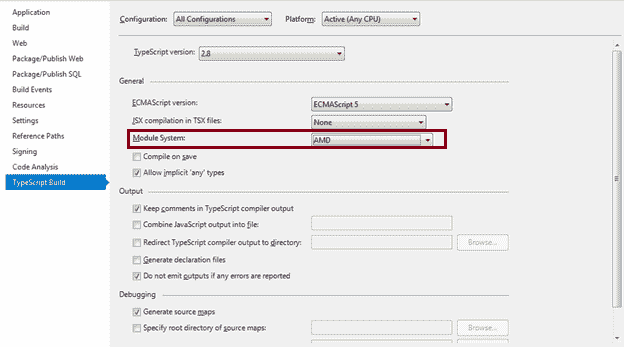

# 编译 TypeScript 模块

> 原文：<https://www.tutorialsteacher.com/typescript/compile-module-in-typescript>

在前一章中，我们导出并导入了一个`.ts`文件中的一个模块。我们不能在应用中直接使用 TypeScript 模块。我们需要为 TypeScript 模块使用 JavaScript。 要获取 TypeScript 模块的 JavaScript 文件，我们需要使用 TypeScript 编译器编译模块。

模块的编译取决于您的目标环境。TypeScript 编译器根据编译期间指定的模块目标选项生成 JavaScript 代码。

使用以下命令编译一个 TypeScript 模块并生成 JavaScript 代码。

`--module <target> <file path>`

如果您正在使用集成开发环境，那么您必须在集成开发环境或 [tsconfig.json](/typescript/typescript-compiling-project-and-tsconfig) 文件中设置模块编译目标。

以下内容可作为上述`--module`命令选项的目标:

1.  没有人
2.  [常见 JS](http://www.commonjs.org)
3.  [AMD](https://github.com/amdjs/amdjs-api/wiki/AMD)
4.  [UMD](https://github.com/umdjs/umd)
5.  [系统](https://github.com/systemjs/systemjs)T2】
6.  它是 6，它是 2015 或 esnext

上述目标的使用取决于您正在使用的应用和模块加载程序。例如，对于使用 [CommonJS](http://www.commonjs.org) 模块加载器的服务器端 Node.js 应用，使用 CommonJS 目标选项； 如果使用客户端模块加载器 [require.js](https://requirejs.org/) 进行 web 应用，请使用 AMD target 选项； 对客户端和服务器端模块都使用 UMD 目标选项；对 ES 模块使用 System，对 ES5 模块或更低版本使用 ES6 或 ES2015。

让我们为带有 require.js 模块加载器的客户端 web 应用编译上一章创建的`Employee`模块。 打开 Windows 上的命令提示符，导航到存储模块文件的路径，执行以下命令:

```ts
C:\MyTypeScriptModules>tsc --module amd Employee.ts
```

这将为客户端应用生成以下 JavaScript 模块，可以使用 require.js 加载:

```ts
define(["require", "exports"], function (require, exports) {
            "use strict";
    exports.__esModule = true;
    exports.age = 20;
            var Employee = /** @class */ (function () {
            function Employee(name, code) {
            this.name = name;
            this.empCode = code;
        }
        Employee.prototype.displayEmployee = function () {
            console.log ("Employee Code: " + this.empCode + ", Employee Name: " + this.empName );
        };
            return Employee;
    }());
    exports.Employee = Employee;
            var companyName = "XYZ";
}); 
```

现在，编译模块`EmployeeProcessor`(在前一章中创建)，其中我们使用了`Employee`模块。

```ts
C:\MyTypeScriptModules>tsc --module amd EmployeeProcessor.ts
```

上述命令将为`EmployeeProcessor`模块生成以下 JavaScript，用于 web app 中的 require.js 模块加载器。

```ts
define(["require", "exports", "./Employee"], function (require, exports, Employee_1) {
            "use strict";
    exports.__esModule = true;
            var empObj = new emp.Employee("Steve Jobs", 1);
    empObj.displayEmployee();
}); 
```

## 在 Visual Studio 中设置目标模块

如果您使用的是 Visual Studio 2017，则可以在“TypeScript 构建”选项卡中设置模块系统选项。通过在解决方案资源管理器中右键单击项目并选择“属性”来打开项目属性。转到属性窗口中的 TypeScript 构建选项卡，并将模块系统设置为 AMD，如下所示。



Set Module Option in Visual Studio


现在，Visual Studio 将为针对 web 应用的 require.js 模块加载器的所有 TypeScript 模块创建 JavaScript 文件。

## 在 Web 应用中使用模块

一旦我们为我们的 TypeScript 模块生成了 JavaScript，我们就需要在我们的应用中使用它们。我们可以使用 [require.js](http://requirejs.org/) 模块加载器在我们的网页中使用上述模块。

下面的 HTML 文件显示了如何在浏览器中使用带有 require.js 模块加载器的模块。

```ts
<!DOCTYPE html>
<html lang="en">
<head>
            <script data-main="./EmployeeProcessor" type="text/javascript" 
            src="https://cdnjs.cloudflare.com/ajax/libs/require.js/2.3.5/require.js"></script>
</head>
<body>
            <h1>TypeScript Module Demo</h1>
</body>
</html> 
```

在上面的 html 代码中，我们使用`<script>`标签包含了来自 CDN 的 require.min.js 文件。 标签还必须使用`data-main`属性为您的应用指定要加载的初始模块。 因此，require.js API 将加载在`data-main`属性中指定的初始模块，所有其他模块将在需要时异步加载。

通过这种方式，您可以在 web 应用中导出、导入、编译和使用模块。

*Further Reading* **   [模块分辨率](https://www.typescriptlang.org/docs/handbook/module-resolution.html)
*   [编译器命令选项](https://www.typescriptlang.org/docs/handbook/compiler-options.html)*