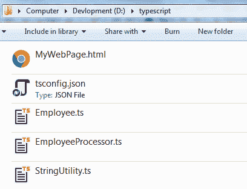
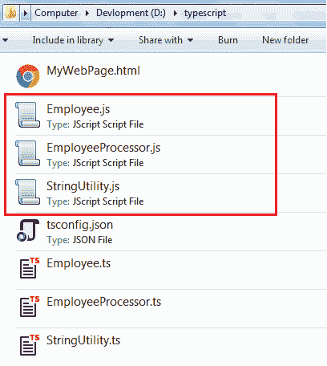

# 编译 TypeScript 项目

> 原文：<https://www.tutorialsteacher.com/typescript/typescript-compiling-project-and-tsconfig>

在这里，您将学习如何编译 TypeScript 项目，并了解 tsconfig.json。

如您所知，TypeScript 文件可以使用`tsc <file name>.ts`命令进行编译。 编译多个会比较繁琐。大型项目中的 ts 文件。因此，TypeScript 提供了另一个选项来编译全部或某些内容。项目的 ts 文件。

## tsconfig.json 文件

TypeScript 通过在根目录中包含 tsconfig.json 文件，支持一次编译整个项目。

tsconfig.json 文件是一个简单的 json 格式的文件，我们可以在其中指定各种选项来告诉编译器如何编译当前项目。

考虑下面这个简单的项目，它包括两个模块文件，一个名称空间文件，tsconfig.json 和一个 html 文件。

[](../../Content/images/typescript/ts-project.png)

上面的 tsconfig.json 文件包含空的花括号{ }，不包含任何选项。在这种情况下，`tsc`命令将考虑编译器选项的默认值，并编译所有。根目录及其子目录中的 ts 文件。

<samp>D:\typescript>tsc</samp>

以上`tsc`命令将生成。js 文件。ts 文件，如下所示。

[](../../Content/images/typescript/compiled-project.png) 

使用`tsc`命令编译文件时，如果没有指定 tsconfig.json 的路径，编译器会在当前目录中查找该文件。 如果在当前目录中找不到，将在父目录中搜索 tsconfig.json 文件。 如果没有 tsconfig 文件，编译器不会编译项目。

如果在根目录中找不到 tsconfig.json 文件，则可以使用`--project`或`-p`选项指定路径，如下所示。

<samp>tsc -p <path to tsconfig.json></samp>

到目前为止，我们使用了一个空的 tsconfig.json 文件，因此，TypeScript 编译器使用默认设置来编译 TypeScript 文件。您可以在 tsconfig.json 文件的“compile options”属性中设置不同的编译器选项，如下所示。

Example: Set compilerOptions in tsconfig.json 

```
{
    "compilerOptions": {
        "module": "amd",
        "noImplicitAny": true,
        "removeComments": true,
        "preserveConstEnums": true,
        "sourceMap": true
    }
} 

```

在上面的示例 tsconfig.json 文件中，compilerOptions 指定了 TypeScript 编译器在编译项目时使用的自定义选项。了解所有可用的[编译器选项](https://www.typescriptlang.org/docs/handbook/compiler-options.html)。 这些是 tsc 命令选项，您可以在编译文件时使用。使用 tsc 命令编译单个文件时，必须指定一个`--`或`-`选项，例如`--module`或`-m`。 同样的选项可以在 tsconfig.json 文件的“compilerOptions”部分指定不带- or。

您也可以使用“文件”选项指定要编译的特定文件。files 属性提供了要编译的所有文件的列表。

Example: files in tsconfig.json 

```
{
    "compilerOptions": {
        "module": "amd",
        "noImplicitAny": true,
        "removeComments": true,
        "preserveConstEnums": true,
        "sourceMap": true
    },
    "files": {
        "Employee.ts"
    }
} 

```

上述文件选项包括要编译的文件名。这里编译器只会编译`Employee.ts`文件。

有两个附加属性可用于包括或省略某些文件:包括和排除。

将编译 include 中指定的所有文件，但 exclude 属性中指定的文件除外。

编译器会排除排除选项中指定的所有文件。请注意，如果 include 中的文件依赖于另一个文件，则不能在 exclude 属性中指定该文件。

Example: tsconfig.json 

```
{
    "compilerOptions": {
        "module": "amd",
        "noImplicitAny": true,
        "removeComments": true,
        "preserveConstEnums": true,
        "outFile": "../../built/local/tsc.js",
        "sourceMap": true
    },
    "include": [
        "src/**/*"
    ],
    "exclude": [
        "node_modules",
        "**/*.spec.ts"
    ]
} 

```

因此，tsconfig.json 文件包含了指示编译器如何编译项目的所有选项。在这里了解更多关于 tsconfig.json [的信息。](https://www.typescriptlang.org/docs/handbook/tsconfig-json.html)***