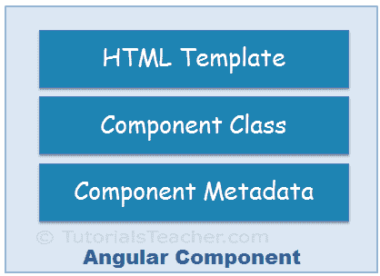
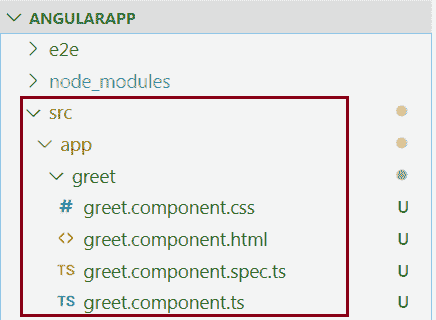
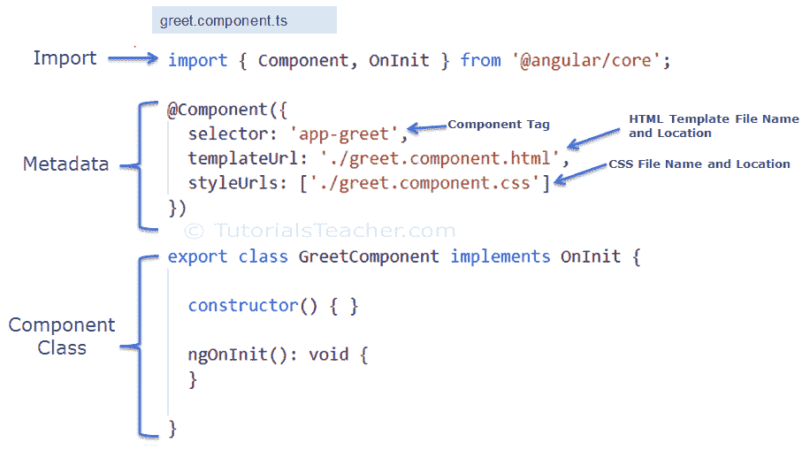
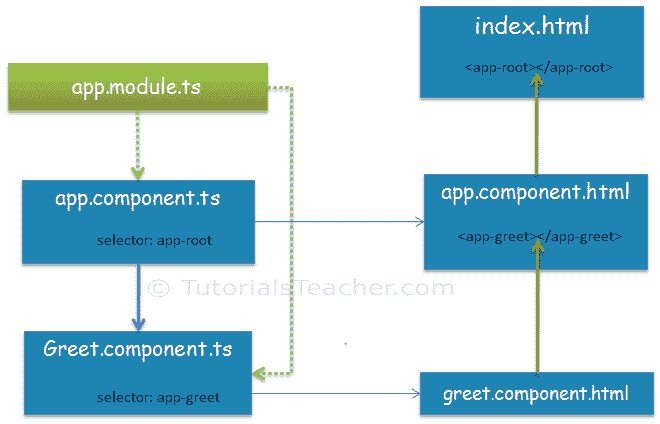
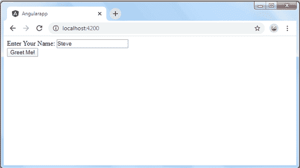

# 角度 2 分量

> 原文:[https://www.tutorialsteacher.com/angular/angular-component](https://www.tutorialsteacher.com/angular/angular-component)

在这里，您将了解角度组件以及如何使用角度命令行界面创建自定义组件。

Angular 是一个 SPA 框架，视图由一个或多个组件组成。角度分量表示视图的一部分。

一般来说，交互式网页是由 HTML、CSS 和 JavaScript 组成的。角度分量也没什么不同。

角度组件= HTML 模板+组件类+组件元数据

<figure>[](../../Content/images/angular/angular-component.png)</figure>

## 超文本标记语言模板

HTML 模板只不过是一个普通的 HTML 代码，带有额外的 Angular 特定语法来与组件类进行通信。

## 班级

本质上，组件类是一个包含属性和方法的[类型脚本](/typescript)类。属性存储数据，方法包括组件的逻辑。最终，这个类将被编译成 [JavaScript](/javascript) 。

*Note:**[TypeScript](/typescript) is an open-source, object-oriented language developed and maintained by Microsoft. It is a typed superset of JavaScript that compiles to plain JavaScript.* *## [计]元数据

元数据是 Angular API 用来执行组件的某个组件的一些额外数据，比如组件的 HTML 和 CSS 文件的位置、选择器、提供者等。

## 使用角度命令行界面生成角度分量

您可以手动或使用角度命令行界面命令为组件创建文件。Angular CLI 减少了开发时间。因此，让我们使用 Angular CLI 创建一个新组件。

使用以下命令行界面命令生成组件。

<samp>ng generate component <component name></samp>

所有 Angular CLI 命令都以`ng`、`generate`或`g`开头，是命令，`component`是参数，然后是组件的名称。

下面执行`ng g`命令，生成 VS 代码中的`greet`组件。

<figure>[](../../Content/images/angular/create-component.png)

<figcaption>Create Angular Component</figcaption>

</figure>

上面的命令将创建一个新的“问候”文件夹和应用程序文件夹，并创建四个文件，如下所示。

<figure>[](../../Content/images/angular/component-files.png)

<figcaption>Component Files</figcaption>

</figure>

上图中，`greet.component.css`是组件的 CSS 文件，`greet.component.html`是组件的 HTML 文件，我们将在其中为组件编写 HTML，`greet.component.spec.ts`是测试文件，我们可以在其中为组件编写单元测试，`greet.component.ts`是组件的类文件。

*Note:**A component can have a single file or multiple files. A single TypeScript file can include an HTML template, component class, and component metadata.* *#### 组件命名约定

Angular 中的所有组件文件都应遵循以下格式:

`<component-name>.component.<file-type>`

组件文件应在名称中包含`.component`，以组件名称为前缀，后跟文件类型。例如，我们的问候组件的一个 TypeScript 文件被命名为`greet.component.ts`。正如您所注意到的，greet 组件的所有文件都有相同的命名约定。访问[棱角风格](https://angular.io/guide/styleguide)指南了解更多信息。

现在，在 VS Code 中打开`greet.component.ts`文件，会看到如下代码。

Example: Component Class<button class="copy-btn pull-right" title="Copy example code">*Copy*</button> *```
import { Component, OnInit } from '@angular/core';

@Component({
  selector: 'app-greet',
  templateUrl: './greet.component.html',
  styleUrls: ['./greet.component.css']
})
export class GreetComponent implements OnInit {

  constructor() { }

  ngOnInit(): void {
  }

}
```

下图说明了组件类的重要部分。

<figure>[](../../Content/images/angular/ng-component.png)</figure>

`greet.component.ts`包括以下部分:

**组件类:** `GreetComponent`为组件类。它包含通过角度应用编程接口与视图交互的属性和方法。它实现了`OnInit`接口，这是一个生命周期钩子。

**组件元数据:**`@Component`是一个修饰器，用于为紧接其下定义的组件类指定元数据。它是一个函数，可以包含组件的不同配置。它指示 Angular 在哪里获取组件所需的文件，创建和渲染组件。所有角度组件必须在组件类之上有`@Component`装饰器。

导入语句从角度库或其他库中获取所需的特征。导入允许我们使用从外部模块导出的成员。例如，`@Component`装饰器和`OnInit`接口包含在`@angular/core`库中。所以，我们可以在导入后使用它们。

现在，让我们在组件类中添加一个属性和方法，如下所示。

Example: Add Properties and Methods in the Component Class<button class="copy-btn pull-right" title="Copy example code">*Copy*</button> *```
export class GreetComponent implements OnInit {

  constructor() { }

  ngOnInit(): void {
  }

  name: string = "Steve";

  greet(): void {
      alert("Hello " + this.name);
  };

}
```

上面，我们已经在组件类中添加了`name`属性和`greet`方法。让我们在 HTML 模板中使用这些。

打开`greet.component.html`文件，删除已有代码，添加如下代码。

greet.component.ts<button class="copy-btn pull-right" title="Copy example code">*Copy*</button> *```
<div>
    Enter Your Name: <input type="text" value={{name}} /> <br />
    <button (click)="greet()">Greet Me!</button>
</div>
```

在上面的 HTML 模板中，我们使用了{{ }} [插值](/angular/interpolation)中的 name 属性来显示其值，并将`greet()`函数作为点击事件。更多信息请参考[事件绑定](/angular/event-binding)部分。

## 自举组件

现在，是时候加载我们的组件了，但是在此之前，我们需要托管我们的应用程序并加载根组件。这个过程叫做引导。

Angular 是一个单页应用程序(SPA)框架。因此，我们需要在`index.html`中托管我们的应用程序，然后我们需要定义一个根模块来引导我们的根组件。`Index.html`将是 Angular 应用程序中唯一的网页，这就是它被称为 SPA 的原因。

当您使用 Angular CLI 生成 Angular 应用程序时，它会自动为您创建`index.html`、根组件`app.component.ts`、根模块`app.module.ts`和 HTML 模板`app.component.html`。`app.component.ts`中的`AppComponent`类是根组件，`app.module.ts`中的`AppModule`类是根模块。

在这里，我们将分两步将我们的问候组件加载到根组件中。

**1。在根模块中声明一个组件。**

我们想将新的`GreetComponent`加载到根组件中。所以，根模块必须知道它。我们可以通过在`app.module.ts`的声明数组中添加`GreetComponent`来实现，如下所示。

Example: Add Component in the root module app.module.ts<button class="copy-btn pull-right" title="Copy example code">*Copy*</button> *```
import { BrowserModule } from '@angular/platform-browser';
import { NgModule } from '@angular/core';

import { AppRoutingModule } from './app-routing.module';
import { AppComponent } from './app.component';
import { GreetComponent } from './greet/greet.component'; //import GreetComponent

@NgModule({
  declarations: [
    AppComponent,
    GreetComponent  // <- include GreetComponent in declarations
  ],
  imports: [
    BrowserModule,
    AppRoutingModule
  ],
  providers: [],
  bootstrap: [AppComponent]
})
export class AppModule { }
```

**2。在根 HTML 模板中添加组件标签。**

添加组件声明后，在根组件的 HTML 文件中使用组件标签`<app-greet></app-greet>`，也就是`app.component.html`，如下图。

app.component.html<button class="copy-btn pull-right" title="Copy example code">*Copy*</button> *```
<div>
    <app-greet></app-greet>
</div>
```

下图说明了组件引导过程:

<figure>[](../../Content/images/angular/app-components.png)

<figcaption></figcaption>

</figure>

在 VS Code 的终端执行 npm 启动命令，运行 app。编译成功后，打开浏览器，输入 http://localhost:4200。将显示以下页面。

<figure>[](../../Content/images/angular/ng-component-in-browser.png)

<figcaption></figcaption>

</figure>

这是我们在 Angular 中创建和使用自定义组件的方式。

如果一个组件的 HTML 代码较少，我们也可以创建单个组件文件`greet.component.ts`。使用`@Component`装饰器中的`template`参数来包含组件的 HTML。下面的`greet`组件给出与上面相同的结果。

Example: Component Class with HTML Template<button class="copy-btn pull-right" title="Copy example code">*Copy*</button> *```
import { Component } from '@angular/core';

@Component({
    selector: "app-greet",
    template: `<div>
    Enter Your Name: <input type="text" value={{name}} /> <br/>
    <button (click)="greet()">Greet Me!</button>
    </div>`
})

export class GreetComponent {

    name: string = "Steve";
    greet(): void {
        alert("Hello " + this.name);
    };
}
```

