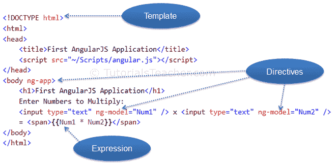

# 第一个 AngularJS 应用

> 原文:[https://www . tutorial stearn . com/anglarjs/first-anglarjs-application](https://www.tutorialsteacher.com/angularjs/first-angularjs-application)

让我们一步一步地创建一个简单的 AngularJS web 应用程序，并了解 AngularJS 的基本构造块。

1.首先，用和元素创建一个 HTML 文档，如下图所示。

Example: HTML Template

```
<!DOCTYPE html>

<html>
    <head>

    </head>
<body>

</body>
</html>
```

2.在标题部分包含 angular.js 文件(在上一节中，您已经学习了如何下载 angular library)。你也可以参考一下 CDN。(本教程中的所有示例都将使用 CDN 参考。)

Example: Include AngularJS Library

```
<!DOCTYPE html>
<html>
<head>
    <title>First AngularJS Application</title>
    <script src= "~/Scripts/angular.js"></script>
</head>
<body>

</body>
</html>
```

3.在这里，我们将创建一个简单的乘数应用程序，它将乘以两个数字并显示结果。用户将在两个单独的文本框中输入两个数字，结果将立即显示，如下所示。

<figure>[](../../Content/images/ng/first-ng-app-ui.png)

<figcaption>First AngularJS Application</figcaption>

</figure>

下面是上面乘数示例的带有 AngularJS 的 HTML 代码。

Example: First AngularJS Application

```
<!DOCTYPE html>

<html>
<head>
    <title>First AngularJS Application</title>
    <script src= "~/Scripts/angular.js"></script>
</head>
<body **ng-app** >
    <h1>First AngularJS Application</h1>

    Enter Numbers to Multiply: 
    <input type="text" **ng-model="Num1"** /> x <input type="text" **ng-model="Num2"** /> 
    = <span>**{{Num1 * Num2}}**</span>  
</body>
</html>
```

上面的例子看起来像是带有一些奇怪属性和大括号的 HTML 代码，比如 ng-app、ng-model 和{{ }}。AngularJS 中的这些内置属性称为指令。

下图说明了上面示例中的 AngularJS 构建块。

<figure>[](../../Content/images/ng/first-ng-app.png)

<figcaption>First AngularJS Application</figcaption>

</figure>

## 模板

在 AngularJS 中，模板是带有附加标记的 HTML。AngularJS 编译模板并呈现结果 HTML。

## 管理的

指令是 DOM 元素上的标记(属性)，它告诉 AngularJS 将特定的行为附加到该 DOM 元素，甚至转换 DOM 元素及其子元素。

AngularJS 中的大多数指令都是以 **ng** 开头的。它代表 Angular。我们在上面的例子中应用了 ng-app 和 ng-model 指令。

**ng-app**:ng-app 指令是一个起点。如果 AngularJS 框架在 HTML 文档的任何地方找到 ng-app 指令，那么它会自己启动(初始化)并编译 HTML 模板。

**ng-model**:ng-model 指令将 HTML 元素绑定到 [$scope](/angularjs/angularjs-scope) 对象上的一个属性。稍后您将了解这个模型，但是现在让我们将它视为一个模型属性。

在上面的例子中，我们将 ng-model 指令包含到了名称不同的 Num1 和 Num2 文本框中。AngularJS 框架将在作用域中创建两个名为 Num1 和 Num2 的属性，并将分配一个我们在文本框中键入的值。

## 表示

表达式就像 JavaScript 代码，通常用双花括号包装，如{{ expression }}。AngularJS 框架计算表达式并产生结果。在上面的例子中，{{ Num1 * Num2}}将简单地显示 Num1 和 Num2 的乘积。

下表列出了 AngularJS 中所有重要的概念。

| 概念 | 描述 |
| --- | --- |
| 模板 | 带有附加标记的 HTML |
| 指令 | 用自定义属性和元素扩展 HTML |
| 模型 | 在视图中向用户显示的数据，以及用户与之交互的数据 |
| 范围 | 存储模型的上下文，以便控制器、指令和表达式可以访问它 |
| 公式 | 执行括号{{ }}内的 JavaScript 代码。 |
| 编译程序 | 分析模板和实例化的指令和表达式 |
| 过滤器 | 格式化表达式的值以显示给用户 |
| 视角 | 用户看到的(DOM) |
| 数据绑定 | 在模型和视图之间同步数据 |
| 控制器 | 维护应用程序数据和业务逻辑 |
| 组件 | 应用程序不同部分的容器，包括控制器、服务、过滤器、配置注射器的指令 |
| 服务 | 可重用的业务逻辑，独立于视图 |
| 依赖注入 | 创建和连接对象和函数 |
| 注射器 | 依赖注入容器 |

在下一节中了解 ng-app 指令。