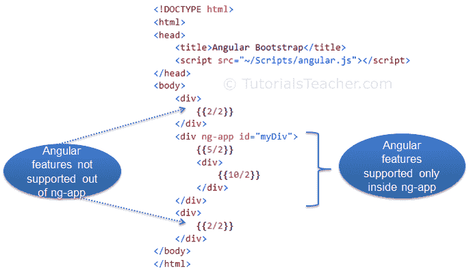

# 天然气应用指令

> 原文：<https://www.tutorialsteacher.com/angularjs/angularjs-ng-app-directive>

**ng-app** 指令是 AngularJS 应用的起点。它会自动初始化 AngularJS 框架。AngularJS 框架将在整个文档加载后首先检查 HTML 文档中的 ng-app 指令，如果找到 ng-app，它会引导自己并编译 HTML 模板。

  Compiling HTML in AngularJS means attaching event listeners to the HTML to make it interactive.

通常，ng-app 指令应该放在 HTML 文档的根位置，例如或标签，这样它就可以控制整个 DOM 层次结构。但是，您可以将其放在任何 DOM 元素中。

AngularJS 框架将只处理应用 ng-app 指令的 DOM 元素及其子元素。考虑下面的例子。

Example: ng-app placement

```
<!DOCTYPE html>
<html>
<head>
    <title>ng-app Directive</title>
    <script src="../Scripts/angular.min.js"></script>    
</head>
<body >
    <div>
        {{2/2}}
    </div>
    <div id="myDiv" **ng-app**>
        {{5/2}}
        <div>
            {{10/2}}
        </div>
    </div>
    <div>
        {{2/2}}
    </div>
</body>
</html>
```

在上面的例子中，ng-app 指令被放在 id 为“myDiv”的 div 元素中。因此，AngularJS 将只编译 myDiv 及其子元素。它不会编译 myDiv 的父元素或同级元素。

下图说明了上述示例。

[](../../Content/images/ng/ng-app.png)

Bootstrap


请注意，单个 HTML 文档中不允许多个 ng-app 指令。

## 带模块名称的应用

ng-app 指令还可以指定应用[模块](/angularjs/modules-in-angularjs)名称。这个应用模块将应用的不同部分分开，如控制器、服务、过滤器等。

Example: ng-app with App Module

```
<!DOCTYPE html>
<html>
<head>
    <title>ng-app Directive</title>
    <script src="~/Scripts/angular.js"></script>
</head>
<body ng-app="myAngularApp">
    <div>
        {{2/2}}
    </div>
    <div>
        {{5/2}}
        <div>
            {{10/2}}
        </div>
    </div>
    <script>
        var app = angular.module('myAngularApp', []);
    </script>
</body>
</html>
```

在上面的例子中，我们已经在<主体>标签中使用`ng-app = 'myAngularApp'`指定了一个模块名称，然后我们在<脚本>中使用 angular.module()函数创建了“myAngularApp”模块。访问[模块](/angularjs/modules-in-angularjs)部分，详细了解 Angular 模块。

Note : You must create a module with the same name if you have specified it with ng-app directive.

## 手动引导

我们已经了解到 ng-app 指令自动初始化一个 AngularJS 框架。但是，我们也可以在不使用 ng-app 指令的情况下手动初始化 AngularJS。

以下示例演示了 Angular 的手动初始化。

Example: Manual Bootstrap

```
<!DOCTYPE html>
<html >
<head>
    <title>Angular Bootstrap</title>
    <script src="~/Scripts/angular.js"></script>
</head>
<body>
    <div>
         {{2/2}}
    </div>
    <div>
        {{5/2}}
        <div>
            {{10/2}}
        </div>   
    </div>
<script>       
     angular.element(document).ready(function () {
         angular.bootstrap(document);
     });
</script>
 </body>
 </html>
```

在上面的例子中，我们调用 angular.bootstrap()函数，并指定根元素，即 document 对象。这将初始化 AngularJS，并从根元素开始编译所有元素，即本例中的整个文档。

在下一节中了解 AngularJS 表达式。