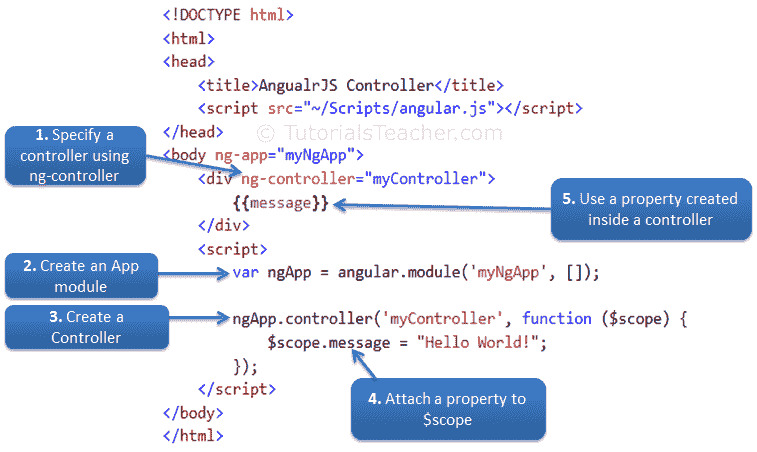

# Angular 控制器

> 原文：<https://www.tutorialsteacher.com/angularjs/angularjs-controller>

AngularJS 中的控制器是一个 JavaScript 函数，使用 [$scope](/angularjs/angularjs-scope) 对象维护应用数据和行为。

您可以将属性和方法附加到控制器函数内的$scope 对象，这反过来将添加/更新数据并将行为附加到 HTML 元素。$scope 对象是控制器和 HTML 之间的粘合剂。

`ng-controller`指令用于在 HTML 元素中指定一个控制器，该控制器将在该 HTML 元素及其子元素中添加行为或维护数据。

下面的示例演示如何将属性附加到控制器内的$scope 对象，然后在 HTML 中显示属性值。

Example: AngularJS Controller

```
<!DOCTYPE html>
<html >
<head>
    <title>AngualrJS Controller</title>
    <script src="~/Scripts/angular.js"></script>
</head>
<body ng-app="myNgApp">
    <div ng-controller="myController">
        {{message}}
    </div>
    <script>
        var ngApp = angular.module('myNgApp', []);

        ngApp.controller('myController', function ($scope) {
            $scope.message = "Hello World!";        
        });
    </script>
</body>
</html> 
```

Result:

```
Hello World!
```

在上例中，ng-controller =“myController”指令应用于

元素，其中“my controller”是控制器的名称。在 div 元素中，我们指定了{{message}}表达式。  The $ sign is used as prefix in all the built-in objects in AngularJS, so that we can differentiate AngularJS built-in objects and other objects.

现在，要创建“myController”，我们需要创建一个应用模块。该模块定义了一个应用，并保留了它的部分，如控制器、服务等。超出全球范围。(您将在下一节中了解该模块。)创建模块后，我们使用 controller()方法添加控制器函数，其中第一个参数应该是控制器的名称，第二个参数应该是控制器的函数。控制器函数包含$scope 参数，该参数将由 AngularJS 框架注入。

Note : AngularJS framework injects $scope object to each controller function. It also injects other services if included as a parameter of controller function.

下图说明了上述示例。

[](../../Content/images/ng/ng-controller.png)

Steps to create an AngularJS Controller


## 附加行为

您可以将多个方法附加到控制器内的 scope 对象，该对象可以用作事件处理程序或用于其他目的。

下面的示例演示如何处理按钮的 click 事件。

Example: Handle Button Click

```
<!DOCTYPE html>
<html>
<head>
    <title>AngualrJS Controller</title>
    <script src="~/Scripts/angular.js"></script>
</head>
<body ng-app="myNgApp">
    <div ng-controller="myController">
        Enter Message: <input type="text" ng-model="message" /> <br />
        
    </div>
    <script>
        var ngApp = angular.module('myNgApp', []);

        ngApp.controller('myController', function ($scope) {
            $scope.message = "Hello World!";       

            $scope.showMsg = function (msg) {
                alert(msg);
            }; 
        });
    </script>
</body>
</html>
```

在上面的例子中，我们已经将 showMsg()函数附加到了 scope 对象。按钮单击时会调用 showMsg()方法。ng-click 指令用于处理 AngularJS 应用中的 click 事件。

请注意，特定控制器内附加到 scope 对象的属性和方法仅适用于应用 ng-controller 指令的 HTML 元素及其子元素。

Example: Controller

```
<!DOCTYPE html>
<html>
<head>
    <title>AngualrJS Controller</title>
    <script src="~/Scripts/angular.js"></script>
</head>
<body ng-app="myNgApp">
    <div id="div1" ng-controller="myController">
        Message: {{message}} <br />       
        <div id="div2">
            Message: {{message}}
        </div>
    </div>
    <div id="div3">
        Message: {{message}}
    </div>
    <div id="div4" ng-controller="anotherController">
        Message: {{message}}
    </div>
    <script>
        var ngApp = angular.module('myNgApp', []);

        ngApp.controller('myController', function ($scope) {
            $scope.message = "This is myController";       
        });

        ngApp.controller('anotherController', function ($scope) {
            $scope.message = "This is anotherController";       
        });
    </script>
</body>
</html>
```

Result:

```
Message: This is myController 
Message: This is myController 
Message:
Message: This is anotherController
```

在上面的例子中，“message”属性是在 myController 中定义的，因此它只能用于 div1 和 div2，而不能用于 div3 和 div4。同样，在另一个控制器中定义的消息属性只对 div4 可用。div3 元素不属于任何控制器，因此“message”属性将为 null 或未定义。

## 附加复杂对象

还可以将对象附加到控制器内部的$scope，并在 HTML 中显示其属性值。

Example: Attach an object

```
<!DOCTYPE html>
<html>
<head>
    <title>AngualrJS Controller</title>
    <script src="~/Scripts/angular.js"></script>
</head>
<body ng-app="myNgApp">
    <h2>Student Information:</h2>
    <div ng-controller="myController">
        First Name: {{student.firstName}} <br />
        Last Name: {{student.lastName}}
    </div>
    <script>
         var ngApp = angular.module('myNgApp', []);

        ngApp.controller('myController', function ($scope) {
            $scope.student = { firstName: 'James', lastName: 'Bond' };
        });
    </script>
</body>
</html>
```

Result:

```
First Name: James 
Last Name: Bond
```

正如您在上面的示例中所看到的，一个学生对象被附加到$scope，它的属性和方法可以使用带有点符号的表达式、ng-model 或 ng-bind 指令来访问。

## 嵌套控制器

Angular 允许嵌套控制器。以下示例演示了多个控制器。

Example: Nested Controllers

```
<!DOCTYPE html>
<html>
<head>
    <title>AngualrJS Controller</title>
    <script src="~/Scripts/angular.js"></script>
</head>
<body ng-app="myNgApp">
    <div ng-controller="parentController">
        Message: {{message1}} 
        <div ng-controller="childController">
            Parent Message: {{message1}}  </br>
            Child Message: {{message2}}
        </div>
        Child Message: {{message2}}
    </div>
    <script>
         var ngApp = angular.module('myNgApp', []);

        ngApp.controller('parentController', function ($scope) {
            $scope.message1 = "This is parentController";
        });

        ngApp.controller('childController', function ($scope) {
            $scope.message2 = "This is childController";
        });
    </script>
</body>
</html>
```

Result:

```
Message: This is parentController 
Parent Message: This is parentController 
Child Message: This is childController
Child Message:
```

如您在上面的示例中所见，子控制器可以访问附加在父控制器函数中的属性和方法，而父控制器不能访问附加在子控制器中的属性和方法。

## 缩小语法

AngularJS 应用中的所有脚本文件都应该在生产环境中缩小。

缩小过程缩短了参数和函数的名称。如前所述，AngularJS 控制器函数可能包含$scope 或其他参数。如果缩小过程改变了参数名称，那么 AngularJS 应用将会中断，因为 Angular 框架需要为内置对象(如$scope)提供相同的参数名称。使用以下语法，以便缩小不会更改参数名称。

Example: Controller Syntax for Minification

```
<!DOCTYPE html>
<html >
<head>
    <script src="~/Scripts/angular.js"></script>
</head>
<body ng-app="myNgApp">
    <div ng-controller="myController">
        {{message}}
    </div>
<script>
    var ngApp = angular.module('myNgApp', []);

    ngApp.controller('myController', ['$scope', function ($scope) {
        $scope.message = "Hello World!";        
    }]);
</script>   
</body>
```

在上面的例子中，我们在方括号[]中给出了参数和控制器函数的名称。参数名将是第一个成员，最后一个成员将是方括号中的动作控制器函数。这将告诉 minifier 在缩小过程中不要转换$scope name。