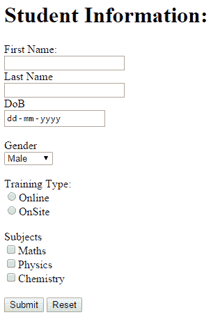

# AngularJS 表单

> 原文：<https://www.tutorialsteacher.com/angularjs/angularjs-form>

HTML 表单是输入控件的集合，用户可以在其中输入数据。在这里，您将学习如何显示 AngularJS 表单并提交数据。

## 一个角形的例子

我们将创建以下具有提交和重置功能的学生信息表单。

[](../../Content/images/ng/angular-form.png)

Sample AngularJS Form


以下是上述表单的代码。

Example: AngularJS Form

```
<!DOCTYPE html>
<html ng-app="studentApp">
<head>
    <script src="~/Scripts/angular.js"></script>
</head>
<body ng-controller="studentController"> 
    <h1>Student Information:</h1>
    <form **ng-submit="submitStudnetForm()"** >
            <label for="firstName" >First Name: </label><br />
            <input type="text" id="firstName" ng-model="student.firstName" /> <br />

            <label for="lastName">Last Name</label><br />
                <input type="text" id="lastName" ng-model="student.lastName" /> <br />
            <label for="dob" >DoB</label><br />
                <input type="date" id="dob" ng-model="student.DoB" /> <br /><br />

            <label for="gender" >Gender</label> <br />
                <select id="gender" ng-model="student.gender">
                    <option value="male">Male</option>
                    <option value="female">Female</option>
                </select><br /> <br />
                <span>Training Type:</span><br />
                    <label><input value="online" type="radio" name="training" ng-model="student.trainingType" />Online</label><br />
                    <label><input value="onsite" type="radio" name="training" ng-model="student.trainingType" />OnSite</label> <br /><br />
                <span>Subjects</span><br />
                    <label><input type="checkbox" ng-model="student.maths" />Maths</label> <br />
                    <label><input type="checkbox" ng-model="student.physics" />Physics</label> <br />
                    <label><input type="checkbox"  ng-model="student.chemistry" />Chemistry</label><br /><br />

        <input type="submit" value="Submit" />
        <input type="reset" ng-click="resetForm()" value="Reset" />
    </form>
    <script>
        //1\. create app module 
        var studentApp = angular.module('studentApp', []);

        //2\. create controller
        studentApp.controller("studentController", function ($scope, $http) {

            //3\. attach originalStudent model object
            $scope.originalStudent = {
                firstName: 'James',
                lastName: 'Bond',
                DoB: new Date('01/31/1980'),
                gender: 'male',
                trainingType: 'online',
                maths: false,
                physics: true,
                chemistry: true
            };

            //4\. copy originalStudent to student. student will be bind to a form 
            $scope.student = angular.copy($scope.originalStudent);

            //5\. create submitStudentForm() function. This will be called when user submits the form
            $scope.submitStudnetForm = function () {

                var onSuccess = function (data, status, headers, config) {
                    alert('Student saved successfully.');
                };

                var onError = function (data, status, headers, config) {
                    alert('Error occured.');
                }

                $http.post('/student/submitData', { student:$scope.student })
                    .success(onSuccess)
                    .error(onError);

            };

            //6\. create resetForm() function. This will be called on Reset button click. 
            $scope.resetForm = function () {
                $scope.student = angular.copy($scope.OriginalStudent);
            };
    });
    </script>    
</body>
</html>
```

以下是对上述示例的逐步解释:

1.  创建一个网页，并将所有必要的输入控件包装到

    <form>标签中。</form>

2.  在
3.  在应用模块中创建 studentController。
4.  创建 originalStudent 对象，并使用必需的属性附加到$作用域。这将在整个生命周期中保持不变。
5.  创建新的学生对象并附加到$作用域，然后从 originalStudent 复制所有属性和值。这个学生对象将使用 ng-model 指令绑定到表单。因此，如果用户更改表单值，那么学生对象也将被更改。
6.  创建 submitStudnetForm 函数，当用户使用“提交”按钮提交表单时，将调用该函数。这里，向远程服务器发送 http POST 请求，使用 [$http 服务](/angularjs/angularjs-service-http)提交数据。
7.  创建 resetForm()函数，通过将表单值复制到学生对象，将表单值重置为原始学生值。
8.  应用 ng-app、ng-控制器指令。
9.  将 ng-model 指令应用于每个 HTML 输入元素，以绑定学生对象的适当属性。
10.  将 ng-submit 指令应用于表单，该指令将在表单提交事件上调用 submitStudentForm()。
11.  将 ng-click 指令应用于重置按钮，该按钮将在按钮单击事件上调用 resetForm()。

可以使用 ng-submit 或 ng-click 指令提交 AngularJS 表单，但不能同时使用这两种指令。

**Ng-submit:** 当表单不包含动作属性时，将角度表达式绑定到 onsubmit 事件。

**Ng-click:** 将角度表达式绑定到 onclick 事件。

Note : The angular form can be submitted using ng-submit directive on the form tag or using ng-click directive on <input type="submit" /> element. Use either ng-submit or ng-click directive but not both to submit the form. The form will be submitted twice if both ng-submit and ng-click directives are used.