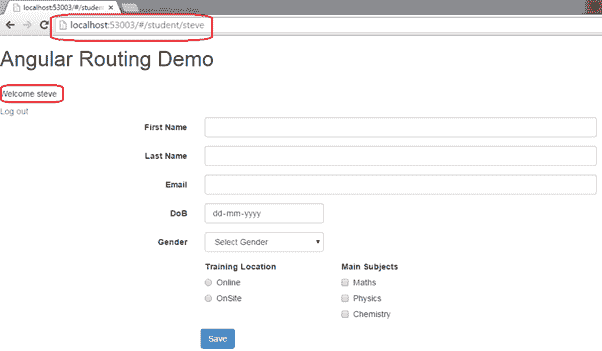

# Angular 和路由

> 原文：<https://www.tutorialsteacher.com/angularjs/angularjs-routing>

我们可以用 AngularJS 构建[单页应用](https://en.wikipedia.org/wiki/Single-page_application) (SPA)。它是一个 web 应用，加载单个 HTML 页面，并在用户与 web 应用交互时动态更新该页面。

AngularJS 支持使用路由模块 ngRoute 进行 SPA。该路由模块基于 url 进行操作。当用户请求特定的 url 时，路由引擎会捕获该 url，并根据定义的路由规则呈现视图。

让我们看看如何在 AngularJS 应用中实现简单的路由。

## 路由示例

我们将构建一个应用，当用户请求基本 url - *http://localhost/* 时，该应用将显示一个登录页面。一旦用户成功登录，我们将把它重定向到学生页面*http://localhost/student/{ username }*，用户名将以用户的名义登录。

在我们的例子中，我们将有一个布局页面-index.html，和两个 HTML 模板-login.html 和 student.html。

1.  Index.html-布局视图
2.  login.html 模板
3.  student.html 模板

以下是主布局视图-index.html。

Example: Layout view - Index.html

```
<!DOCTYPE html>
<html xmlns="http://www.w3.org/1999/xhtml">
<head>
    <title></title>
    <script src="Scripts/angular.js"></script>
    <script src="Scripts/angular-route.js"></script>
    <link href="Content/bootstrap.css" rel="stylesheet" />
</head>
<body ng-app="ngRoutingDemo">
    <h1>Angular Routing Demo</h1>

    <div ng-view>

    </div>
    <script>
        var app = angular.module('ngRoutingDemo', ['ngRoute']);

        app.config(function ($routeProvider) {

            $routeProvider.when('/', {
                templateUrl: '/login.html',
                controller: 'loginController'
            }).when('/student/:username', {
                templateUrl: '/student.html',
                controller: 'studentController'
            }).otherwise({
                redirectTo: "/"
            });

        app.controller("loginController", function ($scope, $location) {

            $scope.authenticate = function (username) {
                // write authentication code here.. 

                $location.path('/student/' + username)
            };

        });

        app.controller("studentController", function ($scope, $routeParams) {
            $scope.username = $routeParams.username;
        });

    });
    </script>
</body>
</html>
```

让我们一步步理解上面的例子:

1.  第一步是在 index.html 包含 angular.js、angular-route.js 和 bootstrap.css。angular-route.js 包含必要的路由功能。
2.  应用 ng-app 指令。
3.  将 ng-view 指令应用于或您想要注入另一个子视图的其他元素。AngularJS 路由模块使用 ng-view 指令在定义它的地方注入另一个子视图。因此，Angular 将在这个 div 元素中注入 login.html 或 student.html。
4.  现在，创建一个应用模块，并将“ngRoute”指定为依赖模块。
5.  现在，我们需要在应用的任何其他模块之前配置需要编译的路由规则。所以，使用 config()方法使用 [$routingProvider](https://docs.angularjs.org/api/ngRoute/provider/$routeProvider) 对象配置路由规则。
6.  使用$routeProvider.when(路径，路由)方法配置路由规则，其中第一个参数是请求 URL，第二个参数是包含控制器、模板或其他属性的对象。在上面的例子中，我们指定如果用户请求“/”URL，也就是基本 URL，那么注入 login.html 和 loginController。同样，如果用户请求“/student/:username”URL，则注入 student.html 和 studentController。:用户名将是 url 参数。
7.  如果用户请求的 url 不是配置的规则，请使用 other()方法重定向到基本 URL。
8.  现在，定义将 authenticate()函数附加到$作用域的 loginController。authenticate()方法使用$location service 重定向到“/student/username/”。
9.  定义将用户名属性附加到$scope 的 studentController，以便在视图中显示用户名。请注意，$ routeParams 用于获取从登录视图提供的 url 参数值。

如下所示创建 login.html，其中包含带有验证的用户名和密码输入框。请注意，我们正在使用 bootstrap.css。

Example: login.html

```
<form class="form-horizontal" role="form" name="loginForm" novalidate>
    <div class="form-group" >
        <div class="col-sm-3">
        </div>
        <div class="col-sm-6">
            <input type="text" id="userName" name="userName" placeholder="User Name" class="form-control" ng-model="userName" required />
            <span class="help-block" ng-show="loginForm.userName.$touched && loginForm.userName.$invalid">Please enter User Name.</span>
        </div>
        <div class="col-sm-3">
        </div>

    </div>
    <div class="form-group" >
        <div class="col-sm-3">
        </div>
        <div class="col-sm-6">
            <input type="password" id="password" name="password" placeholder="Password" class="form-control" ng-model="password" required />
            <span ng-show="loginForm.password.$touched && loginForm.password.$error.required">Please enter Password.</span>
        </div>
        <div class="col-sm-3">
        </div>
    </div>

    <input type="submit" value="Login" class="btn btn-primary col-sm-offset-3" ng-click="authenticate(userName)" />
</form>
```

使用如下所示的必要字段创建 student.html。访问[Bootstrap 表单](/angularjs/angularjs-form-with-bootstrap)部分，了解如何在 AngularJS 中创建 Bootstrap 表单。

Example: student.html

```
<div>
    <p>Welcome {{username}}</p>
    <a href="/">Log out</a>
</div>

<form class="form-horizontal" ng-submit="submitStudnetForm()" role="form">
    <div class="form-group">
        <label for="firstName" class="col-sm-3 control-label">First Name</label>
        <div class="col-sm-6">
            <input type="text" id="firstName" class="form-control" ng-model="student.firstName" />
        </div>
        <div class="col-sm-3"></div>

    </div>
    <div class="form-group">
        <label for="lastName" class="col-sm-3 control-label">Last Name</label>
        <div class="col-sm-6">
            <input type="text" id="lastName" class="form-control" ng-model="student.lastName" />
        </div>
        <div class="col-sm-3"></div>
    </div>

    <div class="form-group">
        <label for="dob" class="col-sm-3 control-label">DoB</label>
        <div class="col-sm-2">
            <input type="date" id="dob" class="form-control" ng-model="student.DoB" />
        </div>
        <div class="col-sm-7"></div>
    </div>

    <div class="form-group">
        <label for="gender" class="col-sm-3 control-label">Gender</label>
        <div class="col-sm-2">
            <select id="gender" class="form-control" ng-model="student.gender">
                <option value="male">Male</option>
                <option value="female">Female</option>
            </select>
        </div>
        <div class="col-sm-7"></div>
    </div>

    <div class="form-group">
        <div class="col-sm-3"></div>
        <div class="col-sm-2">
            <span><b>Training Location</b></span>
            <div class="radio">
                <label><input value="online" type="radio" name="training" ng-model="student.trainingType" />Online</label>
            </div>
            <div class="radio">
                <label><input value="onsite" type="radio" name="training" ng-model="student.trainingType" />OnSite</label>
            </div>
        </div>
        <div class="col-sm-7">
            <span><b>Main Subjects</b></span>
            <div class="checkbox">
                <label><input type="checkbox" ng-model="student.maths" />Maths</label>
            </div>
            <div class="checkbox">
                <label><input type="checkbox" ng-model="student.physics" />Physics</label>
            </div>
            <div class="checkbox">
                <label><input type="checkbox"  ng-model="student.chemistry" />Chemistry</label>
            </div>
        </div>
    </div>

    <input type="submit" value="Save" class="btn btn-primary col-sm-offset-3" />
    <input type="reset" value="Reset" ng-click="resetForm()" 
</form>
```

请注意，login.html 和 student.html 从

<form>标记开始，因为它们将被注入到布局页面-index.html 中。布局页面已经包含标题和正文标签。</form>

现在，当您运行该应用时，它将显示一个登录页面，如下所示。

[](../../Content/images/ng/routing-1.png)

Routing


输入用户名和密码后，它将显示提供用户名的学生页面，如下所示。

[](../../Content/images/ng/routing-2.png)

Routing


Note : AngularJS appends '/#/' to the url to redirect to a particular url using $location service. For example, to redirect to '/student', the url would be http://localhost/#/student.

因此，您可以使用路由在 AngularJS 中创建单页应用。