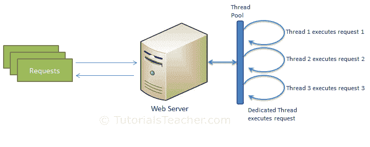
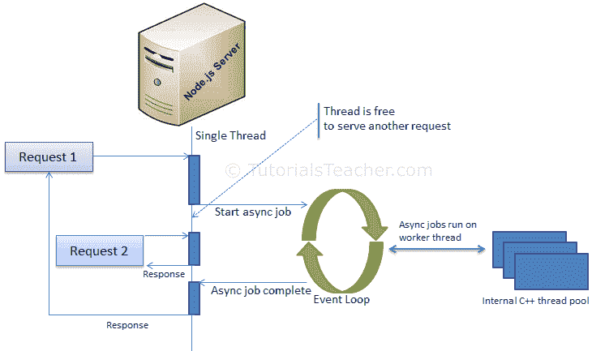

# NodeJS 进程模型

在本节中，我们将了解 Node.js 进程模型，并理解为什么我们应该使用 Node.js

## 传统的 Web 服务器模型

在传统的 web 服务器模型中，每个请求都由线程池中的一个专用线程处理。如果线程池中在任何时间点都没有可用的线程，那么请求将等待下一个可用的线程。专用线程执行特定的请求，直到完成执行并返回响应后才返回线程池。

Traditional Web Server Model

## NodeJS 进程模型

与传统的 web 服务器模型相比，Node.js 处理用户请求的方式不同。Node.js 在单个进程中运行，应用代码在单个线程中运行，因此比其他平台需要更少的资源。对 web 应用的所有用户请求都将由一个线程处理，所有的输入/输出工作或长时间运行的工作都是针对特定请求异步执行的。因此，这个单线程不必等待请求完成，可以自由处理下一个请求。当异步输入/输出工作完成后，它会进一步处理请求并发送响应。

一个事件循环一直在关注异步作业引发的事件，并在作业完成时执行回调函数。在内部，Node.js 将 [libev](http://software.schmorp.de/pkg/libev.html) 用于事件循环，而事件循环又使用内部 C++线程池来提供异步 I/O。

下图说明了使用 Node.js 的异步 web 服务器模型

Node.js Process Model

Node.js 进程模型提高了性能和可伸缩性，但有一些警告。Node.js 不适合执行 CPU 密集型操作(如图像处理或其他繁重的计算工作)的应用，因为它需要时间来处理请求，从而阻塞单线程。