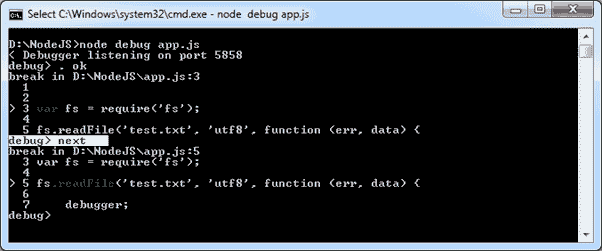
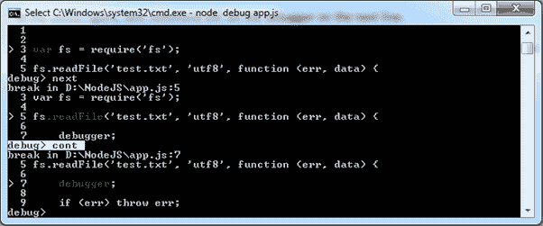
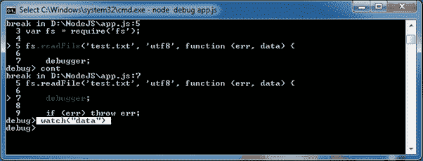
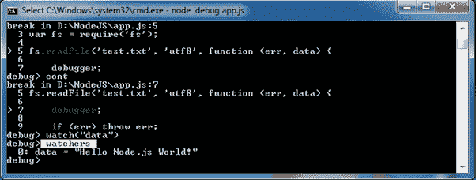

# 调试 NodeJS 应用


在本节中，您将学习调试 Node.js 应用的方法。

您可以使用各种工具调试 Node.js 应用，包括:

1.  核心 NodeJS 调试器
2.  NodeJS 检查器
3.  IDEs 中的内置调试器

## 核心 NodeJS 调试器

Node.js 提供了内置的非图形调试工具，可以在所有平台上使用。它为调试 Node.js 应用提供了不同的命令。

考虑下面包含在 app.js 文件中的简单 Node.js 应用。

app.js 

```js
var fs = require('fs');

fs.readFile('test.txt', 'utf8', function (err, data) {

    debugger;

    if (err) throw err;

    console.log(data);
}); 
```

在您希望调试器停止的 JavaScript 代码中编写调试器。例如，我们想要检查上面例子中的“数据”参数。所以，写调试器；内部回调函数如上。

现在，要调试上述应用，请运行以下命令。

```js
node debug app.js
```

上面的命令启动调试器，并在第一行停止，如下所示。

[](../../Content/images/nodejs/nodejs-debug1.png)

Starting Node.js Debugging


如上图所示， **>** 符号表示当前调试语句。

使用**下一个**继续下一个语句。

[](../../Content/images/nodejs/nodejs-debug2.png)

Debug Node.js Application


在上图中，下一个命令将在下一行设置调试器。 **>** 现在指向下一个语句。

使用 **cont** 在下一个“调试器”停止执行(如果有)。

[](../../Content/images/nodejs/nodejs-debug3.png)

Debug Node.js Application


在上图中，您可以看到 cont 命令在“调试器”处停止。

使用 watch('expression ')命令添加要检查其值的变量或表达式。例如，要检查上例中数据变量的值，请将数据添加到如下所示的 watch 表达式中。

[](../../Content/images/nodejs/nodejs-debug4.png)

Debug Node.js Application


现在，编写 watcherss 命令来检查添加到 watcher()中的所有变量的值。

[](../../Content/images/nodejs/nodejs-debug5.png)

Debug Node.js Application


下表列出了重要的调试命令:

| 命令 | 描述 |
| --- | --- |
| 然后 | 停在下一个语句。 |
| 连续的 | 继续执行并在调试器语句处停止(如果有)。 |
| 步骤 | 介入功能。 |
| 在外 | 退出功能。 |
| 看 | 将表达式或变量添加到 watch 中。 |
| 看守人 | 查看添加到 watch 中的所有表达式和变量的值。 |
| 中止 | 暂停运行代码。 |

因此，您可以使用内置的 Node.js 调试器调试您的 Node.js 应用。访问 Node.js 官方文档了解所有 [Node.js 调试命令](https://nodejs.org/api/debugger.html)或者在 Node.js 控制台(REPL)的调试模式下写“帮助”。

下一节学习如何使用 NodeJS 检查器调试 Node.js 应用。*